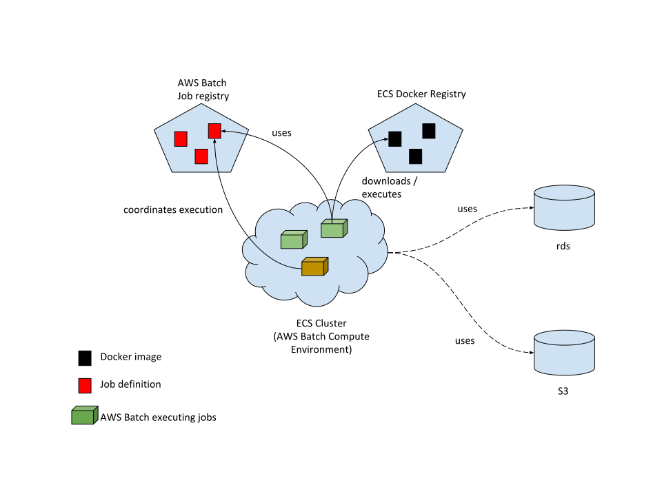

# Scaling out: AWS Batch

> If your laptop choked in the previous sections or if you can't afford to look your laptop just lagging forever, you should read this section&#x2026;

For bigger experiment, one option is use `[[https://aws.amazon.com/batch/][AWS Batch]]`. AWS Batch dynamically provisions the optimal quantity and type of compute resources based on the specific resource requirements of the tasks submitted. AWS Batch will manage (i.e. plans, schedules, and executes) the resources (CPU, Memory) that we need to run the pipeline. In other words, AWS Batch will provide you with a computer (an AWS EC2 machine) that satisfies your computing requirements, and then it will execute the software that you intend to run.

AWS Batch dependes in other two technologies in order to work: Elastic Container Registry (Amazon ECR) as the Docker image registry (allowing AWS Batch to fetch the task images), and Elastic Compute Cloud (Amazon EC2) instances located in the cluster as the docker host (allowing AWS Batch to execute the task).



An AWS ECS task will be executed by an EC2 instance belonging to the ECS cluster (if there are resources available). The EC2 machine operates as a Docker host: it will run the task definition, download the appropriate image from the ECS registry, and execute the container.


## What do you need to setup?

AWS Batch requires setup the following infrastructure:

-   An [AWS S3 bucket](https://aws.amazon.com/s3/?nc2=h_m1) for storing the original data and the successive transformations of it made by the pipeline.
-   A PostgreSQL database (provided by [AWS RDS](https://aws.amazon.com/rds/)) for storing the data in a relational form.
-   An Elastic Container Registry ([AWS ECR](https://aws.amazon.com/ecs/)) for storing the triage's Docker image used in the pipeline.
-   [AWS Batch Job Queue](https://aws.amazon.com/batch/) configured and ready to go.


## Assumptions

-   You have `[[https://stedolan.github.io/jq/download/][jq]]` installed
-   You have IAM credentials with permissions to run AWS Batch, read AWS S3 and create AWS EC2 machines.
-   You installed `awscli` and configure your credentials following the standard instructions.
-   You have access to a S3 bucket:
-   You have a AWS ECR repository with the following form: `dsapp/triage-cli`
-   You have a AWS Batch job queue configured and have permissions for adding, running, canceling jobs.

You can check if you have the `AWS S3` permissions like:

```sh
[AWS_PROFILE=your_profile] aws ls [your-bucket]   # (dont't forget the last backslash)
```

And for the `AWS Batch` part:

```sh
[AWS_PROFILE=your_profile] aws batch describe-job-queues
[AWS_PROFILE=your_profile] aws batch describe-job-definitions
```


## Configuration

First we need to customize the file `.aws_env` (yes, another environment file).

Copy the file `aws_env.example` to `.aws_env` and fill the blanks

**NOTE**: Don't include the `s3://` protocol prefix in the `S3_BUCKET`


### (Local) Environment variables

```text
#!/usr/bin/env bash

PROJECT_NAME=dirtyduck
TRIAGE_VERSION=3.3.0
ENV=development
AWS_REGISTRY={your-ecr-registry}
AWS_JOB_QUEUE={your-job-queue}
POSTGRES_DB={postgresql://user:password@db_server/dbname}
S3_BUCKET={your-bucket}
```

To check if everything is correct you can run:

```sh
[AWS_PROFILE=your_profile]  ./deploy.sh -h
```

Next, we need 3 files for running in AWS Batch, copy the files and remove the `.example` extension and adapt them to your case:


### Job definition

Change the `PROJECT_NAME` and `AWS_ACCOUNT` for their real values

```json
{
  "containerProperties": {
    "command": [
      "--tb",
      "Ref::experiment_file",
      "--project-path",
      "Ref::output_path",
      "Ref::replace",
      "Ref::save_predictions",
      "Ref::profile",
      "Ref::validate"
    ],
    "image": "AWS_ACCOUNT.dkr.ecr.us-west-2.amazonaws.com/YOUR_TRIAGE_IMAGE",
    "jobRoleArn": "arn:aws:iam::AWS_ACCOUNT:role/dsappBatchJobRole",
    "memory": 16000,
    "vcpus": 1
  },
  "jobDefinitionName": "triage-cli-experiment",
  "retryStrategy": {
    "attempts": 1
  },
  "type": "container"
}
```


### Environment variables overrides (for docker container inside the AWS EC2)

Fill out the missing values

```json
{
    "environment": [
        {
            "name":"AWS_DEFAULT_REGION",
            "value":"us-west-2"
        },
        {
            "name":"AWS_JOB_QUEUE",
            "value":""
        },
        {
            "name":"POSTGRES_PASSWORD",
            "value":""
        },
        {
            "name":"POSTGRES_USER",
            "value":""
        },
        {
            "name":"POSTGRES_DB",
            "value":""
        },
        {
            "name":"POSTGRES_PORT",
            "value":""
        },
        {
            "name":"POSTGRES_HOST",
            "value":""
        }
    ]
}
```


### `credentials-filter`

Leave this file as is (We will use it for storing the temporal token in `deploy.sh`)

```json
{
        "environment": [
                {
                        "name": "AWS_ACCESS_KEY_ID",
                        "value": .Credentials.AccessKeyId
                },
                {
                        "name": "AWS_SECRET_ACCESS_KEY",
                        "value": .Credentials.SecretAccessKey
                },
                {
                        "name": "AWS_SESSION_TOKEN",
                        "value": .Credentials.SessionToken
                }
        ]
}
```


### Running an experiment

We provided a simple bash file for creating the image, uploading/updating the job definition and running the experiment:

```shell
    ./deploy.sh -h

    Usage: ./deploy.sh (-h | -i | -u | -b | -r | -a | --sync_{to,from}_s3 )
    OPTIONS:
       -h|--help                   Show this message
       -i|--info                   Show information about the environment
       -b|--update-images          Build the triage image and push it to the AWS ECR
       -u|--update-jobs            Update the triage job definition in AWS Batch
       -r|--run-experiment         Run experiments on chile-dt data
       --sync-to-s3                Uploads the experiments and configuration files to s3://your_project
       --sync-from-s3              Gets the experiments and configuration files from s3://your_project
    EXAMPLES:
       Build and push the images to your AWS ECR:
            $ ./deploy.sh -b
       Update the job's definitions:
            $ ./deploy.sh -u
       Run triage experiments:
            $ ./deploy.sh -r --experiment_file=s3://your_project/experiments/test.yaml,project_path=s3://your_project/triage,replace=--replace
```

If you have multiple AWS profiles use `deploy.sh` as follows:

```sh
[AWS_PROFILE=your_profile] ./deploy.sh -r [job-run-name] experiment_file=s3://{your_bucket}/experiments/simple_test_skeleton.yaml,output_path=s3://{your_bucket}/triage,replace=--no-replace,save_predictions=--no-save-predictions,profile=--profile,validate=--validate
```

Where `your_profile` is the name of the profile in `~/.aws/credentials`


### Suggested workflow

The workflow now is:

-   At the beginning of the project

    -   Set a `docker image` and publish it to the AWS ECR (if needed, or you can use the `triage` official one).

    > You could create different images if you want to run something more tailored to you (like not using the `cli` interface)

    -   Create a *job definition* and publish it:

    ```sh
    [AWS_PROFILE=your_profile] ./deploy.sh -u
    ```

    > You could create different jobs if, for example, you want to have different resources (maybe small resources for testing or a lot of resources for a big experiment)

-   Every time that you have an idea about how to improve the results

    -   Create experiment files and publish them to the `s3` bucket:

    ```sh
    [AWS_PROFILE=your_profile] ./deploy.sh --synt-to-s3
    ```

    -   Run the experiments

    ```sh
    [AWS_PROFILE=your_profile] ./deploy.sh -r [job-run-name] experiment_file=s3://{your_bucket}/experiments/simple_test_skeleton.yaml,output_path=s3://{your_bucket}/triage,replace=--no-replace,save_predictions=--no-save-predictions,profile=--profile,validate=--validate
    ```
