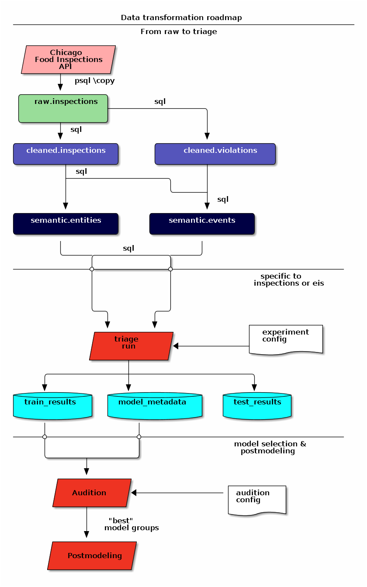
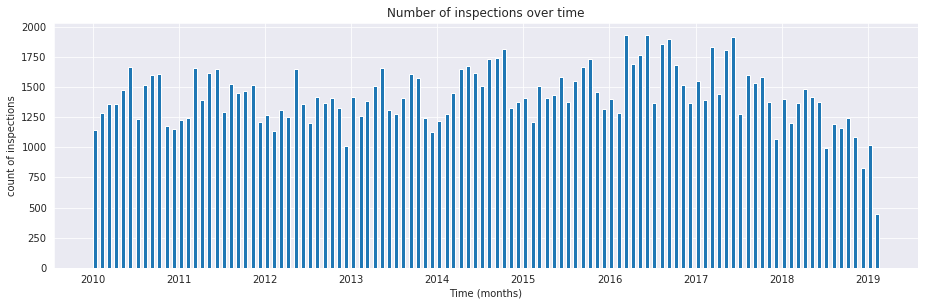
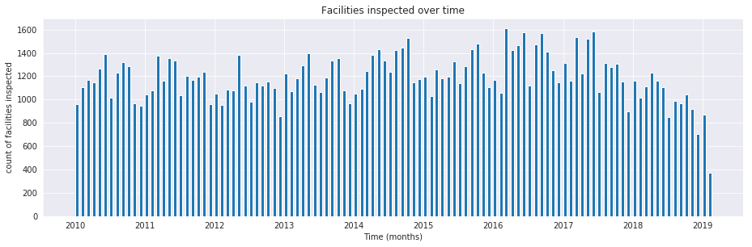
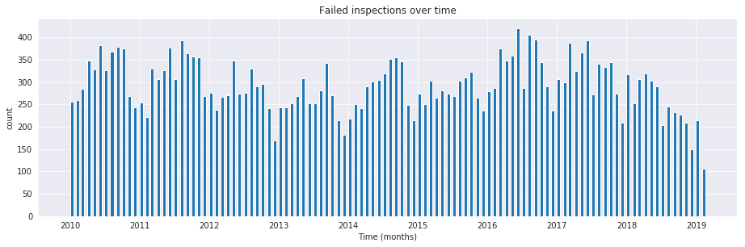
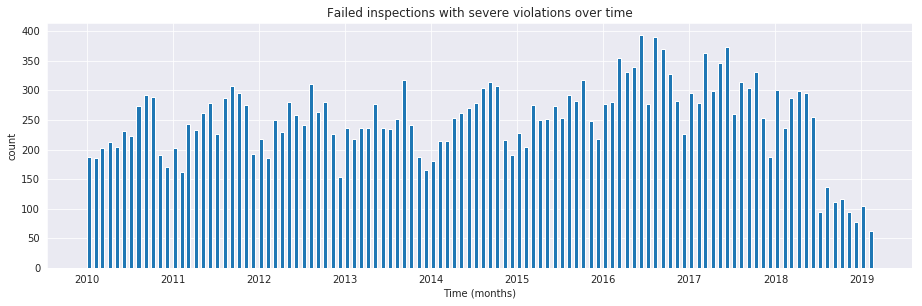
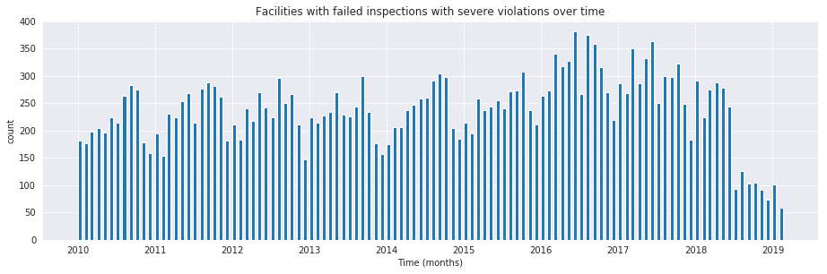

# Data preparation

We need to get the data and transform it into a shape that is suitable for the analysis.

**NOTE:** Unless we say otherwise, you should run all the following commands inside `bastion`.


## Load the data

Before loading the data into the database, verify that the database
table is empty by running the following code:

```sql
select
    count(*)
from
    raw.inspections;
```

| count |
|----- |
| 0     |

We will use some `postgresql` magic in order to get the data in our
database. In particular we will use the powerful
[copy](https://www.postgresql.org/docs/10/sql-copy.html) command and
the City of Chicago's data API:

```sql
\copy raw.inspections from program 'curl "https://data.cityofchicago.org/api/views/4ijn-s7e5/rows.csv?accessType=DOWNLOAD"' HEADER CSV
```

Now, you should have some data:

```sql
select
    to_char(count(*), '999,999') as "facilities inspected"
from
    raw.inspections;
```

| facilities inspected |
|-------------------- |
| 186,426              |

You'll probably get a different number because the data are updated
every day. Let's peek inside the table[^1]

```sql
select
    inspection,
    dba_name,
    risk,
    results
from
    raw.inspections limit 1;
```

| inspection | dba\_name     | risk          | results            |
|---------- |---------------------- |------------- |------------------ |
| 2268241    | ANTOJITOS PUEBLITA INC | Risk 1 (High) | Pass w/ Conditions |

Ok, now you have some data loaded! But we still need to *munge* it to
use it in our machine learning task.


## Transforming (and cleaning) the data


### Rationale

To tackle a machine learning problem, you need to identify the
**entities** for your problem domain. Also, if your problem involves
time, you will need to understand how those entities change, either
what **events** happen to the
entity or what **events** the entity affects.

We will encode this information into two tables, one named `entities`
and the other named `events`.

The entity, in this example, is the food **facility**, and the events
are the **inspections** on the facility.

The `entities` table should contain a unique identifier for the entity
and some data about that entity (like name, age and status). The `events`
table will include data related to the inspection, including the two
most important attributes: its spatial and temporal positions [^2].

Before we start the data cleaning, make your life easier by following this
rule:

!!! important
     *Do not change the original data*

The reason is, if you make a mistake or want to try a different data
transformation, you can always can go back to the `raw` data and start
over.

### Data road

The transformation "road" that we will take in this tutorial is as follows:

1.  Put a copy of the data in the `raw` schema. (We just did that.)
2.  Apply some simple transformations and store the resulting data in the `cleaned` schema.
3.  Organize the data into two *unnormalized*[^3] tables in the
    semantic schema: `events` and `entities`.
4.  Run `triage`. It will create several schemas (`triage_metadata`, `test_results`, `train_results`).



<a id="orga5ba5d1"></a>

### Dataset documentation

!!! info
    For an updated version of the documentation of this dataset see
    [Food Protection
    Services](https://www.chicago.gov/city/en/depts/cdph/provdrs/healthy_restaurants/svcs/food-protection-services.html).

!!! info
    The Food Code Rules (effective 2/1/2019) could be consulted
    [here](https://www.chicago.gov/content/dam/city/depts/cdph/food_env/general/Food_Protection/FoodCodeRules_Effective_Feb12019.pdf).

The Chicago Food Inspection dataset has documentation
[here](https://data.cityofchicago.org/api/assets/BAD5301B-681A-4202-9D25-51B2CAE672FF?download=true).

We can use this documentation to better understand each column's meaning, and the process that generates the data.

Most columns are self-explanatory, but some are not[^4]:

!!! quote "Risk category of facility (`risk`)"
    Each establishment is categorized by its risk of adversely
    affecting the public’s health, with 1 being the highest and 3 the
    lowest. The frequency of inspection is tied to this risk, with risk =
    1 establishments inspected most frequently and risk = 3 least
    frequently.

!!! quote "Inspection type (`type`)"
    An inspection can be one of the following types:

      - **Canvass**, the most common type of inspection performed at a frequency relative to the
        risk of the establishment;
      - **Consultation**, when the inspection is done at the request of the
        owner prior to the opening of the establishment;
      - **Complaint**, when the inspection is done in response to  a
        complaint against the establishment
      - **License**, when the inspection  is done as a requirement for the
        establishment to receive its license to operate;
      - **Suspect food poisoning**, when the inspection is done in response
        to one or more persons claiming to have gotten ill as a result of
        eating at the establishment (a specific type of  complaint-based inspection);
      - **Task-force inspection**, when an inspection of a bar or tavern is
        done.
      - **Re-inspections** can occur for most types of these inspections and are indicated as such.

!!! quote "Results (`results`)"

    An inspection can pass, pass with conditions, or fail. Establishments
    receiving a ‘pass’ were found to have no critical or serious
    violations (violation number 1-14 and 15-29,
    respectively). Establishments receiving a ‘pass with conditions’ were
    found to have critical or serious violations, but these were corrected
    during the inspection. Establishments receiving a ‘fail’ were found to
    have critical or serious violations that were not correctable during
    the inspection. An establishment receiving a ‘fail’ does not
    necessarily mean the establishment’s licensed is
    suspended. Establishments found to be out of business or not located
    are indicated as such.

    !!! info "Important!"
        The result of the inspections (pass, pass with conditions or fail)
        as well as the violations noted are based on the findings
        identified and reported by the inspector at the time of the
        inspection, and may not reflect the findings noted at other
        times.


!!! quote   "Violations (`violations`)"

     An establishment can receive **one or more** of 45 distinct
     violations (violation numbers 1-44 and 70). For each violation
     number listed for a given establishment, *the requirement the
     establishment must meet in order for it* to **NOT** *receive a
     violation is noted, followed by a specific description of the
     findings that caused the violation to be issued*.


    !!! warning "Data Changes"
        On 7/1/2018 the Chicago Department of Public Health’s Food
        Protection unit changed the definition of violations.
        The changes don’t affect structurally the dataset (e.g. how the
        violations are inputted to the database), but the redefinition
        will change the distribution and interpretation of the violation codes.
        See
        [here](https://www.cityofchicago.org/content/dam/city/depts/cdph/FoodProtection/ChicagoFoodCodeMajorChangesFinal2018.pdf).

    !!! warning "Data Changes"
        On 2/1/2019 the Chicago Department of Public Health’s Food
        Protection unit changed the requirements that the facilities must
        follow.
        See [here](https://www.chicago.gov/content/dam/city/depts/cdph/food_env/general/Food_Protection/2019_ChicagoFoodCodeMajorChanges.pdf)


We added emphasis to the last one.


From these definitions, we can infer the following:

1.  *risk* is related to the frequency of inspections of type *canvass*.
2.  *consultation* is an inspection *before* the facility opens (so we can remove it from the data). The same happens with *license*.
3.  *complaint* and *suspected food poisoning* are triggered by people.
4.  *consultation* is triggered by the owner of the facility.
5.  *task-force* occurs at bars or taverns.
6.  **Critical violations** are coded between `1-14`, **serious
    violations** between `15-29`. We can assume that the violations
    code `30` and higher are *minor* violations. (see below)
7.  *violation* describes the problems found, and the comment section
    describes the steps the facility should take to fix the problem.
8.  There are only three possible results of the inspection. (Also, an
    inspection may not happen if the facility was not located or went
    out of business).
9.  There can be several `violations` per `inspection`.

!!! warning "Data Changes"
    On 7/1/2018 *Critical violation* changed to **Priority (P)
    Violation**, *Serious violation* changed to **Priority Foundation
    (PF) Violation** and *Minor violation* changed to **Core (C)
    Violation**.

!!! warning "Data Changes"
    On 7/1/2018 the number of potential violations has increased from
    45 to **63**.

!!! warning "Data Changes"
    On 7/1/2018 *Corrected Dduring Inspection (CDI)* has been changed
    to **Corrected on Site (COS)**. *Potentially Hazardous Foods
    (PHF)* changed to **Time/Temperature Control for Safety Foods (TCS
    Foods)**.

### Reality check

It is important to verify that the documentation is correct. Let's start by checking that the `risk` column **only** has three classifications:

**NOTE** Execute this in `psql` inside the container `bastion`.

```sql
  select
      risk,
      to_char(count(*), '999,999') as "number of inspections"
  from
      raw.inspections
  group by
      risk
  order by
      count(*) desc;
```

| risk            | number of inspections |
|--------------- |--------------------- |
| Risk 1 (High)   | 133,170               |
| Risk 2 (Medium) | 36,597                |
| Risk 3 (Low)    | 16,556                |
| ¤               | 75                    |
| All             | 28                    |

Ok, there are two extra `risk` types, `All` and `NULL`, for a grand total of **5**.

What about `types` of inspections?

```sql
  select
      count(distinct type) as "types of inspections"
  from
      raw.inspections;
```

| types of inspections |
|-------------------- |
| 108                  |

Wow, there are **108** types of inspections instead of the expected **5**!

What are those types? How bad is it?

```sql
select
    type,
    to_char(count(*), '999,999') as "number of inspections"
from
    raw.inspections
group by
    type
order by
    count(*) desc
    limit 10;
```

| type                     | number of inspections |
|------------------------ |--------------------- |
| Canvass                  | 99,792                |
| License                  | 24,385                |
| Canvass Re-Inspection    | 19,380                |
| Complaint                | 17,289                |
| License Re-Inspection    | 8,572                 |
| Complaint Re-Inspection  | 7,060                 |
| Short Form Complaint     | 6,534                 |
| Suspected Food Poisoning | 834                   |
| Consultation             | 671                   |
| License-Task Force       | 605                   |

This column will require also cleaning.

Finally, let's look `results` (should be 3)

```sql
  select
      results,
      to_char(count(*), '999,999') as "number of inspections"
  from
      raw.inspections
  group by
      results
  order by
      count(*) desc;
```

| results              | number of inspections |
|-------------------- |--------------------- |
| Pass                 | 103,528               |
| Fail                 | 35,948                |
| Pass w/ Conditions   | 23,258                |
| Out of Business      | 16,212                |
| No Entry             | 5,784                 |
| Not Ready            | 1,630                 |
| Business Not Located | 66                    |

Ok, disheartening. But that's the reality of *real* data. We'll try to clean this mess.


### Cleaning

Let's look at the data to figure out how we need to transform
it. We'll start with all the columns except `violations`. We'll deal
with that one later because it's more complex.

First, we'll remove superfluous spaces; convert the columns `type,
results, dba_name, aka_name, facility_type, address, city` to lower
case; and clean `risk`, keeping only the description (e.g. `high`
instead of `Risk 1 (High)`).

We still need to clean further the column `type` (which contains more
values than the **seven** mentioned in the documentation: *canvass*,
*complaint*, *license*, *re-inspection*, *task-force*, *consultation*,
and *suspected food poisoning*). For simplicity, we will use *regular
expressions* and ignore *re-inspection*.

For the column `risk`, we will impute as `high` all the `NULL` and `All` values[^5].

As we have seen (and will continue see) through this tutorial, *real
data are messy*; for example, the column `dba_name` has several
spellings for the same thing: `SUBWAY` and `Subway`, `MCDONALDS` and
`MC DONALD'S`, `DUNKIN DONUTS/BASKIN ROBBINS` and `DUNKIN DONUTS /
BASKIN ROBBINS`, etc.

We could use
[soundex](https://www.postgresql.org/docs/current/static/fuzzystrmatch.html)
or machine learning *deduplication*[^6] to clean these names, but
we'll go with a very simple cleaning strategy: convert all the names
to lowercase, remove the trailing spaces, remove the apostrophe, and
remove the spaces around "`/`". It won't completely clean those names,
but it's good enough for this example project.

Let's review the status of the spatial columns (`state, city, zip,
latitude, longitude`). Beginning with `state`, all the facilities in
the data should be located in **Illinois**:

```sql
select
    state,
    to_char(count(*), '999,999') as "number of inspections"
from
    raw.inspections
group by
    state;
```

| state | number of inspections |
|----- |--------------------- |
| IL    | 186,392               |
| ¤     | 34                    |

Ok, almost correct, there are some `NULL` values. We will assume that the `NULL` values are actually `IL` (i.e. we will impute them). Moving to the next spatial column, we expect that all the values in the column `city` are Chicago[^7]:

```sql
select
    lower(city) as city,
    to_char(count(*), '999,999') as "number of inspections"
from
    raw.inspections
group by
    lower(city)
order by
    count(*) desc
    limit 10;
```

| city              | number of inspections |
|----------------- |--------------------- |
| chicago           | 186,009               |
| ¤                 | 161                   |
| cchicago          | 44                    |
| schaumburg        | 23                    |
| maywood           | 16                    |
| elk grove village | 13                    |
| evanston          | 10                    |
| chestnut street   | 9                     |
| cicero            | 9                     |
| inactive          | 8                     |

Oh boy. There are 150-ish rows with `NULL` values and forty-ish rows
with the value `cchicago`. Farther down the list (if you dare), we
even have `chicagochicago`. All the values are near Chicago, even if
they're in different counties, so we will ignore this column (or
equivalently, we will assume that all the records are from Chicago).

Zip code has a similar `NULL` problem:

```sql
select
    count(*) as "number of inspections w/o zip code"
from
    raw.inspections
where
    zip is null or btrim(zip) = '';
```

| number of inspections w/o zip code |
|---------------------------------- |
| 75                                 |

We could attempt to replace these `NULL` values using the location
point or using similar names of restaurants, but for this tutorial we
will remove them. Also, we will convert the coordinates latitude and
longitude to a Postgres `Point`[^8][^9][^10].

We will drop the columns `state`, `latitude`, and `longitude` because
the `Point` contains all that information. We also will remove the
column `city` because almost everything happens in Chicago.

If you're keeping count, we are only keeping two columns related to
the spatial location of the events: the location of the facility
(`location`) and one related to inspection assignments (`zip_code`).

Additionally, we will keep the columns `wards, historical_wards,
census_tracts` and `community_areas`.

Each inspection can have multiple violations. To handle that as simply
as possible, we'll put violations in their own table.

!!! info "Decisions regarding data"
    We will inspections that occurred *before*  `2018-07-01`. This is
    due the changes in the types and definition of the violations. See
    [here](https://www.cityofchicago.org/content/dam/city/depts/cdph/FoodProtection/ChicagoFoodCodeMajorChangesFinal2018.pdf)


Finally, we will improve the names of the columns (e.g. `results ->
result, dba_name -> facility`, etc).

We will create a new `schema` called `cleaned`. The objective of this
schema is twofold: to keep our raw data *as is*[^11] and to store our
assumptions and cleaning decisions separate from the *raw* data in a
schema that *semantically* transmits that "this is our cleaned data."

The `cleaned` schema will contain two tables: `cleaned.inspections` and `cleaned.violations`.

```sql
  create schema if not exists cleaned;
```

Then, we will create our mini **ETL** with our cleaning decisions:

!!! note "Data changes"
    At least from May 2019 the dataset contains news columns:
    `zip_codes, historical_wards, wards, community_areas` and `census_tracts`. The most
    recent code reflects those changes.

```sql
create schema if not exists cleaned;

drop table if exists cleaned.inspections cascade;

create table cleaned.inspections as (
        with cleaned as (
        select
            inspection::integer,
            btrim(lower(results)) as result,
            license_num::integer,
            btrim(lower(dba_name)) as facility,
            btrim(lower(aka_name)) as facility_aka,
            case when
            facility_type is null then 'unknown'
            else btrim(lower(facility_type))
            end as facility_type,
            lower(substring(risk from '\((.+)\)')) as risk,
            btrim(lower(address)) as address,
            zip as zip_code,
            community_areas as community_area,
            census_tracts as census_tracts,
            historical_wards as historical_ward,
            wards as ward,
            substring(
                btrim(lower(regexp_replace(type, 'liquor', 'task force', 'gi')))
            from 'canvass|task force|complaint|food poisoning|consultation|license|tag removal') as type,
            date,
            -- point(longitude, latitude) as location
            ST_SetSRID(ST_MakePoint(longitude, latitude), 4326)::geography as location  -- We use geography so the measurements are in meters
        from raw.inspections
        where zip is not null  -- removing NULL zip codes
        and date < '2018-07-01'
            )

    select * from cleaned where type is not null
        );
```

The number of inspections now is:

```sql
select
    to_char(count(inspection), '999,999,999') as "number of
    inspections (until 07/01/2018)"
from cleaned.inspections;
```

| number of inspections (until 07/01/2018)|
|--------------------- |
| 172,052               |

Note that quantity is smaller than the one from `raw.inspections`,
since we throw away some inspections.

With the `cleaned.inspections` table created, let's take a closer look
at the `violations` column to figure out how to clean it.

The first thing to note is that the column `violation` has a lot of
information: it describes the code violation, what's required to
address it (see [Dataset documentation](#dataset-documentation)), and
the inspector's comments. The comments are free text, which means that
they can contain line breaks, mispellings, etc. In particular, note
that pipes (`|`) seperate multiple violations.

The following `sql` code removes line breaks and multiple spaces and creates an array with all the violations for inspection number `2145736`:

```sql
select
    unnest(string_to_array(regexp_replace(violations, '[\n\r]+', ' ', 'g' ), '|'))  as violations_array
from raw.inspections
where
    inspection = '2145736';
```

| violations<sub>array</sub>                                                                                                                                                                                                                                                                                                                                                                                                                                                                                                   |
|---------------------------------------------------------------------------------------------------------------------------------------------------------------------------------------------------------------------------------------------------------------------------------------------------------------------------------------------------------------------------------------------------------------------------------------------------------------------------------------------------------------------------- |
| 32. FOOD AND NON-FOOD CONTACT SURFACES PROPERLY DESIGNED, CONSTRUCTED AND MAINTAINED - Comments: FIRST FLOOR GIRL'S WASHROOM,MIDDLE WASHBOWL SINK FAUCET NOT IN GOOD REPAIR, MUST REPAIR AND MAINTAIN.   ONE OUT OF TWO HAND DRYER NOT WORKING IN THE FOLLOWING WASHROOM: FIRST FLOOR  BOY'S AND GIRL'S WASHROOM, AND  BOY'S AND GIRL'S WASHROOM 2ND FLOOR. MUST REPAIR AND MAINTAIN.                                                                                                                                        |
| 34. FLOORS: CONSTRUCTED PER CODE, CLEANED, GOOD REPAIR, COVING INSTALLED, DUST-LESS CLEANING METHODS USED - Comments: DAMAGED FLOOR INSIDE THE BOY'S AND GIRL'S WASHROOM 2ND FLOOR. MUST REPAIR, MAKE THE FLOOR SMOOTH EASILY CLEANABLE.                                                                                                                                                                                                                                                                                     |
| 35. WALLS, CEILINGS, ATTACHED EQUIPMENT CONSTRUCTED PER CODE: GOOD REPAIR, SURFACES CLEAN AND DUST-LESS CLEANING METHODS - Comments: MISSING PART OF THE COVING(BASEBOARD) BY THE EXPOSED HAND SINK IN THE KITCHEN. MUST REPAIR AND MAINTAIN.   WATER STAINED CEILING TILES IN THE LUNCH ROOM. MUST REPLACE CEILING TILES AND MAINTAIN.  PEELING PAINT ON THE CEILING AND WALLS THROUGHOUT THE SCHOOL. HALLWAYS, INSIDE THE CLASSROOMS, INSIDE THE WASHROOMS IN ALL FLOORS. INSTRUCTED TO SCRAPE PEELING PAINT AND RE PAINT. |

This little piece of code is doing a lot: first it replaces all the line breaks `[\n\r]+` with spaces, then, it splits the string using the pipe and stores it in an array (`string_to_array`), finally it returns every violation description in a row (`unnest`).

From this, we can learn that the structure of the `violations` column follows:

-   If there are several violations reported, those violations will be separated by `'|'`
-   Every violation begins with a code and a description
-   Every violation can have **comments**, which appear after the string `- Comments:`

We will create a new table called `cleaned.violations` to store

-   inspection
-   code
-   description
-   comments

```sql
   drop table if exists cleaned.violations cascade;

   create table cleaned.violations as (
   select
       inspection::integer,
       license_num::integer,
       date::date,
       btrim(tuple[1]) as code,
       lower(btrim(tuple[2])) as description,
       lower(btrim(tuple[3])) as comment,
       (case
           when btrim(tuple[1]) = '' then NULL
           when btrim(tuple[1])::int between 1 and 14 then 'critical' -- From the documentation
           when btrim(tuple[1])::int between 15 and 29  then 'serious'
           else 'minor'
           end
           ) as severity from
       (
       select
           inspection,
           license_num,
           date,
           regexp_split_to_array(   -- Create an array we will split the code, description, comment
               regexp_split_to_table( -- Create a row per each comment we split by |
                   coalesce(            -- If there isn't a violation add '- Comments:'
                       regexp_replace(violations, '[\n\r]+', '', 'g' )  -- Remove line breaks
                       , '- Comments:')
                   , '\|')  -- Split the violations
               , '(?<=\d+)\.\s*|\s*-\s*Comments:')  -- Split each violation in three
            -- , '\.\s*|\s*-\s*Comments:')  -- Split each violation in three (Use this if your postgresql is kind off old
           as tuple
       from raw.inspections
       where results in ('Fail', 'Pass', 'Pass w/ Conditions') and license_num is not null
           ) as t
       );
```

This code is in `/sql/create_violations_table.sql`.

We can verify the result of the previous script

```sql
select
    inspection, date, code, description
from cleaned.violations
where
    inspection = 2145736
order by
    code asc;
```

| inspection | date       | code | description                                                                                                          |
|---------- |---------- |---- |-------------------------------------------------------------------------------------------------------------------- |
| 2145736    | 2018-03-01 | 32   | food and non-food contact surfaces properly designed, constructed and maintained                                     |
| 2145736    | 2018-03-01 | 34   | floors: constructed per code, cleaned, good repair, coving installed, dust-less cleaning methods used                |
| 2145736    | 2018-03-01 | 35   | walls, ceilings, attached equipment constructed per code: good repair, surfaces clean and dust-less cleaning methods |

If everything worked correctly you should be able to run the following
code[^12]:

```sql
select
    case
    when
    grouping(severity) = 1 then 'TOTAL'
    else
    severity
    end as severity,
    to_char(count(*), '999,999,999') as "number of inspections"
from
    cleaned.violations
group by
    rollup (severity)
order by
    severity nulls first;
```

| severity | number of inspections |
|-------- |--------------------- |
| ¤        | 26,415                |
| critical | 51,486                |
| minor    | 478,340               |
| serious  | 55,583                |
| TOTAL    | 611,824               |

As a last step, we should create from the cleaned tables the `entities` and `events` tables.


## Semantic tables


### Entities table

The `entities` table should uniquely identify each facility and
contain descriptive attributes. First, we should investigate how we
can uniquely identify a facility. Let's hope it's easy[^13].

Let's start with the obvious option. Perhaps `license_num` is a unique
identifier. Let's confirm our hypothesis with some queries.

We will begin with the following query: *What are 5 licenses with the
most inspections?*

```sql
select
    license_num,
    to_char(count(*), '999,999,999') as "number of inspections",
    coalesce(count(*) filter (where result = 'fail'), 0)
    as "number of failed inspections"
from
    cleaned.inspections
group by
    license_num
order by
     count(*) desc
    limit 5;
```

| license<sub>num</sub> | number of inspections | number of failed inspections |
|--------------------- |--------------------- |---------------------------- |
| 0                     | 442                   | 111                          |
| 1354323               | 192                   | 1                            |
| 14616                 | 174                   | 31                           |
| 1574001               | 82                    | 4                            |
| 1974745               | 59                    | 3                            |

This looks weird. There are three license numbers, in particular
license number `0`, that have many more inspections than the
rest. Let's investigate `license_num` = `0`.

```sql
  select
      facility_type,
      count(*) as "number of inspections",
      coalesce(count(*) filter (where result = 'fail'), 0) as "number of failed inspections"
  from
      cleaned.inspections
  where
      license_num=0
  group by
      facility_type
  order by
      "number of inspections" desc
  limit 10;
```

| facility<sub>type</sub> | number of inspections | number of failed inspections |
|----------------------- |--------------------- |---------------------------- |
| restaurant              | 103                   | 43                           |
| special event           | 70                    | 8                            |
| unknown                 | 44                    | 10                           |
| shelter                 | 31                    | 6                            |
| navy pier kiosk         | 30                    | 4                            |
| church                  | 30                    | 3                            |
| grocery store           | 16                    | 7                            |
| school                  | 13                    | 1                            |
| long term care          | 11                    | 2                            |
| church kitchen          | 11                    | 4                            |

It seems that `license_number` `0` is a generic placeholder: Most of
these are related to *special events*, *churches*, *festivals*,
etc. But what about the `restaurants` that have `license_num` = `0`?
Are those the same restaurant?

```sql
  select
      license_num,
      facility,
      address,
      count(*) as "number of inspections",
      coalesce(count(*) filter (where result = 'fail'), 0)
      as "number of failed inspections"
  from
      cleaned.inspections
  where
      license_num = 0
      and
      facility_type = 'restaurant'
  group by
      license_num, facility, address
  order by
      "number of inspections" desc
  limit 10;
```

| license<sub>num</sub> | facility                      | address               | number of inspections | number of failed inspections |
|--------------------- |----------------------------- |--------------------- |--------------------- |---------------------------- |
| 0                     | british airways               | 11601 w touhy ave     | 5                     | 1                            |
| 0                     | rib lady 2                    | 4203 w cermak rd      | 4                     | 3                            |
| 0                     | taqueria la capital           | 3508 w 63rd st        | 3                     | 1                            |
| 0                     | nutricion familiar            | 3000 w 59th st        | 3                     | 1                            |
| 0                     | salvation army                | 506 n des plaines st  | 3                     | 1                            |
| 0                     | herbalife                     | 6214 w diversey ave   | 3                     | 2                            |
| 0                     | la michoacana                 | 4346 s california ave | 3                     | 1                            |
| 0                     | las quecas                    | 2500 s christiana ave | 3                     | 1                            |
| 0                     | mrs ts southern fried chicken | 3343 n broadway       | 3                     | 1                            |
| 0                     | unlicensed                    | 7559 n ridge blvd     | 3                     | 1                            |

Nope. Unfortunately, `license_num` is not a unique identifier.

Perhaps `license_num` and `address` are a unique identifier.

```sql
  select
  to_char(count(distinct license_num), '999,999') as "number of licenses",
  to_char(count(distinct facility), '999,999') as "number of facilities",
  to_char(count(distinct address), '999,999') as "number of addresses"
  from cleaned.inspections;
```

| number of licenses | number of facilities | number of addresses |
|------------------ |-------------------- |------------------- |
| 34,364             | 25,371               | 17,252             |

We were expecting (naively) that we should get one `license_num` per
`facility` per `address`, but that isn't the case. Perhaps several
facilities share a name (e.g. "Subway" or "McDonalds") or license, or
perhaps several facilities share the same address, such as facilities
at the stadium or the airport.

We will try to use the combination of `license_num`, `facility`,
`facility_aka`, `facility_type`, and `address` to identify a facility:

```sql
select
    license_num, facility, facility_type, facility_aka, address , count(*) as "number of inspections"
from
    cleaned.inspections
group by
    license_num, facility, facility_type, facility_aka, address
order by
    count(*) desc, facility, facility_aka, address, license_num, facility_type
limit 10;
```

 license\_num |           facility           | facility\_type |         facility\_aka         |          address          | number of inspections
-------------|------------------------------|---------------|------------------------------|---------------------------|-----------------------
     1490035 | mcdonald's                   | restaurant    | mcdonald's                   | 6900 s lafayette ave      |                    46
     1142451 | jewel food  store # 3345     | grocery store | jewel food  store # 3345     | 1224 s wabash ave         |                    45
     1596210 | food 4 less midwest #552     | grocery store | food 4 less                  | 7030 s ashland ave        |                    44
     2083833 | mariano's fresh market #8503 | grocery store | mariano's fresh market       | 333 e benton pl           |                    41
     1302136 | mcdonald's                   | restaurant    | mcdonald's                   | 70 e garfield blvd        |                    40
     1476553 | pete's produce               | grocery store | pete's produce               | 1543 e 87th st            |                    40
     1000572 | jewel food store #3030       | grocery store | jewel food store #3030       | 7530 s stony island ave   |                    39
        1094 | one stop food & liquor store | grocery store | one stop food & liquor store | 4301-4323 s lake park ave |                    39
       60184 | taqueria el ranchito         | restaurant    | taqueria el ranchito         | 2829 n milwaukee ave      |                    39
        9154 | jimmy g's                    | restaurant    | jimmy g's                    | 307 s kedzie ave          |                    37


Yay, it looks like these columns enable us to identify a facility![^14]

The `entities` table should store two other types of attributes. The
first type describe the entity no matter the time. If the entity were
a person, date of birth would be an example but age would not because
the latter changes but the former does not. We'll include `zip_code`
and `location` as two facility attributes.

The second type describes when the entity is available for action
(e.g. inspection). In this case, the columns `start_time, end_time`
describe the interval in which the facility is in business or
*active*. These columns are important because we don't want to make
predictions for inactive entities.

The data don't contain active/inactive date columns, so we will use
the date of the facility's first inspection as `start_time`, and
either `NULL` or the date of inspection if the result was `out of
business` or `business not located` as `end_time`.

```sql
create schema if not exists semantic;

drop table if exists semantic.entities cascade;

create table semantic.entities as (
        with entities as (
        select
            distinct on (
                license_num,
                facility,
                facility_aka,
                facility_type,
                address
                )
            license_num,
            facility,
            facility_aka,
            facility_type,
            address,
            zip_code,
            location,
            min(date) over (partition by license_num, facility, facility_aka, facility_type, address) as start_time,
            max(case when result in ('out of business', 'business not located')
                then date
                else NULL
                end)
            over (partition by license_num, facility, facility_aka, address) as end_time
        from cleaned.inspections
        order by
            license_num asc, facility asc, facility_aka asc, facility_type asc, address asc,
            date asc -- IMPORTANT!!
            )

    select
        row_number() over (order by start_time asc, license_num asc, facility asc, facility_aka asc, facility_type asc, address asc ) as entity_id,
        license_num,
        facility,
        facility_aka,
        facility_type,
        address,
        zip_code,
        location,
        start_time,
        end_time,
        daterange(start_time, end_time) as activity_period
    from entities
        );
```

Note that we added a *unique* identifier (`entity_id`) to this
table. This identifier was assigned using a PostgreSQL idiom:
`distinct on()`. `DISTINCT ON` keeps the "first" row of each group. If
you are interested in this powerful technique see this
[blogpost](http://www.postgresqltutorial.com/postgresql-select-distinct/).

```sql
select
    to_char(count(entity_id), '999,999') as entities
from
    semantic.entities;
```

| entities |
|-------- |
| 35,668   |

We will add some indexes to this table[^15]:

```sql
create index entities_ix on semantic.entities (entity_id);
create index entities_license_num_ix on semantic.entities (license_num);
create index entities_facility_ix on semantic.entities (facility);
create index entities_facility_type_ix on semantic.entities (facility_type);
create index entities_zip_code_ix on semantic.entities (zip_code);

-- Spatial index
create index entities_location_gix on semantic.entities using gist (location);

create index entities_full_key_ix on semantic.entities (license_num, facility, facility_aka, facility_type, address);
```


### Events table

We are ready to create the events table. This table will describe the
inspection, like the *type* of inspection, *when* and *where* the
inspection happened, and the inspection *result*. We will add the
violations as a `JSONB` column[^16]. Finally, we'll rename
`inspection` as `event_id`[^17].

```sql
drop table if exists semantic.events cascade;

create table semantic.events as (

        with entities as (
        select * from semantic.entities
            ),

        inspections as (
        select
            i.inspection, i.type, i.date, i.risk, i.result,
            i.license_num, i.facility, i.facility_aka,
            i.facility_type, i.address, i.zip_code, i.location,
            jsonb_agg(
                jsonb_build_object(
                    'code', v.code,
                    'severity', v.severity,
	            'description', v.description,
	            'comment', v.comment
	            )
            order  by code
                ) as violations
        from
            cleaned.inspections as i
            inner join
            cleaned.violations as v
            on i.inspection = v.inspection
        group by
            i.inspection, i.type, i.license_num, i.facility,
            i.facility_aka, i.facility_type, i.address, i.zip_code, i.location,
            i.date, i.risk, i.result
            )

    select
        i.inspection as event_id,
        e.entity_id, i.type, i.date, i.risk, i.result,
        e.facility_type, e.zip_code, e.location,
        i.violations
    from
        entities as e
        inner join
        inspections as i
        using (license_num, facility, facility_aka, facility_type, address, zip_code)
        );

-- Add some indices
create index events_entity_ix on semantic.events (entity_id asc nulls last);
create index events_event_ix on semantic.events (event_id asc nulls last);
create index events_type_ix on semantic.events (type);
create index events_date_ix on semantic.events(date asc nulls last);
create index events_facility_type_ix on semantic.events  (facility_type);
create index events_zip_code_ix on semantic.events  (zip_code);

-- Spatial index
create index events_location_gix on semantic.events using gist (location);

-- JSONB indices
create index events_violations on semantic.events using gin(violations);
create index events_violations_json_path on semantic.events using gin(violations jsonb_path_ops);

create index events_event_entity_zip_code_date on semantic.events (event_id asc nulls last, entity_id asc nulls last, zip_code, date desc nulls last);

```

Success! We have one row per event[^18] Our semantic data looks like:

```sql
select
    event_id,
    entity_id,
    type,
    date,
    risk,
    result,
    facility_type,
    zip_code
from
    semantic.events limit 1;
```

 event\_id | entity\_id |  type   |    date    | risk | result | facility\_type | zip\_code
----------|-----------|---------|------------|------|--------|---------------|----------
  1343315 |     22054 | canvass | 2013-06-06 | low  | fail   | newsstand     | 60623

We omitted `violations` and `location` for brevity. The total number of inspections is

```sql
select
    to_char(count(event_id), '999,999,999') as events
from semantic.events;
```

| events  |
|------- |
| 148,724 |

Now that we have our data in a good shape, we are ready to use **Triage**.


## Let's EDA &#x2026;

It is always a good idea to do some *Exploratory Data Analysis*[^19]
or **EDA** for short. This will help us to learn more about the
dynamics of the entities or the inspections.

We will generate a few plots, just to know:

-   how many entities/events are every month?
-   how many entities/events ended in a failed state every month? and,
-   how many entities/events have in a critical violation in a failed inspection?


### Inspections over time

First, we will try the answer the question: *how many inspections are realized every month?*




### Number of facilities *inspected* over time

The previous plot was about the number of *events* every month, now we will plot how many *entities* are acted every month.

One question, that is useful to answer is: Are there facilities that are inspected more than once in a month?

!!! note
    We are doing an emphasis in *inspected* since our data set doesn't
    contain **all** the facilities in Chicago. This will have an effect
    on the modeling stage.




### Number of failed inspections over time

What is the proportion of inspections every month that actually end in a failed inspection?




### Number of facilities with failed inspections over time

Now let's see the behavior of the *outcomes* of the inspection across
time. First just if the inspection failed.


### Number of severe violations found in a failed inspection over time

Finally let's analyze the evolution of failed inspections with severe
violations (violation code in 15-29)




### Number of facilities with severe violations found in a failed inspection over time



This few plots give us a sense of how the data behaves and will help
us in detect weird bugs or model-behavior later.

## What’s next?

- Learn more about [triage](triage_intro.md)
- Learn more about [early warning systems](eis.md)
- Learn more about [resource prioritization systems](inspections.md)


[^1]: If you want to try different columns (or you don't remember
    which columns try `\d raw.inspectios` first

[^2]:  We are following the [event's definition from
    physics](https://en.wikipedia.org/wiki/Event_(relativity)): "an
    event is the instantaneous physical situation or occurrence
    associated with a point in spacetime"

[^3]:  It will make your life easier and most of the Machine Learning
    algorithms only accept data in matrix form (i.e. one big table)

[^4]: Verbatim from the datasource documentation.

[^5]: A controversial decision, I know.

[^6]: This problem is related to the process of *deduplication* and there is
    another DSaPP tool for that:
    [matching-tool](https://dssg.github.io/matching-tool/).

[^7]: It is the *Chicago* Food Inspections dataset, after all.

[^8]: We could also use the default geometric data type from postgresql:
    `point`
    (<https://www.postgresql.org/docs/10/datatype-geometric.html>)

[^9]: We will store the `Point` as a `geography` object. As a result,
    spatial database operations (like calculating the distances
    between two facilities) will return answers in meters instead of
    degrees. See
    [this](http://workshops.boundlessgeo.com/postgis-intro/geography.html).

[^10]: As a real geographical object [check the PostGIS
    documentation](https://postgis.net/docs/ST_MakePoint.html)

[^11]: Remember our tip at the beginning of this section!

[^12]: If the code looks funny to you, it is because we are using
    [grouping
    sets](https://www.postgresql.org/docs/devel/queries-table-expressions.html#QUERIES-GROUPING-SETS),
    in particular `rollup`. See the docs.

[^13]: Yeah, you wish

[^14]: Almost. At least good for this tutorial. Look carefully.

[^15]: **ALWAYS** add indexes to your tables!

[^16]: If you want to have a deep explanation about why is this good
    check [this blog
    post](http://coussej.github.io/2016/01/14/Replacing-EAV-with-JSONB-in-PostgreSQL/)

[^17]: As a general rule I hate to add the suffix `_id`, I would rather
    prefer to name them as `event` and `entity` instead of `event_id`
    and `entity_id`. But `triage` named those columns in that way and
    for that we are stuck with that nomenclature.

[^18]: This will simplify the creation of *features* for our machine
    learning models.

[^19]: [Defined](https://en.wikipedia.org/wiki/Exploratory_data_analysis)
    by John Tukey as: *Procedures for analyzing data, techniques for
    interpreting the results of such procedures, ways of planning the
    gathering of data to make its analysis easier, more precise or
    more accurate, and all the machinery and results of (mathematical)
    statistics which apply to analyzing data.*
