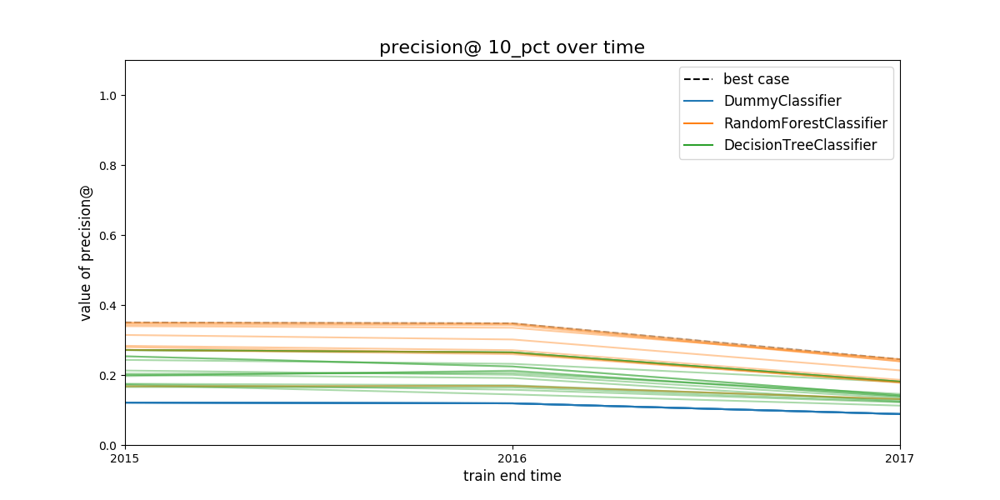
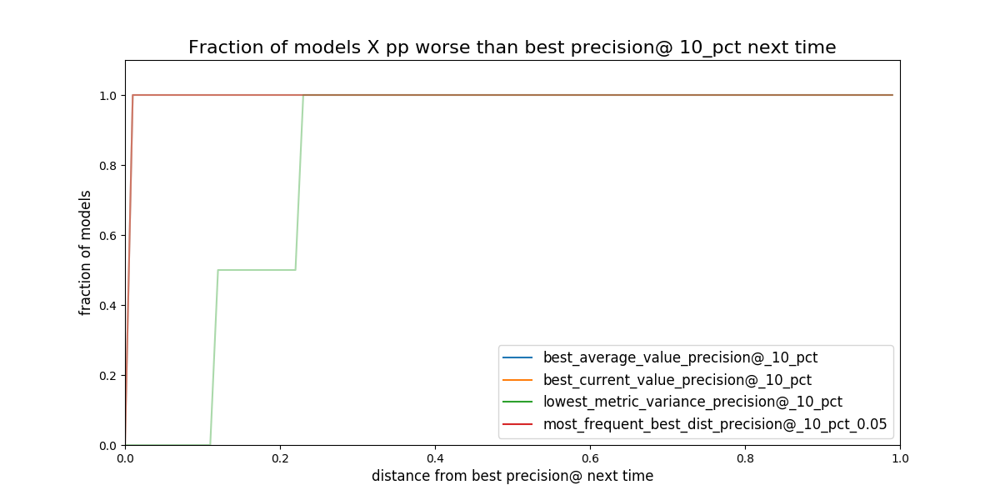
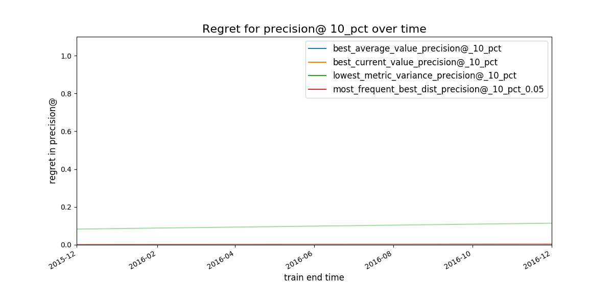

# An Early Intervention System: Chicago food inspections

!!! warning "Before continue, Did you…?"
    This case study, part of the dirtyduck tutorial,  assumes that you already setup the
    tutorial’s infrastructure and load the dataset.

    - If you didn’t setup the infrastructure go [here](infrastructure.md),

    - If you didn't load the data, you can do it very [quickly](for_the_impatient.md)
      or you can follow all the [steps and explanations about the data](data_preparation.md).


## Problem description

`Triage` is designed to also build early warning systems (also called
early intervention, EIS). While there are several differences between
modeling early warnings and inspection prioritization, perhaps the
biggest is that the *entity* is active (i.e. it is doing stuff for
which an outcome will happen) in EIS but passive (i.e. inspected) in
**inspection prioritization**. Among other things, this difference
affects the way the *outcome* is built.

Here's the question we want to answer:

!!! quote ""
    Will my restaurant be inspected in the next $Y$ period of time?

Where \(X\) could be 3 days, 2 months, 1 year, etc.

We will translate that problem to

!!! quote ""
    Will my restaurant be at the top-$X$ facilities most likely to be
    inspected in the next $Y$ period of time?


Knowing the answer to this question enables you (as the restaurant
owner or manager) to prepare for the inspection.


## What are the labels? What are the outcomes?

The trick to note is that on any given day there are two possible
outcomes: *the facility was inspected* and *the facility wasn't
inspected*. Our *outcomes* table will be larger than in the inspection
prioritization example because we need an *outcome* for every *active*
facility on every date. The following image tries to exemplify this
reasoning:


*Figure. The image shows three facilities,
and next to each, a temporal line with 6 days (0-5). Each dot
represents the event (whether an inspection happened). Yellow means
the inspection happened (`TRUE` outcome) and blue means it didn't
(`FALSE` outcome). Each facility in the image had two inspections, six
in total.*

Fortunately, `triage` will help us to create this table. The *cohort*
table is the same as the *cohort* table in the inspection case.

!!! info "Experiment description file"
    You could check the meaning about experiment description files
    (or configuration files) in [*A deeper look into triage*](triage_intro.md).

First the usual stuff. Note that we are changing `model_comment` and
`label_definition` (remember that this is used for generating the
*hash* that differentiates models and model groups).

```yaml
config_version: 'v7'

model_comment: 'eis: 01'
random_seed: 23895478

user_metadata:
  label_definition: 'inspected'
  experiment_type: 'eis'
  description: |
    EIS 01
  purpose: 'model creation'
  org: 'DSaPP'
  team: 'Tutorial'
  author: 'Your name here'
  etl_date: '2019-05-07'

model_group_keys:
  - 'class_path'
  - 'parameters'
  - 'feature_names'
  - 'feature_groups'
  - 'cohort_name'
  - 'state'
  - 'label_name'
  - 'label_timespan'
  - 'training_as_of_date_frequency'
  - 'max_training_history'
  - 'label_definition'
  - 'experiment_type'
  - 'org'
  - 'team'
  - 'author'
  - 'purpose'
  - 'etl_date'

```

For the labels the query is pretty simple, if the facility showed in
the data, it will get a *positive* outcome, if not they will get a
*negative* outcome

```yaml
label_config:
  query: |
    select
    entity_id,
    True::integer as outcome
    from semantic.events
    where '{as_of_date}'::timestamp <= date
    and date < '{as_of_date}'::timestamp + interval '{label_timespan}'
    group by entity_id
  include_missing_labels_in_train_as: False
  name: 'inspected'
```

Note the two introduced changes in this block, first, the *outcome* is
`True` , because all our observations represent *inspected* facilities
(see discussion above and in particular previous image), second, we
added the line `include_missing_labels_in_train_as: False`. This line
tells `triage` to incorporate all the missing facilities in the
*training* matrices with `False` as the *label*.

As stated we will use the same configuration block for *cohorts* that
we used in inspections:

```yaml
cohort_config:
  query: |
    select e.entity_id
    from semantic.entities as e
    where
    daterange(start_time, end_time, '[]') @> '{as_of_date}'::date
  name: 'active_facilities'
```


## Modeling Using Machine Learning

We need to specify the temporal configuration, this section should
reflect the *operationalization* of the model.

Let’s assume that every facility owner needs 6 months to prepare for
an inspection. So, the model needs to answer the question: *Will my
restaurant be inspected in the next 6 months?*

### Temporal configuration

```yaml
    temporal_config:
        feature_start_time: '2010-01-04'
        feature_end_time: '2018-06-01'
        label_start_time: '2013-01-01'
        label_end_time: '2018-06-01'

        model_update_frequency: '6month'
        training_label_timespans: ['6month']
        training_as_of_date_frequencies: '6month'

        test_durations: '6month'
        test_label_timespans: ['6month']
        test_as_of_date_frequencies: '6month'

        max_training_histories: '5y'
```

As before, you can generate the image of the temporal blocks:

```sh
# Remember to run this in bastion  NOT in your laptop shell!
triage experiment experiments/eis_01.yaml --show-timechop
```

!!! info "What? … Bastion?"
    `bastion` is the docker container that contains all the setup
    required to run this tutorial, if this is the first time that
    you see this word, you should stop and revisit [setup infrastructure](insfrastructure.md).


*Figure. Temporal blocks for the Early Warning System. We want to
predict the most likely facilities to be inspected in the
following 6 months*


###  Features

Regarding the features, we will use the same ones that were used
in [inspections prioritization](inspections.md):

```yaml
    feature_aggregations:
      -
        prefix: 'inspections'
        from_obj: 'semantic.events'
        knowledge_date_column: 'date'

        aggregates_imputation:
          count:
            type: 'zero_noflag'

        aggregates:
          -
            quantity:
              total: "*"
            metrics:
              - 'count'

        intervals: ['1month', '3month', '6month', '1y', 'all']

        groups:
          - 'entity_id'

      -
        prefix: 'risks'
        from_obj: 'semantic.events'
        knowledge_date_column: 'date'

        categoricals_imputation:
          sum:
            type: 'zero'
          avg:
            type: 'zero'

        categoricals:
          -
            column: 'risk'
            choices: ['low', 'medium', 'high']
            metrics:
              - 'sum'
              - 'avg'

        intervals: ['1month', '3month', '6month', '1y', 'all']

        groups:
          - 'entity_id'
          - 'zip_code'

      -
        prefix: 'results'
        from_obj: 'semantic.events'
        knowledge_date_column: 'date'

        categoricals_imputation:
          all:
            type: 'zero'

        categoricals:
          -
            column: 'result'
            choice_query: 'select distinct result from semantic.events'
            metrics:
              - 'sum'
              - 'avg'

        intervals: ['1month', '3month', '6month', '1y', 'all']

        groups:
          - 'entity_id'

      -
        prefix: 'inspection_types'
        from_obj: 'semantic.events'
        knowledge_date_column: 'date'

        categoricals_imputation:
          sum:
            type: 'zero_noflag'

        categoricals:
          -
            column: 'type'
            choice_query: 'select distinct type from semantic.events where type is not null'
            metrics:
              - 'sum'

        intervals: ['1month', '3month', '6month', '1y', 'all']

        groups:
          - 'entity_id'
          - 'zip_code'
```

We specify that we want to use all possible feature-group combinations for training:

```yaml
    feature_group_definition:
       prefix:
         - 'inspections'
         - 'results'
         - 'risks'
         - 'inspection_types'

    feature_group_strategies: ['all']
```

i.e. `all` will train models with all the features groups,
`leave-one-in` will use only one of the feature groups for
traning, and lastly, `leave-one-out` will train the model with all
the features except one.

###  Algorithm and hyperparameters

We will begin defining some basic models as baselines.

```yaml
'triage.component.catwalk.baselines.thresholders.SimpleThresholder':
  rules:
    - ['inspections_entity_id_1month_total_count > 0']
    - ['results_entity_id_1month_result_fail_sum > 0']
    - ['risks_entity_id_1month_risk_high_sum > 0']

'triage.component.catwalk.baselines.rankers.PercentileRankOneFeature':
  feature: ['risks_entity_id_all_risk_high_sum', 'inspections_entity_id_all_total_count', 'results_entity_id_all_result_fail_sum']
  descend: [True]

'sklearn.dummy.DummyClassifier':
  strategy: ['prior', 'stratified']

'sklearn.tree.DecisionTreeClassifier':
  criterion: ['gini']
  max_features: ['sqrt']
  max_depth: [1,2,5,~]
  min_samples_split: [2]

'triage.component.catwalk.estimators.classifiers.ScaledLogisticRegression':
  penalty: ['l1','l2']
  C: [0.000001, 0.0001, 0.01,  1.0]
```

!!! info "How did I know the name of the features?"
    `triage` has a very useful utility called `featuretest`

    ```shell
        triage featuretest experiments/eis_01.yaml 2018-01-01
    ```

    You can use for testing the definition of your features and also
    to see if the way that the features are calculated is actually
    what do you expect.

    Here we are using it just to check the name of the generated features.


`triage` will create **20** *model groups*: algorithms and
hyperparameters (4 `DecisionTreeClassifier`, 8
`ScaledLogisticRegression`, 2 `DummyClassifier`, 3 `SimpleThresholder`
and 3 `PercentileRankOneFeature`) &times; **1**
features sets (1 `all`). The
total number of *models* is three times that (we have 8 time
blocks, so **160** models).

```yaml
    scoring:
        testing_metric_groups:
            -
              metrics: [precision@, recall@]
              thresholds:
                percentiles: [1.0, 2.0, 3.0, 4.0, 5.0, 10, 15, 20, 25, 30, 35, 40, 45, 50, 55, 60, 65, 70, 75, 80, 85, 90, 95, 100]
                top_n: [1, 5, 10, 25, 50, 100, 250, 500, 1000]


        training_metric_groups:
          -
            metrics: [accuracy]
          -
            metrics: [precision@, recall@]
            thresholds:
              percentiles: [1.0, 2.0, 3.0, 4.0, 5.0, 10, 15, 20, 25, 30, 35, 40, 45, 50, 55, 60, 65, 70, 75, 80, 85, 90, 95, 100]
              top_n: [1, 5, 10, 25, 50, 100, 250, 500, 1000]

```

As a last step, we validate that the configuration file is correct:

```sh

# Remember to run this in bastion  NOT in your laptop shell!
triage experiment experiments/eis_01.yaml  --validate-only
```

And then just run it:

```sh
# Remember to run this in bastion  NOT in your laptop shell!
triage experiment experiments/eis_01.yaml
```

This will take a **lot** amount of time (on my computer took 3h
42m), so, grab your coffee, chat with your coworkers, check your
email, or read the [DSSG blog](https://dssg.uchicago.edu/blog). It's
taking that long for several reasons:

1.  There are a lot of models, parameters, etc.
2.  We are running in serial mode (i.e. not in parallel).
3.  The database is running on your laptop.

You can solve 2 and 3. For the second point you could use the
`docker` container that has the multicore option enabled. For 3, I
recommed you to use a PostgreSQL database in the cloud, such as
Amazon's **PostgreSQL RDS** (we will explore this later in running
triage in AWS Batch).

After the experiment finishes, we can create the following table:

```sql
    with features_groups as (
    select
        model_group_id,
        split_part(unnest(feature_list), '_', 1) as feature_groups
    from
        model_metadata.model_groups
    ),

    features_arrays as (
    select
        model_group_id,
        array_agg(distinct feature_groups) as feature_groups
    from
        features_groups
    group by
        model_group_id
    )

    select
        model_group_id,
        model_type,
        hyperparameters,
        feature_groups,
        array_agg(model_id order by train_end_time asc) as models,
        array_agg(train_end_time::date order by train_end_time asc) as times,
        array_agg(to_char(stochastic_value, '0.999') order by
    train_end_time asc) as "precision@10% (stochastic)"
    from
        model_metadata.models
        join
        features_arrays using(model_group_id)
        join
        test_results.evaluations using(model_id)
    where
        model_comment ~ 'eis'
        and
        metric || parameter = 'precision@10_pct'
    group by
        model_group_id,
        model_type,
        hyperparameters,
        feature_groups
    order by
        model_group_id;
```

 model\_group\_id |               model\_type                |                                                  hyperparameters                                                   |             feature\_groups             |    models     |               times                |       precision@10% (
----------------|-----------------------------------------|--------------------------------------------------------------------------------------------------------------------|----------------------------------------|---------------|------------------------------------|------------------------------
             44 | sklearn.tree.DecisionTreeClassifier     | {"max\_depth": 2}                                                                                                   | {inspection,inspections,results,risks} | {130,148,166} | {2014-06-01,2015-06-01,2016-06-01} | {" 0.758"," 0.844"," 0.863"}
             45 | sklearn.tree.DecisionTreeClassifier     | {"max\_depth": null}                                                                                                | {inspection,inspections,results,risks} | {131,149,167} | {2014-06-01,2015-06-01,2016-06-01} | {" 0.733"," 0.734"," 0.765"}
             46 | sklearn.tree.DecisionTreeClassifier     | {"max\_depth": 2}                                                                                                   | {inspection,results,risks}             | {132,150,168} | {2014-06-01,2015-06-01,2016-06-01} | {" 0.758"," 0.845"," 0.861"}
             47 | sklearn.tree.DecisionTreeClassifier     | {"max\_depth": null}                                                                                                | {inspection,results,risks}             | {133,151,169} | {2014-06-01,2015-06-01,2016-06-01} | {" 0.720"," 0.739"," 0.769"}
             48 | sklearn.tree.DecisionTreeClassifier     | {"max\_depth": 2}                                                                                                   | {inspection,inspections,risks}         | {134,152,170} | {2014-06-01,2015-06-01,2016-06-01} | {" 0.857"," 0.796"," 0.863"}
             49 | sklearn.tree.DecisionTreeClassifier     | {"max\_depth": null}                                                                                                | {inspection,inspections,risks}         | {135,153,171} | {2014-06-01,2015-06-01,2016-06-01} | {" 0.707"," 0.752"," 0.769"}
             50 | sklearn.tree.DecisionTreeClassifier     | {"max\_depth": 2}                                                                                                   | {inspection,inspections,results}       | {136,154,172} | {2014-06-01,2015-06-01,2016-06-01} | {" 0.755"," 0.773"," 0.825"}
             51 | sklearn.tree.DecisionTreeClassifier     | {"max\_depth": null}                                                                                                | {inspection,inspections,results}       | {137,155,173} | {2014-06-01,2015-06-01,2016-06-01} | {" 0.714"," 0.748"," 0.773"}
             52 | sklearn.tree.DecisionTreeClassifier     | {"max\_depth": 2}                                                                                                   | {inspections,results,risks}            | {138,156,174} | {2014-06-01,2015-06-01,2016-06-01} | {" 0.707"," 0.845"," 0.858"}
             53 | sklearn.tree.DecisionTreeClassifier     | {"max\_depth": null}                                                                                                | {inspections,results,risks}            | {139,157,175} | {2014-06-01,2015-06-01,2016-06-01} | {" 0.715"," 0.749"," 0.773"}
             54 | sklearn.tree.DecisionTreeClassifier     | {"max\_depth": 2}                                                                                                   | {inspections}                          | {140,158,176} | {2014-06-01,2015-06-01,2016-06-01} | {" 0.777"," 0.781"," 0.796"}
             55 | sklearn.tree.DecisionTreeClassifier     | {"max\_depth": null}                                                                                                | {inspections}                          | {141,159,177} | {2014-06-01,2015-06-01,2016-06-01} | {" 0.823"," 0.849"," 0.852"}
             56 | sklearn.tree.DecisionTreeClassifier     | {"max\_depth": 2}                                                                                                   | {results}                              | {142,160,178} | {2014-06-01,2015-06-01,2016-06-01} | {" 0.775"," 0.774"," 0.826"}
             57 | sklearn.tree.DecisionTreeClassifier     | {"max\_depth": null}                                                                                                | {results}                              | {143,161,179} | {2014-06-01,2015-06-01,2016-06-01} | {" 0.801"," 0.830"," 0.850"}
             58 | sklearn.tree.DecisionTreeClassifier     | {"max\_depth": 2}                                                                                                   | {risks}                                | {144,162,180} | {2014-06-01,2015-06-01,2016-06-01} | {" 0.805"," 0.844"," 0.853"}
             59 | sklearn.tree.DecisionTreeClassifier     | {"max\_depth": null}                                                                                                | {risks}                                | {145,163,181} | {2014-06-01,2015-06-01,2016-06-01} | {" 0.738"," 0.750"," 0.798"}
             60 | sklearn.tree.DecisionTreeClassifier     | {"max\_depth": 2}                                                                                                   | {inspection}                           | {146,164,182} | {2014-06-01,2015-06-01,2016-06-01} | {" 0.735"," 0.837"," 0.850"}
             61 | sklearn.tree.DecisionTreeClassifier     | {"max\_depth": null}                                                                                                | {inspection}                           | {147,165,183} | {2014-06-01,2015-06-01,2016-06-01} | {" 0.738"," 0.744"," 0.778"}
             62 | sklearn.ensemble.RandomForestClassifier | {"criterion": "gini", "max\_features": "sqrt", "n\_estimators": 500, "min\_samples\_leaf": 1, "min\_samples\_split": 50} | {inspection,inspections,results,risks} | {184,202,220} | {2014-06-01,2015-06-01,2016-06-01} | {" 0.903"," 0.905"," 0.913"}
             63 | sklearn.dummy.DummyClassifier           | {"strategy": "prior"}                                                                                              | {inspection,inspections,results,risks} | {185,203,221} | {2014-06-01,2015-06-01,2016-06-01} | {" 0.477"," 0.481"," 0.489"}
             64 | sklearn.ensemble.RandomForestClassifier | {"criterion": "gini", "max\_features": "sqrt", "n\_estimators": 500, "min\_samples\_leaf": 1, "min\_samples\_split": 50} | {inspection,results,risks}             | {186,204,222} | {2014-06-01,2015-06-01,2016-06-01} | {" 0.899"," 0.912"," 0.907"}
             65 | sklearn.dummy.DummyClassifier           | {"strategy": "prior"}                                                                                              | {inspection,results,risks}             | {187,205,223} | {2014-06-01,2015-06-01,2016-06-01} | {" 0.471"," 0.481"," 0.485"}
             66 | sklearn.ensemble.RandomForestClassifier | {"criterion": "gini", "max\_features": "sqrt", "n\_estimators": 500, "min\_samples\_leaf": 1, "min\_samples\_split": 50} | {inspection,inspections,risks}         | {188,206,224} | {2014-06-01,2015-06-01,2016-06-01} | {" 0.897"," 0.905"," 0.909"}
             67 | sklearn.dummy.DummyClassifier           | {"strategy": "prior"}                                                                                              | {inspection,inspections,risks}         | {189,207,225} | {2014-06-01,2015-06-01,2016-06-01} | {" 0.476"," 0.483"," 0.486"}
             68 | sklearn.ensemble.RandomForestClassifier | {"criterion": "gini", "max\_features": "sqrt", "n\_estimators": 500, "min\_samples\_leaf": 1, "min\_samples\_split": 50} | {inspection,inspections,results}       | {190,208,226} | {2014-06-01,2015-06-01,2016-06-01} | {" 0.884"," 0.891"," 0.908"}
             69 | sklearn.dummy.DummyClassifier           | {"strategy": "prior"}                                                                                              | {inspection,inspections,results}       | {191,209,227} | {2014-06-01,2015-06-01,2016-06-01} | {" 0.477"," 0.483"," 0.488"}
             70 | sklearn.ensemble.RandomForestClassifier | {"criterion": "gini", "max\_features": "sqrt", "n\_estimators": 500, "min\_samples\_leaf": 1, "min\_samples\_split": 50} | {inspections,results,risks}            | {192,210,228} | {2014-06-01,2015-06-01,2016-06-01} | {" 0.891"," 0.889"," 0.911"}
             71 | sklearn.dummy.DummyClassifier           | {"strategy": "prior"}                                                                                              | {inspections,results,risks}            | {193,211,229} | {2014-06-01,2015-06-01,2016-06-01} | {" 0.476"," 0.482"," 0.486"}
             72 | sklearn.ensemble.RandomForestClassifier | {"criterion": "gini", "max\_features": "sqrt", "n\_estimators": 500, "min\_samples\_leaf": 1, "min\_samples\_split": 50} | {inspections}                          | {194,212,230} | {2014-06-01,2015-06-01,2016-06-01} | {" 0.822"," 0.849"," 0.850"}
             73 | sklearn.dummy.DummyClassifier           | {"strategy": "prior"}                                                                                              | {inspections}                          | {195,213,231} | {2014-06-01,2015-06-01,2016-06-01} | {" 0.477"," 0.482"," 0.484"}
             74 | sklearn.ensemble.RandomForestClassifier | {"criterion": "gini", "max\_features": "sqrt", "n\_estimators": 500, "min\_samples\_leaf": 1, "min\_samples\_split": 50} | {results}                              | {196,214,232} | {2014-06-01,2015-06-01,2016-06-01} | {" 0.871"," 0.878"," 0.891"}
             75 | sklearn.dummy.DummyClassifier           | {"strategy": "prior"}                                                                                              | {results}                              | {197,215,233} | {2014-06-01,2015-06-01,2016-06-01} | {" 0.475"," 0.482"," 0.486"}
             76 | sklearn.ensemble.RandomForestClassifier | {"criterion": "gini", "max\_features": "sqrt", "n\_estimators": 500, "min\_samples\_leaf": 1, "min\_samples\_split": 50} | {risks}                                | {198,216,234} | {2014-06-01,2015-06-01,2016-06-01} | {" 0.864"," 0.857"," 0.909"}
             77 | sklearn.dummy.DummyClassifier           | {"strategy": "prior"}                                                                                              | {risks}                                | {199,217,235} | {2014-06-01,2015-06-01,2016-06-01} | {" 0.477"," 0.478"," 0.486"}
             78 | sklearn.ensemble.RandomForestClassifier | {"criterion": "gini", "max\_features": "sqrt", "n\_estimators": 500, "min\_samples\_leaf": 1, "min\_samples\_split": 50} | {inspection}                           | {200,218,236} | {2014-06-01,2015-06-01,2016-06-01} | {" 0.847"," 0.877"," 0.898"}
             79 | sklearn.dummy.DummyClassifier           | {"strategy": "prior"}                                                                                              | {inspection}                           | {201,219,237} | {2014-06-01,2015-06-01,2016-06-01} | {" 0.480"," 0.486"," 0.486"}


## Let’s explore more: second grid


After the *baseline* we will explore a more robust set of
algorithms. We will use a different experiment config file:
`eis_02.yaml`.

The only differences between this experiment config file and the
previous are in the `user_metadata` section:

```yaml
config_version: 'v7'

model_comment: 'eis: 02'
random_seed: 23895478

user_metadata:
  label_definition: 'inspected'
  experiment_type: 'eis'
  description: |
    EIS 02
  purpose: 'model creation'
  org: 'DSaPP'
  team: 'Tutorial'
  author: 'Your name here'
  etl_date: '2019-05-07'
```

and in the `grid_config`:


```yaml

grid_config:
   ## Boosting
   'sklearn.ensemble.AdaBoostClassifier':
     n_estimators: [1000, 2000, 5000]

   'sklearn.ensemble.GradientBoostingClassifier':
     n_estimators: [1000, 2000, 10000]
     learning_rate : [0.001, 0.01, 0.1, 1.0]
     subsample: [0.5, 1.0]
     min_samples_split: [2]
     max_depth: [1,2,3,5]

   ## Forest
   'sklearn.tree.DecisionTreeClassifier':
     criterion: ['gini']
     max_depth: [2, 5, 10, 20]
     min_samples_split: [2, 10, 50]

   'sklearn.ensemble.RandomForestClassifier':
     n_estimators: [10000]
     criterion: ['gini']
     max_depth: [2, 5, 10, 20]
     max_features: ['sqrt','log2']
     min_samples_split: [2, 10, 50]
     n_jobs: [-1]

   'sklearn.ensemble.ExtraTreesClassifier':
     n_estimators: [10000]
     criterion: ['gini']
     max_depth: [2, 5, 10, 20]
     max_features: ['sqrt','log2']
     min_samples_split: [2, 10, 50]
     n_jobs: [-1]
```

You can run this experiment with:

```sh
# Remember to run this in bastion  NOT in your laptop shell!
triage experiment experiments/eis_02.yaml
```


## Audition: So many models, how can I choose the best one?

Let’s select the best model groups, using Audition. We need to make
small changes to the `/triage/audition/eis_audition_config.yaml`
compared to the inspection’s one:

```yaml
# CHOOSE MODEL GROUPS
model_groups:
    query: |
        select distinct(model_group_id)
        from model_metadata.model_groups
        where model_config ->> 'experiment_type' ~ 'eis'
# CHOOSE TIMESTAMPS/TRAIN END TIMES
time_stamps:
    query: |
        select distinct train_end_time
        from model_metadata.models
        where model_group_id in ({})
        and extract(day from train_end_time) in (1)
        and train_end_time >= '2014-01-01'
# FILTER
filter:
    metric: 'precision@' # metric of interest
    parameter: '10_pct' # parameter of interest
    max_from_best: 1.0 # The maximum value that the given metric can be worse than the best model for a given train end time.
    threshold_value: 0.0 # The worst absolute value that the given metric should be.
    distance_table: 'eis_distance_table' # name of the distance table
    models_table: 'models' # name of the models table

# RULES
rules:
    -
        shared_parameters:
            -
                metric: 'precision@'
                parameter: '10_pct'

        selection_rules:
            -
                name: 'best_current_value' # Pick the model group with the best current metric value
                n: 5
            -
                name: 'best_average_value' # Pick the model with the highest average metric value
                n: 5
            -
                name: 'lowest_metric_variance' # Pick the model with the lowest metric variance
                n: 5
            -
                name: 'most_frequent_best_dist' # Pick the model that is most frequently within `dist_from_best_case`
                dist_from_best_case: [0.05]
                n: 5

```

And then we run the simulation of the rules againts the experiment as:

```sh
triage audition eis_audition_config.yaml --directory audition/eis
```

`Audition` will create several plots that will help you to sort out
which is the *best* model group to use (like in a production setting
or just to generate your list).


### Filtering model groups

`Audition` will generate two plots that are meant to be used together:
*model performance over time* and *distance from best*.


*Figure. Model group performance over time. In this case the metric
show is `precision@10%`. The black dashed line represents the
(theoretical) system's performance if we select the best performant
model in a every evaluation date. The colored lines represents
different model groups. All the model groups that share an algorithm
will be colored the same.*


*Figure. Proportion of **all** the **models** in a **model group** that are
separated from the best model. The distance is measured in percentual
points, i.e. How much less precision at 10 percent of the population
compared to the best model in that date.*


### Selecting the best rule or strategy for choosing model groups

In this phase of the audition, you will see what will happen in the
next time if you choose your model group with an specific strategy or
rule.

You then, can calculate the *regret*. *Regret* is defined as the
difference between the performance of the best model evaluated on the
"next time" and the performance of the model selected by a particular
rule.


*Figure. Given a
strategy for selecting model groups (in the plot 4 are shown), What
will be the performace of the model group chosen by that strategy in
the next evaluation date?*



*Figure. Given a strategy for selecting model groups (in the plot 4
are shown). What will be the distance (*regret*) to the best
theoretical model in the following evaluation date.*


*Figure. Expected regret for the strategies. The less the better.*

It seems that the *worst* strategy (the one with the bigger “regret”)
for selecting a *model_group* is
`lowest_metric_variance_precision`. The other three seem almost
indistinguishable. We will dig in using Postmodeling. And afterwards
instead of using the feature importance to characterize the
facilities, we will explore how the model is splitting the facilities
using *crosstabs*.

As before, the best **3** *model groups* per strategy will be stored
in the file `/triage/audition/eis/results_model_group_ids.json`

```json
{
  "best_current_value_precision@_10_pct": [
    76,
    70,
    62,
    66,
    64
  ],
  "best_average_value_precision@_10_pct": [
    62,
    70,
    64,
    66,
    76
  ],
  "lowest_metric_variance_precision@_10_pct": [
    53,
    59,
    51,
    64,
    67
  ],
  "most_frequent_best_dist_precision@_10_pct_0.05": [
    48,
    62,
    64,
    66,
    68
  ]
}
```


## Postmodeling: Inspecting the best models closely

Given that almost all the strategies perform well, we will change the
parameter `model_group_id` in the [postmodeling's configuration
file](file:///home/nanounanue/projects/dsapp/dirtyduck/triage/eis_postmodeling_config.yaml)
and we will use the complete set of model groups selected by audition:

```yaml
# Postmodeling Configuration File

  project_path: '/triage' # Project path defined in triage with matrices and models
  audition_output_path: '/triage/audition/eis/results_model_group_ids.json'

  thresholds: # Thresholds for2 defining positive predictions
        rank_abs: [50, 100, 250]
        rank_pct: [5, 10, 25]

  baseline_query: | # SQL query for defining a baseline for comparison in plots. It needs a metric and parameter
      select g.model_group_id,
             m.model_id,
             extract('year' from m.evaluation_end_time) as as_of_date_year,
             m.metric,
             m.parameter,
             m.value,
             m.num_labeled_examples,
             m.num_labeled_above_threshold,
             m.num_positive_labels
       from test_results.evaluations m
       left join model_metadata.models g
       using(model_id)
       where g.model_group_id = 81
             and metric = 'precision@'
             and parameter = '10_pct'

  max_depth_error_tree: 5 # For error trees, how depth the decision trees should go?
  n_features_plots: 10 # Number of features for importances
  figsize: [12, 12] # Default size for plots
  fontsize: 20 # Default fontsize for plots
```

Again launch jupyter in `bastion`:


### Setup

The first lines of code are the same as in the inspection’s section

```jupyter-python
%matplotlib inline
import pandas as pd
import numpy as np
from collections import OrderedDict
from triage.component.postmodeling.contrast.utils.aux_funcs import create_pgconn, get_models_ids
from triage.component.catwalk.storage import ProjectStorage, ModelStorageEngine, MatrixStorageEngine
from triage.component.postmodeling.contrast.parameters import PostmodelParameters
from triage.component.postmodeling.contrast.model_evaluator import ModelEvaluator
from triage.component.postmodeling.contrast.model_group_evaluator import ModelGroupEvaluator

params = PostmodelParameters('../triage/eis_postmodeling_config.yaml')

engine = create_pgconn('database.yaml')

# Model group object (useful to compare across model_groups and models in time)
audited_models_class = ModelGroupEvaluator(tuple(params.model_group_id), engine)
```


### Model groups

Let’s start with the behavior in time of the selected model groups

```jupyter-python
audited_models_class.plot_prec_across_time(param_type='rank_pct',
                                           param=10,
                                           baseline=True,
                                           baseline_query=params.baseline_query,
                                           metric='precision@',
                                           figsize=params.figsize)
```


Every model selected by audition has a very similar performance across
time, and they are ~2.5 times above the baseline in precision@10%. We
could also check the recall of the model groups.

```jupyter-python
audited_models_class.plot_prec_across_time(param_type='rank_pct',
                                           param=10,
                                           metric='recall@',
                                           figsize=params.figsize)
```


That behavior is similar for the recall@10%, except for the model group **69**

```jupyter-python
audited_models_class.plot_jaccard_preds(param_type='rank_pct',
                                        param=10,
                                        temporal_comparison=True)
```

 to asses the overlap between lists.")

There are a high jaccard similarity between some model groups across
time. This could be an indicator that they are so similar that you can
choose any and it won’t matter.


### Going deeper with a model

We will choose the model group **64** as the winner.

```sql
select
    mg.model_group_id,
    mg.model_type,
    mg.hyperparameters,
    array_agg(model_id order by train_end_time) as models
from
    model_metadata.model_groups as mg
    inner join
    model_metadata.models
    using (model_group_id)
where model_group_id = 76
group by 1,2,3
```

| model<sub>group</sub><sub>id</sub> | model<sub>type</sub>                    | hyperparameters                                                                                                                                                                | models        |
|---------------------------------- |--------------------------------------- |------------------------------------------------------------------------------------------------------------------------------------------------------------------------------ |------------- |
| 64                                 | sklearn.ensemble.RandomForestClassifier | {"criterion": "gini", "max<sub>features</sub>": "sqrt", "n<sub>estimators</sub>": 500, "min<sub>samples</sub><sub>leaf</sub>": 1, "min<sub>samples</sub><sub>split</sub>": 50} | {190,208,226} |

But before going to production and start making predictions in unseen data, let’s see what the particular models are doing. *Postmodeling* created a `ModelEvaluator` (similar to the `ModelGroupEvaluator`) to do this exploration:

```jupyter-python
models_76 = { f'{model}': ModelEvaluator(76, model, engine) for model in [198,216,234] }
```

In this tutorial, we will just show some parts of the analysis in the most recent model, but feel free of exploring the behavior of all the models in this model group, and check if you can detect any pattern.

-   Feature importances

    ```jupyter-python
    models_76['234'].plot_feature_importances(path=params.project_path,
                                              n_features_plots=params.n_features_plots,
                                              figsize=params.figsize)
    ```

    .")

    ```jupyter-python
    models_76['234'].plot_feature_group_average_importances()
    ```

     for the model group 64, model 226.")


## Crosstabs: How are the entities classified?

Model interpretation is a huge topic nowadays, the most obvious path is using the *features importance* from the model. This could be useful, but we could do a lot better.

`Triage` uses `crosstabs` as a different approach that complements the list of *features importance*. `crosstabs` will run statistical tests to compare the predicted positive and the predicted false facilities in *each* feature.

```yaml
output:
  schema: 'test_results'
  table: 'eis_crosstabs'

thresholds:
    rank_abs: [50]
    rank_pct: [5]

#(optional): a list of entity_ids to subset on the crosstabs analysis
entity_id_list: []

models_list_query: "select unnest(ARRAY[226]) :: int as model_id"

as_of_dates_query: "select generate_series('2017-12-01'::date, '2018-09-01'::date, interval '1month')  as as_of_date"

#don't change this query unless strictly necessary. It is just validating pairs of (model_id,as_of_date)
#it is just a join with distinct (model_id, as_of_date) in a predictions table
models_dates_join_query: |
  select model_id,
  as_of_date
  from models_list_query as m
  cross join as_of_dates_query a join (select distinct model_id, as_of_date from test_results.predictions) as p
  using (model_id, as_of_date)

#features_query must join models_dates_join_query with 1 or more features table using as_of_date
features_query: |
  select m.model_id, m.as_of_date, f4.entity_id, f4.results_entity_id_1month_result_fail_avg, f4.results_entity_id_3month_result_fail_avg, f4.results_entity_id_6month_result_fail_avg,
  f2.inspection_types_zip_code_1month_type_canvass_sum, f3.risks_zip_code_1month_risk_high_sum, f4.results_entity_id_6month_result_pass_avg,
  f3.risks_entity_id_all_risk_high_sum, f2.inspection_types_zip_code_3month_type_canvass_sum, f4.results_entity_id_6month_result_pass_sum,
  f2.inspection_types_entity_id_all_type_canvass_sum
  from features.inspection_types_aggregation_imputed as f2
  inner join features.risks_aggregation_imputed as f3 using (entity_id, as_of_date)
  inner join features.results_aggregation_imputed as f4 using (entity_id, as_of_date)
  inner join models_dates_join_query as m using (as_of_date)

#the predictions query must return model_id, as_of_date, entity_id, score, label_value, rank_abs and rank_pct
#it must join models_dates_join_query using both model_id and as_of_date
predictions_query: |
  select model_id,
      as_of_date,
      entity_id,
      score,
      label_value,
      coalesce(rank_abs_no_ties, row_number() over (partition by (model_id, as_of_date) order by score desc)) as rank_abs,
      coalesce(rank_pct_no_ties*100, ntile(100) over (partition by (model_id, as_of_date) order by score desc)) as rank_pct
      from test_results.predictions
      join models_dates_join_query using(model_id, as_of_date)
      where model_id in (select model_id from models_list_query)
      and as_of_date in (select as_of_date from as_of_dates_query)
```

```sh
triage --tb crosstabs /triage/eis_crosstabs_config.yaml
```

When it finishes, you could explore the table with the following code:

```sql
with significant_features as (
select
    feature_column,
    as_of_date,
    threshold_unit
from
    test_results.eis_crosstabs
where
    metric = 'ttest_p'
    and
    value < 0.05 and as_of_date = '2018-09-01'
    )

select
    distinct
    model_id,
    as_of_date::date as as_of_date,
    format('%s %s', threshold_value, t1.threshold_unit) as threshold,
    feature_column,
    value as "ratio PP / PN"
from
    test_results.eis_crosstabs as t1
    inner join
    significant_features as t2 using(feature_column, as_of_date)
where
    metric = 'ratio_predicted_positive_over_predicted_negative'
    and
    t1.threshold_unit = 'pct'
order by value desc
```

| model<sub>id</sub> | as<sub>of</sub><sub>date</sub> | threshold | feature<sub>column</sub>                                                                                                | ratio PP / PN      |
|------------------ |------------------------------ |--------- |----------------------------------------------------------------------------------------------------------------------- |------------------ |
| 226                | 2018-09-01                     | 5 pct     | results<sub>entity</sub><sub>id</sub><sub>1month</sub><sub>result</sub><sub>fail</sub><sub>avg</sub>                    | 11.7306052855925   |
| 226                | 2018-09-01                     | 5 pct     | results<sub>entity</sub><sub>id</sub><sub>3month</sub><sub>result</sub><sub>fail</sub><sub>avg</sub>                    | 3.49082798996376   |
| 226                | 2018-09-01                     | 5 pct     | results<sub>entity</sub><sub>id</sub><sub>6month</sub><sub>result</sub><sub>fail</sub><sub>avg</sub>                    | 1.27344759545161   |
| 226                | 2018-09-01                     | 5 pct     | risks<sub>zip</sub><sub>code</sub><sub>1month</sub><sub>risk</sub><sub>high</sub><sub>sum</sub>                         | 1.17488357227451   |
| 226                | 2018-09-01                     | 5 pct     | inspection<sub>types</sub><sub>entity</sub><sub>id</sub><sub>all</sub><sub>type</sub><sub>canvass</sub><sub>sum</sub>   | 0.946432281075976  |
| 226                | 2018-09-01                     | 5 pct     | inspection<sub>types</sub><sub>zip</sub><sub>code</sub><sub>3month</sub><sub>type</sub><sub>canvass</sub><sub>sum</sub> | 0.888940127100436  |
| 226                | 2018-09-01                     | 5 pct     | results<sub>entity</sub><sub>id</sub><sub>6month</sub><sub>result</sub><sub>pass</sub><sub>sum</sub>                    | 0.041806916457784  |
| 226                | 2018-09-01                     | 5 pct     | results<sub>entity</sub><sub>id</sub><sub>6month</sub><sub>result</sub><sub>pass</sub><sub>avg</sub>                    | 0.0232523724927717 |

This table represents the ratio between the predicted positives at the top 5% and predicted negatives (the rest). For example, you can see that in PP are eleven times more inspected if they have a failed inspection in the last month, 3.5 times more if they have a failed inspection in the previous 3 months, etc.
