# Resource prioritization systems: Chicago food inspections

!!! warning "Before continue, Did you…?"
    This case study, part of the dirtyduck tutorial,  assumes that you already setup the
    tutorial’s infrastructure and load the dataset.

    - If you didn’t setup the infrastructure go [here](infrastructure.md),

    - If you didn't load the data, you can do it very [quickly](for_the_impatient.md)
      or you can follow all the [steps and explanations about the data](data_preparation.md).


## Problem description

We want to generate a list of facilities that will have a **critical** or
**serious** food violation *if* inspected.

The scenario is the following: you work for the City of Chicago and
you have limited food inspectors, so you try to prioritize them to
focus on the highest-risk facilities. So you will use the data to
answer the next question:

!!! quote ""
    Which $X$ facilities are most likely to fail a food inspection in the following $Y$ period of time?

A more technical way of writing the question is: What is the
*probability distribution* of facilities that are at **risk** of fail
a food inspection if they are inspected in the following period of
time?[^1]

If you want to focus on major violations only, you can do that too:

!!! quote ""
    Which $X$ facilities are most likely to have a critical or serious violation in the following $Y$ period of time?

This situation is very common in governmental agencies that provide
social services: *they need to prioritize their resources and use them
in the facilities that are most likely to have problems*

We will use machine learning to accomplish this. This means that we
will use *historical* data to train our models, and we will use
temporal cross validation to test the performance of them.

For the **resource prioritization** problems there are commonly two
problems with the data: (a) bias and (b) incompleteness.

First, note that our data have bias: We only have data on facilities
that *were* inspected. That means that our data set contains
information about the probability of have a violation (\(V\)) given
that the facility was inspected (\(I\)), \(P(V|I)\). But the
probability that we try to find is \(P(V)\).

A different problem that our data set could have is if our dataset
contains **all** the facilities in Chicago, i.e. if our *entities*
table represents the Universe of facilities. There are almost 40,000
entities in our database. We could make the case that **every**
facility in Chicago is in the database, since **every** facility that
opens will be subject to an inspection. We will assume that **all**
the facilities are in our data.

## *What do you want to predict?*

We are interested in two different *outcomes*:

-   **Which facilities are likely to fail an inspection?**

The outcome takes a 1 if the inspection had at least one `result` = `'fail'` and a 0 otherwise.

-   **Which facilities fail an inspection with a major violation?**

Critical violations are coded between `1-14`, serious violations
between `15-29`, everything above `30` is assumed to be a minor
violation. The label takes a 1 if the inspection had at least one
`result` = `'fail'` and a violation between 1 and 29, and a 0
otherwise.

!!! info "I want to learn more about the data"

    Check the [Data preparation](/data_preparation) section!

!!! warning "Data Changes"
    On 7/1/2018 the Chicago Department of Public Health’s Food
    Protection unit changed the definition of violations.
    The changes don’t affect structurally the dataset (e.g. how the
    violations are inputted to the database), but the redefinition
    will change the distribution and interpretation of the violation codes.
    See
    [here](https://www.cityofchicago.org/content/dam/city/depts/cdph/FoodProtection/ChicagoFoodCodeMajorChangesFinal2018.pdf).


We can extract the severity of the violation using the following code:

```sql
select
    event_id,
    entity_id,
    date,
    result,
    array_agg(distinct obj ->>'severity') as violations_severity,
    (result = 'fail') as failed,
    coalesce(
    (result = 'fail' and
        ('serious' = ANY(array_agg(obj ->> 'severity')) or 'critical' = ANY(array_agg(obj ->> 'severity')))
        ), false
    ) as failed_major_violation
from
    (
    select
        event_id,
        entity_id,
        date,
        result,
        jsonb_array_elements(violations::jsonb) as obj
    from
        semantic.events
        limit 20
        ) as t1
group by
    entity_id, event_id, date, result
order by
   date desc;
```

| event\_id | entity\_id | date       | result | violations\_severity | failed | failed\_major\_violation |
|------------------ |------------------- |---------- |------ |----------------------------- |------ |------------------------------------------ |
| 1770568            | 30841               | 2016-05-11 | pass   | {minor}                       | f      | f                                          |
| 1763967            | 30841               | 2016-05-03 | fail   | {critical,minor,serious}      | t      | t                                          |
| 1434534            | 21337               | 2014-04-03 | pass   | {NULL}                        | f      | f                                          |
| 1343315            | 22053               | 2013-06-06 | fail   | {minor,serious}               | t      | t                                          |
| 1235707            | 21337               | 2013-03-27 | pass   | {NULL}                        | f      | f                                          |
| 537439             | 13458               | 2011-06-10 | fail   | {NULL}                        | t      | f                                          |
| 569377             | 5570                | 2011-06-01 | pass   | {NULL}                        | f      | f                                          |

The *outcome* will be used by `triage` to generate the **labels**
(once that we define a time span of interest). The
following image tries to show the meaning of the *outcomes* for the
*inspection failed* problem definition.

. Each
dot represents an inspection. Color is the *outcome* of the
inspection. Green means the facility passed the inspection, and red
means it failed. Each facility in the image had two inspections, but
only the facility in the middle passed both.")
*Figure. The image shows three
facilities (blue, red and orange) and, next to each, a temporal line with 6 days (0-5). Each
dot represents an inspection. Color is the **outcome** of the
inspection. Green means the facility passed the inspection, and red
means it failed. Each facility in the image had two inspections, but
only the facility in the middle passed both.*


## Modeling Using Machine Learning

It is time to put these steps together. All the coding is complete
(`triage` dev team did that for us); we just need to modify the
`triage` experiment’s configuration file.


### Defining a baseline

As a first step, lets do an experiment that defines our
*baseline*. The rationale of this is that the knowing the *baseline*
will allow us to verify if our Machine Learning model is better than
the baseline. The baseline in our example will be a *random selection
of facilities*[^2]. This is implemented as a `DummyClassifier` in
`scikit-learn`. Another advantage of starting with the baseline, is
that is very fast to train (`DummyClassifier` is
not computationally expensive) , so it will help us to verify that the
experiment configuration is correct without waiting for a long time.

!!! info "Experiment description file"
    You could check the meaning about experiment description files
    (or configuration files) in [*A deeper look into triage*](triage_intro.md).


We need to write the experiment config file for that. Let's break it
down and explain their sections.

The config file for this first experiment is located in
[inspections_baseline.yaml](https://github.com/dssg/triage/blob/master/example/dirtyduck/experiments/inspections_baseline.yaml).

The first lines of the experiment config file specify the config-file
version (`v7` at the moment of writing this tutorial), a comment
(`model_comment`, which will end up as a value in the
`triage_metadata.models` table), and a list of user-defined metadata
(`user_metadata`) that can help to identify the resulting model
groups. For this example, if you run experiments that share a temporal
configuration but that use different label definitions (say, labeling
inspections with **any** violation as positive versus only labeling
inspections with major violations as positive), you can use the user
metadata keys to indicate that the matrices from these experiments
have different labeling criteria. The matrices from the two
experiments will have different filenames (and should not be
overwritten or incorrectly used), and if you add the
`label_definition` key to the `model_group_keys`, models made on
different label definitions will belong to different model groups.

```yaml
config_version: 'v7'

model_comment: 'inspections: baseline'
random_seed: 23895478

user_metadata:
    label_definition: 'failed'
    file_name: 'inspections_baseline.yaml'
    experiment_type: 'inspections prioritization'
    description: |
      Baseline calculation
    purpose: 'baseline'
    org: 'DSaPP'
    team: 'Tutorial'
    author: 'Your name here'
    etl_date: '2019-05-07'

model_group_keys:
  - 'class_path'
  - 'parameters'
  - 'feature_names'
  - 'feature_groups'
  - 'cohort_name'
  - 'state'
  - 'label_name'
  - 'label_timespan'
  - 'training_as_of_date_frequency'
  - 'max_training_history'
  - 'label_definition'
  - 'experiment_type'
  - 'org'
  - 'team'
  - 'author'
  - 'etl_date'

```
!!! note
    Obviously, change `'Your name here'` for your name (if you like)

Next comes the **temporal configuration** section. The first four
parameters are related to the availability of data: How much data you
have for feature creation? How much data you have for label
generation?

!!! warning "Data Changes"
    On 7/1/2018 the Chicago Department of Public Health’s Food
    Protection unit changed the definition of violations.
    The changes don’t affect structurally the dataset (e.g. how the
    violations are inputted to the database), but the redefinition
    will change the distribution and interpretation of the violation codes.
    See
    [here](https://www.cityofchicago.org/content/dam/city/depts/cdph/FoodProtection/ChicagoFoodCodeMajorChangesFinal2018.pdf).

The next parameters are related to the training intervals:

-   How frequently to retrain models? (`model_update_frequency`)
-   How many rows per entity in the train matrices? (`training_as_of_date_frequencies`)
-   How much time is covered by labels in the training matrices? (`training_label_timespans`)

The remaining elements are related to the **testing** matrices. For **inspections**, you can choose them as follows:

-   `test_as_of_date_frequencies` is planning/scheduling frequency
-   `test_durations` how far ahead do you schedule inspections?
-   `test_label_timespan` is equal to `test_durations`

Let's assume that we need to do rounds of inspections every 6 months
(`test_as_of_date_frequencies = 6month`) and we need to complete that
round in exactly in that time (i.e. 6 months) (`test_durations = test_label_timespan =
6month`).

We will assume that the data is more or less stable[^3], at least for
now, so `model_update_frequency` = `6month.`

```yaml
temporal_config:
    feature_start_time: '2010-01-04'
    feature_end_time: '2018-06-01'
    label_start_time: '2015-01-01'
    label_end_time: '2018-06-01'

    model_update_frequency: '6month'
    training_label_timespans: ['6month']
    training_as_of_date_frequencies: '6month'

    test_durations: '0d'
    test_label_timespans: ['6month']
    test_as_of_date_frequencies: '6month'

    max_training_histories: '5y'

```

We can visualize the time splitting using the function `show-timechop`
(See [A deeper look into triage](triage_intro.md) for more information)

```sh

# Remember to run this in bastion  NOT in your laptop shell!
triage experiment experiments/inspections_baseline.yaml --show-timechop
```

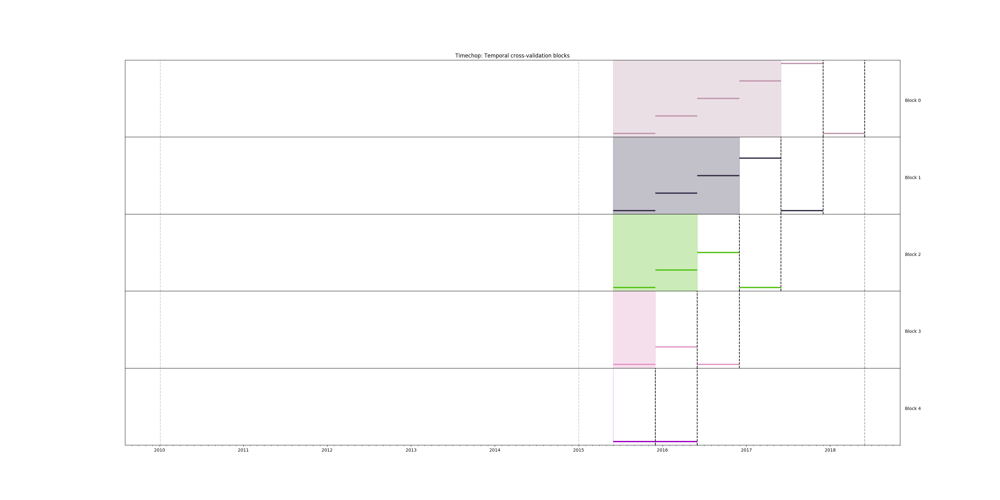
*Figure. Temporal blocks for the inspections baseline experiment*

We need to specify our labels. For this first experiment we will use
the label `failed`, using the same query from the
`simple_skeleton_experiment.yaml`

```yaml
label_config:
  query: |
    select
    entity_id,
    bool_or(result = 'fail')::integer as outcome
    from semantic.events
    where '{as_of_date}'::timestamp <= date
    and date < '{as_of_date}'::timestamp + interval '{label_timespan}'
    group by entity_id
  name: 'failed_inspections'
```

It should be obvious, but let's state it anyway: We are only training
in facilities that **were** inspected, but we will **test** our model
in all the facilities in our cohort[^4]. So, in the train matrices we
will have only `0` and `1` as possible labels, but in the test
matrices we will found `0`, `1` and `NULL`.


!!! warning "I want to learn more about this…"
    In the section regarding to [*Early Warning Systems*](eis.md) we will learn how
    to incorporate *all* the facilities of the cohort in the train
    matrices.

We just want to include **active** facilities in our matrices, so
we tell `triage` to take that in account:

```yaml
cohort_config:
  query: |
    select e.entity_id
    from semantic.entities as e
    where
    daterange(start_time, end_time, '[]') @> '{as_of_date}'::date
  name: 'active_facilities'
```

`Triage` will generate the features for us, but we need to tell it
which features we want in the section `feature_aggregations`. Here,
each entry describes a `collate.SpacetimeAggregation` object and the
arguments needed to create it[^5]. For this experiment, we will use only
one feature (number of inspections). `DummyClassifier` don't use any
feature to do the "prediction", so we won't expend compute cycles
doing the feature/matrix creation:

```yaml
feature_aggregations:
  -
    prefix: 'inspections'
    from_obj: 'semantic.events'
    knowledge_date_column: 'date'

    aggregates_imputation:
      count:
        type: 'zero_noflag'

    aggregates:
       -
        quantity:
          total: "*"
        metrics:
          - 'count'

    intervals: ['all']

    groups:
      - 'entity_id'

feature_group_definition:
   prefix:
     - 'inspections'

feature_group_strategies: ['all']
```

If we observe the image generated from the `temporal_config` section,
each particular date is the beginning of the rectangles that describes
the rows in the matrix. In that date (`as_of_date` in `timechop`
parlance) we will calculate the feature, and we will repeat that for
every other rectangle in that image.

Now, let's discuss how we will specify the models to try (remember
that the model is specified by the algorithm, the hyperparameters, and
the subset of features to use). In `triage` you need to specify in the
`grid_config` section a list of machine learning algorithms that you
want to train and a list of hyperparameters. You can use any algorithm
that you want; the only requirement is that it respects the `sklearn`
API.

```yaml
grid_config:
    'sklearn.dummy.DummyClassifier':
        strategy: [uniform]
```

Finally, we should define wich metrics we care about for evaluating
our model. Here we will concentrate only in `precision` and `recall`
at an specific value \(k\) [^6].

In this setting \(k\) represents the resource’s constraint: It is the
number of inspections that the city could do in a month given all the
inspectors available.

```yaml
scoring:
    testing_metric_groups:
        -
          metrics: [precision@, recall@, 'false negatives@', 'false positives@', 'true positives@', 'true negatives@']
          thresholds:
            percentiles: [1.0, 2.0, 3.0, 4.0, 5.0, 10, 15, 20, 25, 30, 35, 40, 45, 50, 55, 60, 65, 70, 75, 80, 85, 90, 95, 100]
            top_n: [1, 5, 10, 25, 50, 100, 250, 500, 1000]
        -
          metrics: [auc, accuracy]

    training_metric_groups:
      -
        metrics: [auc, accuracy]
      -
        metrics: [precision@, recall@]
        thresholds:
          percentiles: [1.0, 2.0, 3.0, 4.0, 5.0, 10, 15, 20, 25, 30, 35, 40, 45, 50, 55, 60, 65, 70, 75, 80, 85, 90, 95, 100]
          top_n: [1, 5, 10, 25, 50, 100, 250, 500, 1000]
```

You should be warned that precision and recall at \(k\) in this
setting is kind of ill-defined (because you will end with a lot of
`NULL` labels, remember, only a few of facilities are inspected in
each period)[^7].

We will want a **list** of facilities to be inspected. The length of
our list is constrained by our inspection resources, i.e. the answer
to the question *How many facilities can I inspect in a month?* In
this experiment we are assuming that the maximum capacity is **10%**
but we are evaluating for a larger space of possibilities (see
`top_n`, `percentiles` above).

The execution of the experiments can take a long time, so it is a good
practice to *validate* the configuration file *before* running the
model. You don't want to wait for hours (or days) and then discover
that something went wrong.

```sh

# Remember to run this in bastion  NOT in your laptop shell!
triage experiment experiments/inspections_baseline.yaml  --validate-only
```

If everything was ok, you should see an `Experiment validation ran to completion with no errors`.

You can execute the experiment as[^8]

```sh
# Remember to run this in bastion  NOT in your laptop shell!
time triage experiment experiments/inspections_baseline.yaml
```

!!! tip "Protip"

    We are including the command `time` in order to get the total
    running time of the experiment. You can remove it, if you like.

!!! warning "Don’t be scared!"
    This will print a lot of output! It is not an error!

We can query the table `experiments` to see the quantity of work that
`triage` needs to do

```sql
select
    substring(experiment_hash, 1,4) as experiment,
    config -> 'user_metadata' ->> 'description'  as description,
    total_features,
    matrices_needed,
    models_needed
from triage_metadata.experiments;
```

  experiment  | description | total_features | matrices_needed | models_needed
----------------|---------------|----------------|-----------------|-----------------------
 e912 | "Baseline calculation\n" |  1 |              10 |             5


If everything is correct, `triage`  will
create **10** matrices (5 for training, 5 for testing) in
`triage/matrices` and every matrix will be represented by two files,
one with the metadata of the matrix (a `yaml` file) and one with the
actual matrix (the `gz` file).

```sh

# We will use some bash magic

ls matrices | awk -F . '{print $NF}' | sort | uniq -c
```

`Triage` also will store **5** trained models in `triage/trained_models`:

```sh
ls trained_models | wc -l
```

And it will populate the `results` schema in the database. As
mentioned, we will get **1** *model groups*:

```sql
select
    model_group_id,
    model_type,
    hyperparameters
from
    triage_metadata.model_groups
where
    model_config ->> 'experiment_type' ~ 'inspection'
```

 model\_group\_id |          model\_type           |    hyperparameters
----------------|-------------------------------|-----------------------
             1 | sklearn.dummy.DummyClassifier | {"strategy": "prior"}


And **5** *models*:

```sql
select
    model_group_id,
    array_agg(model_id) as models,
    array_agg(train_end_time::date) as train_end_times
from
    triage_metadata.models
where
    model_comment ~ 'inspection'
group by
    model_group_id
order by
    model_group_id;
```

 model\_group\_id |        models         |                                                 train\_end\_times
----------------|-----------------------|-----------------------------------------------------------------------------------------------------------------
             1 | {1,2,3,4,5} | {2015-12-01,2016-06-01,2016-12-01,2017-06-01,2017-12-01}


From that last query, you should note that the order in which `triage`
trains the models is from oldest to newest `train_end_time` and
`model_group` , also in ascending order. It will not go to the next
block until all the *models groups* are trained.

You can check on which matrix each models were trained:

```sql
select
    model_group_id,
    model_id, train_end_time::date,
    substring(model_hash,1,5) as model_hash,
    substring(train_matrix_uuid,1,5) as train_matrix_uuid,
    ma.num_observations as observations,
    ma.lookback_duration as feature_lookback_duration,  ma.feature_start_time
from
    triage_metadata.models as mo
    join
    triage_metadata.matrices as ma
    on train_matrix_uuid = matrix_uuid
where
    mo.model_comment ~ 'inspection'
order by
    model_group_id,
    train_end_time asc;
```

 model\_group\_id | model\_id | train\_end\_time | model\_hash | train\_matrix\_uuid | observations | feature\_lookback\_duration | feature\_start\_time
----------------|----------|----------------|------------|-------------------|--------------|---------------------------|---------------------
             1 |      1 | 2015-12-01     | 743a6      | 1c266             |         5790 | 5 years                   | 2010-01-04 00:00:00
             1 |      2 | 2016-06-01     | 5b656      | 755c6             |        11502 | 5 years                   | 2010-01-04 00:00:00
             1 |      3 | 2016-12-01     | 5c170      | 2aea8             |        17832 | 5 years                   | 2010-01-04 00:00:00
             1 |      4 | 2017-06-01     | 55c3e      | 3efdc             |        23503 | 5 years                   | 2010-01-04 00:00:00
             1 |      5 | 2017-12-01     | ac993      | a3762             |        29112 | 5 years                   | 2010-01-04 00:00:00


Each model was
trained with the matrix indicated in the column
`train_matrix_uuid`. This `uuid` is the file name of the stored
matrix. The model itself was stored under the file named with the
`model_hash`.

If you want to see in which matrix the model was *tested* you need to run the following query

```sql
select distinct
    model_id,
    model_group_id, train_end_time::date,
    substring(model_hash,1,5) as model_hash,
    substring(ev.matrix_uuid,1,5) as test_matrix_uuid,
    ma.num_observations as observations
from
    triage_metadata.models as mo
    join
    test_results.evaluations as ev using (model_id)
    join
    triage_metadata.matrices as ma on ev.matrix_uuid = ma.matrix_uuid
where
    mo.model_comment ~ 'inspection'
order by
    model_group_id, train_end_time asc;
```

 model\_id | model\_group\_id | train\_end\_time | model\_hash | test\_matrix\_uuid | observations
----------|----------------|----------------|------------|------------------|--------------
      1 |             1 | 2015-12-01     | 743a6      | 4a0ea            |        18719
      2 |             1 | 2016-06-01     | 5b656      | f908e            |        19117
      3 |             1 | 2016-12-01     | 5c170      | 00a88            |        19354
      4 |             1 | 2017-06-01     | 55c3e      | 8f3cf            |        19796
      5 |             1 | 2017-12-01     | ac993      | 417f0            |        20159


All the models were stored in `/triage/trained_models/{model_hash}`
using the standard serialization of sklearn models. Every model was
trained with the matrix `train_matrix_uuid` stored in the directory
`/triage/matrices`.

What's the performance of this model groups?

```sql
\set k 0.10    -- This defines a variable, "k = 0.10"

select distinct
    model_group_id,
    model_id,
    ma.feature_start_time::date,
    train_end_time::date,
    ev.evaluation_start_time::date,
    ev.evaluation_end_time::date,
    to_char(ma.num_observations, '999,999') as observations,
    to_char(ev.num_labeled_examples, '999,999') as "total labeled examples",
    to_char(ev.num_positive_labels, '999,999') as "total positive labels",
    to_char(ev.num_labeled_above_threshold, '999,999') as "labeled examples@k%",
    to_char(:k * ma.num_observations, '999,999') as "predicted positive (PP)",
    ARRAY[to_char(ev.best_value * ev.num_labeled_above_threshold,'999,999'),
          to_char(ev.worst_value * ev.num_labeled_above_threshold,'999,999'),
          to_char(ev.stochastic_value * ev.num_labeled_above_threshold, '999,999')]
    as "true positive (TP)@k% (best,worst,stochastic)",
    ARRAY[ to_char(ev.best_value, '0.999'), to_char(ev.worst_value, '0.999'),
    to_char(ev.stochastic_value, '0.999')]  as "precision@k% (best,worst,stochastic)",
    to_char(ev.num_positive_labels*1.0 / ev.num_labeled_examples, '0.999') as baserate,
    :k * 100 as "k%"
from
    triage_metadata.models as mo
    join
    test_results.evaluations as ev using (model_id)
    join
    triage_metadata.matrices as ma on ev.matrix_uuid = ma.matrix_uuid
where
    ev.metric || ev.parameter = 'precision@15_pct'
    and
    mo.model_comment ~ 'inspection'
order by
    model_id, train_end_time asc;
order by
    model_id, train_end_time asc;
```

 model\_group\_id | model\_id | feature\_start\_time | train\_end\_time | evaluation\_start\_time | evaluation\_end\_time | observations | total labeled examples | total positive labels | labeled examples@k% | predicted positive (PP) | true positive (TP)@k% (best,worst,stochastic) | precision@k% (best,worst,stochastic) | baserate |  k%
----------------|----------|--------------------|----------------|-----------------------|---------------------|--------------|------------------------|-----------------------|---------------------|-------------------------|-----------------------------------------------|--------------------------------------|----------|-------
             21 |      121 | 2010-01-04         | 2015-12-01     | 2015-12-01            | 2015-12-01          |   18,719     |    5,712               |    1,509              |        0            |    2,808                | {"       0","       0","       0"}            | {" 0.000"," 0.000"," 0.000"}         |  0.264   | 15.00
             21 |      122 | 2010-01-04         | 2016-06-01     | 2016-06-01            | 2016-06-01          |   19,117     |    6,330               |    1,742              |        0            |    2,868                | {"       0","       0","       0"}            | {" 0.000"," 0.000"," 0.000"}         |  0.275   | 15.00
             21 |      123 | 2010-01-04         | 2016-12-01     | 2016-12-01            | 2016-12-01          |   19,354     |    5,671               |    1,494              |        0            |    2,903                | {"       0","       0","       0"}            | {" 0.000"," 0.000"," 0.000"}         |  0.263   | 15.00
             21 |      124 | 2010-01-04         | 2017-06-01     | 2017-06-01            | 2017-06-01          |   19,796     |    5,609               |    1,474              |        0            |    2,969                | {"       0","       0","       0"}            | {" 0.000"," 0.000"," 0.000"}         |  0.263   | 15.00
             21 |      125 | 2010-01-04         | 2017-12-01     | 2017-12-01            | 2017-12-01          |   20,159     |    4,729               |    1,260              |        0            |    3,024                | {"       0","       0","       0"}            | {" 0.000"," 0.000"," 0.000"}         |  0.266   | 15.00

The columns `num_labeled_examples, num_labeled_above_threshold,
num_positive_labels` represent the number of selected entities on the
prediction date that are labeled, the number of entities with a
positive label above the threshold, and the number of entities with
positive labels among all the labeled entities respectively.

We added some extra columns: `baserate`, `predicted positive (PP)`
and `true positive (TP)`. *Baserate* represents the proportion of the
all the facilities that were inspected that failed the inspection,
i.e. \(P(V|I)\). The `PP` and `TP` are approximate since it were
calculated using the value of \(k\) or the precision value. But you could get the exact value
of those from the `test_results.predictions` table.

Also note that in the `precision@k%` column we are showing three
numbers: **best**, **worst**, **stochastic**.

They try to answer the question *How do you break ties in the
prediction score?* This is important because it will affect the
calculation of your metrics. The `Triage` proposed solution to this is calculate the metric in the *best case
scenario* (score descending, all the true labels are at the top), and then do it in the *worst
case scenario* (score descending, all the true labels are at the
bottom) and then
calculate the metric several times ($n=30$) with the labels randomly shuffled
(a.k.a. *stochastic scenario*), so you
get the mean metric, plus some confidence intervals.

This problem is not specific of an inspection problem, is more related to
simple models like a shallow `Decision Tree` or a `Dummy Classifier`
when score ties likely will occur.


Note how in this model, the stochastic value is close to the
*baserate*, since we are selecting at random using the *prior*.

!!! info "Check this!"
    Note that the *baserate* should be equal to the *precision@100%*, if is not there is something wrong …

### Creating a simple experiment

We will try two of the simplest machine learning algorithms: a
**Decision Tree Classifier** (*DT*) and a  **Scaled Logistic
Regression** (*SLR*)[^12] as a second experiment. The
rationale of this is that the DT is very fast to train (so it will
help us to verify that the experiment configuration is correct without
waiting for a long time) and it helps you to understand the structure
of your data.

The config file for this first experiment is located in `/triage/experiments/inspections_dt.yaml`

Note that we don't modify the `temporal_config` section neither the
`feature_aggregations`, `cohort_config` or `label_config`. Triage is
smart enough to use the previous tables and matrices instead of
generating them from scratch.

```yaml
config_version: 'v7'

model_comment: 'inspections: basic ML'

user_metadata:
  label_definition: 'failed'
  experiment_type: 'inspections prioritization'
  file_name: 'inspections_dt.yaml'
  description: |
    DT and SLR
  purpose: 'data mining'
  org: 'DSaPP'
  team: 'Tutorial'
  author: 'Your name here'
  etl_date: '2019-02-21'

```

Note that we don't modify the `temporal_config` section neither the
`cohort_config` or `label_config`. Triage is smart enough to use the
previous tables and matrices instead of generating them from scratch.

For this experiment, we will add the following features:

-   Number of different types of inspections the facility had in the last year (calculated for an *as-of-date*).

-   Number of different types of inspections that happened in the zip code in the last year from a particular day.

-   Number of inspections

-   Number/proportion of inspections by result type

-   Number/proportion of times that a facility was classify with particular risk level

In all of them we will do the aggregation in the last month, 3 months,
6 months, 1 year and historically. Remember that all this refers to
events in the past, i.e. *How many times the facility was marked with
high risk in the previous 3 Months?*, *What is the proportion of
failed inspections in the previous year?*

```yaml
feature_aggregations:
  -
    prefix: 'inspections'
    from_obj: 'semantic.events'
    knowledge_date_column: 'date'

    aggregates_imputation:
      count:
        type: 'zero_noflag'

    aggregates:
      -
        quantity:
          total: "*"
        metrics:
          - 'count'

    intervals: ['1month', '3month', '6month', '1y', 'all']

    groups:
      - 'entity_id'

  -
    prefix: 'risks'
    from_obj: 'semantic.events'
    knowledge_date_column: 'date'

    categoricals_imputation:
      sum:
        type: 'zero'
      avg:
        type: 'zero'

    categoricals:
      -
        column: 'risk'
        choices: ['low', 'medium', 'high']
        metrics:
          - 'sum'
          - 'avg'

    intervals: ['1month', '3month', '6month', '1y', 'all']

    groups:
      - 'entity_id'
      - 'zip_code'

  -
    prefix: 'results'
    from_obj: 'semantic.events'
    knowledge_date_column: 'date'

    categoricals_imputation:
      all:
        type: 'zero'

    categoricals:
      -
        column: 'result'
        choice_query: 'select distinct result from semantic.events'
        metrics:
          - 'sum'
          - 'avg'

    intervals: ['1month', '3month', '6month', '1y', 'all']

    groups:
      - 'entity_id'

  -
    prefix: 'inspection_types'
    from_obj: 'semantic.events'
    knowledge_date_column: 'date'

    categoricals_imputation:
      sum:
        type: 'zero_noflag'

    categoricals:
      -
        column: 'type'
        choice_query: 'select distinct type from semantic.events where type is not null'
        metrics:
          - 'sum'

    intervals: ['1month', '3month', '6month', '1y', 'all']

    groups:
      - 'entity_id'
      - 'zip_code'

```

And as stated, we will train some Decision Trees, in particular we are
interested in some shallow trees, and in a full grown tree. These trees
will show you the structure of your data. We also will train some Scaled
Logistic Regression, this will show us how "linear" is the data (or how
the assumptions of the Logistic Regression holds in this data)

```yaml
grid_config:
  'sklearn.tree.DecisionTreeClassifier':
        criterion: ['gini']
        max_features: ['sqrt']
        max_depth: [1, 2, 5,~]
        min_samples_split: [2,10,50]

  'triage.component.catwalk.estimators.classifiers.ScaledLogisticRegression':
        penalty: ['l1','l2']
        C: [0.000001, 0.0001, 0.01,  1.0]

```

!!! info "About `yaml` and `sklearn`"
    Some of the parameters in `sklearn` are `None`. If you want to try
    those you need to indicate it with `yaml`'s `null` or `~` keyword.

Besides the algorithm and the hyperparameters, you should specify
which subset of features use. First, in the section
`feature_group_definition` you specify how to group the features (you
can use the `table name` or the `prefix` from the section
`feature_aggregation`) and then a *strategy* for choosing the subsets:
`all` (all the subsets at once), `leave-one-out` (try all the subsets
except one, do that for all the combinations), or `leave-one-in` (just
try subset at the time).

```yaml
feature_group_definition:
   prefix:
     - 'inspections'
     - 'results'
     - 'risks'
     - 'inspection_types'

feature_group_strategies: ['all']
```

Finally we will leave the `scoring` section as before.

In this experiment we will end with **6** model groups (number of
algorithms [1] \(\times\) number of hyperparameter combinations [2
\(\times\) 3 = 5] \(\times\) number of feature groups strategies
[1]]). Also, we will create **18** models (3 per model group) given
that we have 3 temporal blocks (one model per temporal group).

Before running the experiment, remember to validate that the configuration is correct:

```sh

# Remember to run this in bastion  NOT in your laptop shell!
triage experiment experiments/inspections_dt.yaml  --validate-only
```

and check the temporal cross validation:

```sh

# Remember to run this in bastion  NOT in your laptop shell!
triage experiment experiments/inspections_dt.yaml --show-timechop
```


*Temporal blocks for inspections experiment. The label is a failed inspection in the next year.*

You can execute the experiment like this:

```sh
# Remember to run this in bastion  NOT in your laptop shell!
time triage experiment experiments/inspections_dt.yaml
```

Again, we can run the following `sql` to see which things `triage`
needs to run:

```sql
select
    substring(experiment_hash, 1,4) as experiment,
    config -> 'user_metadata' ->> 'description'  as description,
    total_features,
    matrices_needed,
    models_needed
from triage_metadata.experiments;
```


 experiment |     description      | total_features | matrices_needed | models_needed
------------|----------------------|----------------|-----------------|---------------
 e912       | Baseline calculation|              1 |              10 |             5
 b535       | DT and SLR          |            201 |              10 |           100


You can compare our two experiments and there are several differences,
mainly in the order of magnitude. Like the number of features (1 vs
201) and models built (5 vs 100).

The After the experiment finishes, you will get **19** new `model_groups` (1 per combination in `grid_config`)

```sql
select
    model_group_id,
    model_type,
    hyperparameters
from
    triage_metadata.model_groups
where
    model_group_id not in (1);
```

model\_group\_id |             model\_type              |               hyperparameters
----------------|-------------------------------------|---------------------------------------------
              2 | sklearn.tree.DecisionTreeClassifier                                      | {"criterion": "gini", "max_depth": 1, "max_features": "sqrt", "min_samples_split": 2}
              3 | sklearn.tree.DecisionTreeClassifier                                      | {"criterion": "gini", "max_depth": 1, "max_features": "sqrt", "min_samples_split": 10}
              4 | sklearn.tree.DecisionTreeClassifier                                      | {"criterion": "gini", "max_depth": 1, "max_features": "sqrt", "min_samples_split": 50}
              5 | sklearn.tree.DecisionTreeClassifier                                      | {"criterion": "gini", "max_depth": 2, "max_features": "sqrt", "min_samples_split": 2}
              6 | sklearn.tree.DecisionTreeClassifier                                      | {"criterion": "gini", "max_depth": 2, "max_features": "sqrt", "min_samples_split": 10}
              7 | sklearn.tree.DecisionTreeClassifier                                      | {"criterion": "gini", "max_depth": 2, "max_features": "sqrt", "min_samples_split": 50}
              8 | sklearn.tree.DecisionTreeClassifier                                      | {"criterion": "gini", "max_depth": 5, "max_features": "sqrt", "min_samples_split": 2}
              9 | sklearn.tree.DecisionTreeClassifier                                      | {"criterion": "gini", "max_depth": 5, "max_features": "sqrt", "min_samples_split": 10}
             10 | sklearn.tree.DecisionTreeClassifier                                      | {"criterion": "gini", "max_depth": 5, "max_features": "sqrt", "min_samples_split": 50}
             11 | sklearn.tree.DecisionTreeClassifier                                      | {"criterion": "gini", "max_depth": null, "max_features": "sqrt", "min_samples_split": 2}
             12 | sklearn.tree.DecisionTreeClassifier                                      | {"criterion": "gini", "max_depth": null, "max_features": "sqrt", "min_samples_split": 10}
             13 | sklearn.tree.DecisionTreeClassifier                                      | {"criterion": "gini", "max_depth": null, "max_features": "sqrt", "min_samples_split": 50}
             14 | triage.component.catwalk.estimators.classifiers.ScaledLogisticRegression | {"C": 0.000001, "penalty": "l1"}
             15 | triage.component.catwalk.estimators.classifiers.ScaledLogisticRegression | {"C": 0.000001, "penalty": "l2"}
             16 | triage.component.catwalk.estimators.classifiers.ScaledLogisticRegression | {"C": 0.0001, "penalty": "l1"}
             17 | triage.component.catwalk.estimators.classifiers.ScaledLogisticRegression | {"C": 0.0001, "penalty": "l2"}
             18 | triage.component.catwalk.estimators.classifiers.ScaledLogisticRegression | {"C": 0.01, "penalty": "l1"}
             19 | triage.component.catwalk.estimators.classifiers.ScaledLogisticRegression | {"C": 0.01, "penalty": "l2"}
             20 | triage.component.catwalk.estimators.classifiers.ScaledLogisticRegression | {"C": 1.0, "penalty": "l1"}
             21 | triage.component.catwalk.estimators.classifiers.ScaledLogisticRegression | {"C": 1.0, "penalty": "l2"}

and **100** models (as stated before)

```sql
select
    model_group_id,
    array_agg(model_id) as models,
    array_agg(train_end_time) as train_end_times
from
    triage_metadata.models
where
    model_group_id not in (1)
group by
    model_group_id
order by
    model_group_id;
```

 model\_group\_id |  models   |                           train\_end\_times
----------------|-----------|---------------------------------------------------------------------
              2 | {6,26,46,66,86}                           | {"2015-12-01 00:00:00","2016-06-01 00:00:00","2016-12-01 00:00:00","2017-06-01 00:00:00","2017-12-01 00:00:00"}
              3 | {7,27,47,67,87}                           | {"2015-12-01 00:00:00","2016-06-01 00:00:00","2016-12-01 00:00:00","2017-06-01 00:00:00","2017-12-01 00:00:00"}
              4 | {8,28,48,68,88}                           | {"2015-12-01 00:00:00","2016-06-01 00:00:00","2016-12-01 00:00:00","2017-06-01 00:00:00","2017-12-01 00:00:00"}
              5 | {9,29,49,69,89}                           | {"2015-12-01 00:00:00","2016-06-01 00:00:00","2016-12-01 00:00:00","2017-06-01 00:00:00","2017-12-01 00:00:00"}
              6 | {10,30,50,70,90}                          | {"2015-12-01 00:00:00","2016-06-01 00:00:00","2016-12-01 00:00:00","2017-06-01 00:00:00","2017-12-01 00:00:00"}
              7 | {11,31,51,71,91}                          | {"2015-12-01 00:00:00","2016-06-01 00:00:00","2016-12-01 00:00:00","2017-06-01 00:00:00","2017-12-01 00:00:00"}
              8 | {12,32,52,72,92}                          | {"2015-12-01 00:00:00","2016-06-01 00:00:00","2016-12-01 00:00:00","2017-06-01 00:00:00","2017-12-01 00:00:00"}
              9 | {13,33,53,73,93}                          | {"2015-12-01 00:00:00","2016-06-01 00:00:00","2016-12-01 00:00:00","2017-06-01 00:00:00","2017-12-01 00:00:00"}
             10 | {14,34,54,74,94}                          | {"2015-12-01 00:00:00","2016-06-01 00:00:00","2016-12-01 00:00:00","2017-06-01 00:00:00","2017-12-01 00:00:00"}
             11 | {15,35,55,75,95}                          | {"2015-12-01 00:00:00","2016-06-01 00:00:00","2016-12-01 00:00:00","2017-06-01 00:00:00","2017-12-01 00:00:00"}
             12 | {16,36,56,76,96}                          | {"2015-12-01 00:00:00","2016-06-01 00:00:00","2016-12-01 00:00:00","2017-06-01 00:00:00","2017-12-01 00:00:00"}
             13 | {17,37,57,77,97}                          | {"2015-12-01 00:00:00","2016-06-01 00:00:00","2016-12-01 00:00:00","2017-06-01 00:00:00","2017-12-01 00:00:00"}
             14 | {18,38,58,78,98}                          | {"2015-12-01 00:00:00","2016-06-01 00:00:00","2016-12-01 00:00:00","2017-06-01 00:00:00","2017-12-01 00:00:00"}
             15 | {19,39,59,79,99}                          | {"2015-12-01 00:00:00","2016-06-01 00:00:00","2016-12-01 00:00:00","2017-06-01 00:00:00","2017-12-01 00:00:00"}
             16 | {20,40,60,80,100}                         | {"2015-12-01 00:00:00","2016-06-01 00:00:00","2016-12-01 00:00:00","2017-06-01 00:00:00","2017-12-01 00:00:00"}
             17 | {21,41,61,81,101}                         | {"2015-12-01 00:00:00","2016-06-01 00:00:00","2016-12-01 00:00:00","2017-06-01 00:00:00","2017-12-01 00:00:00"}
             18 | {22,42,62,82,102}                         | {"2015-12-01 00:00:00","2016-06-01 00:00:00","2016-12-01 00:00:00","2017-06-01 00:00:00","2017-12-01 00:00:00"}
             19 | {23,43,63,83,103}                         | {"2015-12-01 00:00:00","2016-06-01 00:00:00","2016-12-01 00:00:00","2017-06-01 00:00:00","2017-12-01 00:00:00"}
             20 | {24,44,64,84,104}                         | {"2015-12-01 00:00:00","2016-06-01 00:00:00","2016-12-01 00:00:00","2017-06-01 00:00:00","2017-12-01 00:00:00"}
             21 | {25,45,65,85,105}                         | {"2015-12-01 00:00:00","2016-06-01 00:00:00","2016-12-01 00:00:00","2017-06-01 00:00:00","2017-12-01 00:00:00"}


Let's see the performance over time of the models so far:

```sql
select
    model_group_id,
    array_agg(model_id order by ev.evaluation_start_time asc) as models,
    array_agg(ev.evaluation_start_time::date order by ev.evaluation_start_time asc) as evaluation_start_time,
    array_agg(ev.evaluation_end_time::date order by ev.evaluation_start_time asc) as evaluation_end_time,
    array_agg(to_char(ev.num_labeled_examples, '999,999') order by ev.evaluation_start_time asc) as labeled_examples,
    array_agg(to_char(ev.num_labeled_above_threshold, '999,999') order by ev.evaluation_start_time asc) as labeled_above_threshold,
    array_agg(to_char(ev.num_positive_labels, '999,999') order by ev.evaluation_start_time asc) as total_positive_labels,
    array_agg(to_char(ev.stochastic_value, '0.999') order by ev.evaluation_start_time asc) as "precision@15%"
from
    triage_metadata.models as mo
    inner join
    triage_metadata.model_groups as mg using(model_group_id)
    inner join
    test_results.evaluations  as ev using(model_id)
where
     mg.model_config ->> 'experiment_type' ~ 'inspection'
     and
     ev.metric||ev.parameter = 'precision@15_pct'
     and model_group_id between 2 and 21
group by
    model_group_id
```


 model\_group\_id |  models   |       evaluation\_start\_time        |        evaluation\_end\_time         |          labeled\_examples          |      labeled\_above\_threshold       |       total\_positive\_labels        |        precision@15%
----------------|-----------|------------------------------------|------------------------------------|------------------------------------|------------------------------------|------------------------------------|------------------------------
              1 | {1,2,3,4,5}       | {2015-12-01,2016-06-01,2016-12-01,2017-06-01,2017-12-01} | {2015-12-01,2016-06-01,2016-12-01,2017-06-01,2017-12-01} | {"   5,712","   6,330","   5,671","   5,609","   4,729"} | {"       0","       0","       0","       0","       0"} | {"   1,509","   1,742","   1,494","   1,474","   1,260"} | {" 0.000"," 0.000"," 0.000"," 0.000"," 0.000"}
              2 | {6,26,46,66,86}   | {2015-12-01,2016-06-01,2016-12-01,2017-06-01,2017-12-01} | {2015-12-01,2016-06-01,2016-12-01,2017-06-01,2017-12-01} | {"   5,712","   6,330","   5,671","   5,609","   4,729"} | {"       0","     578","     730","     574","       0"} | {"   1,509","   1,742","   1,494","   1,474","   1,260"} | {" 0.000"," 0.352"," 0.316"," 0.315"," 0.000"}
              3 | {7,27,47,67,87}   | {2015-12-01,2016-06-01,2016-12-01,2017-06-01,2017-12-01} | {2015-12-01,2016-06-01,2016-12-01,2017-06-01,2017-12-01} | {"   5,712","   6,330","   5,671","   5,609","   4,729"} | {"     161","     622","       0","     433","       0"} | {"   1,509","   1,742","   1,494","   1,474","   1,260"} | {" 0.283"," 0.203"," 0.000"," 0.282"," 0.000"}
              4 | {8,28,48,68,88}   | {2015-12-01,2016-06-01,2016-12-01,2017-06-01,2017-12-01} | {2015-12-01,2016-06-01,2016-12-01,2017-06-01,2017-12-01} | {"   5,712","   6,330","   5,671","   5,609","   4,729"} | {"     161","   1,171","       0","       0","     995"} | {"   1,509","   1,742","   1,494","   1,474","   1,260"} | {" 0.285"," 0.348"," 0.000"," 0.000"," 0.306"}
              5 | {9,29,49,69,89}   | {2015-12-01,2016-06-01,2016-12-01,2017-06-01,2017-12-01} | {2015-12-01,2016-06-01,2016-12-01,2017-06-01,2017-12-01} | {"   5,712","   6,330","   5,671","   5,609","   4,729"} | {"     726","   1,318","     362","     489","     291"} | {"   1,509","   1,742","   1,494","   1,474","   1,260"} | {" 0.306"," 0.360"," 0.213"," 0.294"," 0.241"}
              6 | {10,30,50,70,90}  | {2015-12-01,2016-06-01,2016-12-01,2017-06-01,2017-12-01} | {2015-12-01,2016-06-01,2016-12-01,2017-06-01,2017-12-01} | {"   5,712","   6,330","   5,671","   5,609","   4,729"} | {"     992","     730","       0","     176","     290"} | {"   1,509","   1,742","   1,494","   1,474","   1,260"} | {" 0.294"," 0.349"," 0.000"," 0.324"," 0.334"}
              7 | {11,31,51,71,91}  | {2015-12-01,2016-06-01,2016-12-01,2017-06-01,2017-12-01} | {2015-12-01,2016-06-01,2016-12-01,2017-06-01,2017-12-01} | {"   5,712","   6,330","   5,671","   5,609","   4,729"} | {"   1,023","     325","     329","     176","   1,033"} | {"   1,509","   1,742","   1,494","   1,474","   1,260"} | {" 0.323"," 0.400"," 0.347"," 0.323"," 0.315"}
              8 | {12,32,52,72,92}  | {2015-12-01,2016-06-01,2016-12-01,2017-06-01,2017-12-01} | {2015-12-01,2016-06-01,2016-12-01,2017-06-01,2017-12-01} | {"   5,712","   6,330","   5,671","   5,609","   4,729"} | {"   1,250","   1,013","     737","   1,104","     939"} | {"   1,509","   1,742","   1,494","   1,474","   1,260"} | {" 0.331"," 0.280"," 0.327"," 0.335"," 0.365"}
              9 | {13,33,53,73,93}  | {2015-12-01,2016-06-01,2016-12-01,2017-06-01,2017-12-01} | {2015-12-01,2016-06-01,2016-12-01,2017-06-01,2017-12-01} | {"   5,712","   6,330","   5,671","   5,609","   4,729"} | {"     595","     649","     547","   1,000","     841"} | {"   1,509","   1,742","   1,494","   1,474","   1,260"} | {" 0.281"," 0.250"," 0.309"," 0.350"," 0.356"}
             10 | {14,34,54,74,94}  | {2015-12-01,2016-06-01,2016-12-01,2017-06-01,2017-12-01} | {2015-12-01,2016-06-01,2016-12-01,2017-06-01,2017-12-01} | {"   5,712","   6,330","   5,671","   5,609","   4,729"} | {"   1,012","     887","     856","     387","     851"} | {"   1,509","   1,742","   1,494","   1,474","   1,260"} | {" 0.345"," 0.339"," 0.342"," 0.248"," 0.327"}
             11 | {15,35,55,75,95}  | {2015-12-01,2016-06-01,2016-12-01,2017-06-01,2017-12-01} | {2015-12-01,2016-06-01,2016-12-01,2017-06-01,2017-12-01} | {"   5,712","   6,330","   5,671","   5,609","   4,729"} | {"       0","       0","       0","       0","       0"} | {"   1,509","   1,742","   1,494","   1,474","   1,260"} | {" 0.000"," 0.000"," 0.000"," 0.000"," 0.000"}
             12 | {16,36,56,76,96}  | {2015-12-01,2016-06-01,2016-12-01,2017-06-01,2017-12-01} | {2015-12-01,2016-06-01,2016-12-01,2017-06-01,2017-12-01} | {"   5,712","   6,330","   5,671","   5,609","   4,729"} | {"   1,094","   1,033","     878","     880","     842"} | {"   1,509","   1,742","   1,494","   1,474","   1,260"} | {" 0.278"," 0.332"," 0.285"," 0.311"," 0.299"}
             13 | {17,37,57,77,97}  | {2015-12-01,2016-06-01,2016-12-01,2017-06-01,2017-12-01} | {2015-12-01,2016-06-01,2016-12-01,2017-06-01,2017-12-01} | {"   5,712","   6,330","   5,671","   5,609","   4,729"} | {"     995","   1,117","     987","     623","     651"} | {"   1,509","   1,742","   1,494","   1,474","   1,260"} | {" 0.313"," 0.324"," 0.320"," 0.318"," 0.299"}
             14 | {18,38,58,78,98}  | {2015-12-01,2016-06-01,2016-12-01,2017-06-01,2017-12-01} | {2015-12-01,2016-06-01,2016-12-01,2017-06-01,2017-12-01} | {"   5,712","   6,330","   5,671","   5,609","   4,729"} | {"       0","       0","       0","       0","       0"} | {"   1,509","   1,742","   1,494","   1,474","   1,260"} | {" 0.000"," 0.000"," 0.000"," 0.000"," 0.000"}
             15 | {19,39,59,79,99}  | {2015-12-01,2016-06-01,2016-12-01,2017-06-01,2017-12-01} | {2015-12-01,2016-06-01,2016-12-01,2017-06-01,2017-12-01} | {"   5,712","   6,330","   5,671","   5,609","   4,729"} | {"     771","     582","     845","     570","     625"} | {"   1,509","   1,742","   1,494","   1,474","   1,260"} | {" 0.246"," 0.227"," 0.243"," 0.244"," 0.232"}
             16 | {20,40,60,80,100} | {2015-12-01,2016-06-01,2016-12-01,2017-06-01,2017-12-01} | {2015-12-01,2016-06-01,2016-12-01,2017-06-01,2017-12-01} | {"   5,712","   6,330","   5,671","   5,609","   4,729"} | {"       0","       0","       0","       0","       0"} | {"   1,509","   1,742","   1,494","   1,474","   1,260"} | {" 0.000"," 0.000"," 0.000"," 0.000"," 0.000"}
             17 | {21,41,61,81,101} | {2015-12-01,2016-06-01,2016-12-01,2017-06-01,2017-12-01} | {2015-12-01,2016-06-01,2016-12-01,2017-06-01,2017-12-01} | {"   5,712","   6,330","   5,671","   5,609","   4,729"} | {"     783","     587","     813","     586","     570"} | {"   1,509","   1,742","   1,494","   1,474","   1,260"} | {" 0.250"," 0.235"," 0.253"," 0.259"," 0.253"}
             18 | {22,42,62,82,102} | {2015-12-01,2016-06-01,2016-12-01,2017-06-01,2017-12-01} | {2015-12-01,2016-06-01,2016-12-01,2017-06-01,2017-12-01} | {"   5,712","   6,330","   5,671","   5,609","   4,729"} | {"     551","     649","     588","     552","     444"} | {"   1,509","   1,742","   1,494","   1,474","   1,260"} | {" 0.310"," 0.336"," 0.355"," 0.330"," 0.372"}
             19 | {23,43,63,83,103} | {2015-12-01,2016-06-01,2016-12-01,2017-06-01,2017-12-01} | {2015-12-01,2016-06-01,2016-12-01,2017-06-01,2017-12-01} | {"   5,712","   6,330","   5,671","   5,609","   4,729"} | {"   1,007","     776","     818","     784","     725"} | {"   1,509","   1,742","   1,494","   1,474","   1,260"} | {" 0.343"," 0.409"," 0.373"," 0.366"," 0.421"}
             20 | {24,44,64,84,104} | {2015-12-01,2016-06-01,2016-12-01,2017-06-01,2017-12-01} | {2015-12-01,2016-06-01,2016-12-01,2017-06-01,2017-12-01} | {"   5,712","   6,330","   5,671","   5,609","   4,729"} | {"     797","     971","     887","     770","     745"} | {"   1,509","   1,742","   1,494","   1,474","   1,260"} | {" 0.311"," 0.355"," 0.347"," 0.395"," 0.431"}
             21 | {25,45,65,85,105} | {2015-12-01,2016-06-01,2016-12-01,2017-06-01,2017-12-01} | {2015-12-01,2016-06-01,2016-12-01,2017-06-01,2017-12-01} | {"   5,712","   6,330","   5,671","   5,609","   4,729"} | {"     943","     953","     837","     730","     699"} | {"   1,509","   1,742","   1,494","   1,474","   1,260"} | {" 0.320"," 0.363"," 0.349"," 0.397"," 0.429"}

Which model in production (*model selection*) is something that we
will review later, with `Audition`, but for now, let's choose the
model group `3` and see the `predictions` table:

```sql
select
    model_id,
    entity_id,
    as_of_date::date,
    round(score,2),
    label_value as label
from
    test_results.predictions
where
    model_id = 11
order by as_of_date asc, score desc
limit 20
```

 model\_id | entity\_id | as\_of\_date | round | label
----------|-----------|------------|-------|-------
       11 |     26873 | 2015-06-01 |  0.49 |
       11 |     26186 | 2015-06-01 |  0.49 |
       11 |     25885 | 2015-06-01 |  0.49 |
       11 |     24831 | 2015-06-01 |  0.49 |
       11 |     24688 | 2015-06-01 |  0.49 |
       11 |     21485 | 2015-06-01 |  0.49 |
       11 |     20644 | 2015-06-01 |  0.49 |
       11 |     20528 | 2015-06-01 |  0.49 |
       11 |     19531 | 2015-06-01 |  0.49 |
       11 |     18279 | 2015-06-01 |  0.49 |
       11 |     17853 | 2015-06-01 |  0.49 |
       11 |     17642 | 2015-06-01 |  0.49 |
       11 |     16360 | 2015-06-01 |  0.49 |
       11 |     15899 | 2015-06-01 |  0.49 |
       11 |     15764 | 2015-06-01 |  0.49 |
       11 |     15381 | 2015-06-01 |  0.49 |
       11 |     15303 | 2015-06-01 |  0.49 |
       11 |     14296 | 2015-06-01 |  0.49 |
       11 |     14016 | 2015-06-01 |  0.49 |
       11 |     27627 | 2015-06-01 |  0.49 |

**NOTE:** Given that this is a *shallow* tree, there will be a lot of
entities with the same *score*,you probably will get a different set
of entities, since `postgresql` will sort them at random.

!!! info "It is important to know…"
    `Triage` sorted the predictions at *random* using the
    `random_seed` from the experiment’s config file. If you want the
    predictions being sorted in a different way add

        prediction:
            randk_tiebreaker: "worst" # or "best" or "random"

Note that at the top of the list (sorted by `as_of_date`, and then by
`score`), the *labels* are `NULL`. This means that the facilities that
you are classifying as high risk, actually weren't inspected in that
*as of date*. So, you actually don't know if this is a correct
prediction or not.

This is a **characteristic** of all the resource optimization
problems: You do not have all the information about the elements in
your system[^9].

So, how the precision/recall is calculated? The number that is show in
the `evaluations` table is calculated using only the rows that have a
non-null label. You could argue that this is fine, if you assume that
the distribution of the label in the non-observed facilities is the
same that the ones that were inspected that month[^10]. We will come
back to this problem in the Early Warning Systems.


### A more advanced experiment

Ok, let's add a more complete experiment. First the usual generalities.

```yaml
config_version: 'v7'

model_comment: 'inspections: advanced'

user_metadata:
  label_definition: 'failed'
  experiment_type: 'inspections prioritization'
  description: |
    Using Ensamble methods
  purpose: 'trying ensamble algorithms'
  org: 'DSaPP'
  team: 'Tutorial'
  author: 'Your name here'
  etl_date: '2019-02-21'
```

We won't change anything related to features, cohort and label definition neither to temporal configuration.

As before, we can check the temporal structure of our crossvalidation:

```sh

# Remember to run this in bastion  NOT in your laptop shell!
triage experiment experiments/inspections_label_failed_01.yaml --show-timechop
```


*Figure. Temporal blocks
for inspections experiment. The label is a failed inspection in the
next month.*

We want to use all the features groups
(`feature_group_definition`). The training will be made on matrices
with `all` the feature groups, then leaving one feature group out at a
time, `leave-one-out` (i.e. one model with `inspections` and
`results`, another with `inspections` and `risks`, and another with
`results` and `risks), and finally leaving one feature group in at a
time (i.e. a model with `inspections` only, another with `results`
only, and a third with `risks` only).

```yaml
feature_group_definition:
   prefix:
     - 'inspections'
     - 'results'
     - 'risks'
     - 'inspection_types'

feature_group_strategies: ['all', 'leave-one-in', 'leave-one-out']
```

Finally, we will try some `RandomForestClassifier`:

```yaml
grid_config:
   'sklearn.ensemble.RandomForestClassifier':
     n_estimators: [10000]
     criterion: ['gini']
     max_depth: [2, 5, 10]
     max_features: ['sqrt']
     min_samples_split: [2, 10, 50]
     n_jobs: [-1]

   'sklearn.ensemble.ExtraTreesClassifier':
     n_estimators: [10000]
     criterion: ['gini']
     max_depth: [2, 5, 10]
     max_features: ['sqrt']
     min_samples_split: [2, 10, 50]
     n_jobs: [-1]

scoring:
    testing_metric_groups:
        -
          metrics: [precision@, recall@]
          thresholds:
            percentiles: [1.0, 2.0, 3.0, 4.0, 5.0, 10, 15, 20, 25, 30, 35, 40, 45, 50, 55, 60, 65, 70, 75, 80, 85, 90, 95, 100]
            top_n: [1, 5, 10, 25, 50, 100, 250, 500, 1000]

    training_metric_groups:
      -
        metrics: [accuracy]
      -
        metrics: [precision@, recall@]
        thresholds:
          percentiles: [1.0, 2.0, 3.0, 4.0, 5.0, 10, 15, 20, 25, 30, 35, 40, 45, 50, 55, 60, 65, 70, 75, 80, 85, 90, 95, 100]
          top_n: [1, 5, 10, 25, 50, 100, 250, 500, 1000]

```
Before running, let's verify the configuration file

```sh

# Remember to run this in bastion  NOT in your laptop shell!
triage experiment experiments/inspections_label_failed_01.yaml  --validate-only
```

You can execute the experiment with

```sh
# Remember to run this in bastion  NOT in your laptop shell!
time triage experiment experiments/inspections_label_failed_01.yaml
```

This will take a looooong time to run. The reason for that is easy to
understand: We are computing a *lot* of models: 6 time splits, 18 model
groups and 9 features sets (one for `all`, four for `leave_one_in` and
four for `leave_one_out`), so \(6 \times 18 \times 9 = 486\) extra
models.

Well, now we have a lot of models. How can you pick the best one? You
could try the following query:

```sql
with features_groups as (
select
    model_group_id,
    split_part(unnest(feature_list), '_', 1) as feature_groups
from
    triage_metadata.model_groups
),

features_arrays as (
select
    model_group_id,
    array_agg(distinct feature_groups) as feature_groups
from
    features_groups
group by
    model_group_id
)

select
    model_group_id,
    model_type,
    hyperparameters,
    feature_groups,
     array_agg(to_char(stochastic_value, '0.999') order by train_end_time asc) filter (where metric = 'precision@') as "precision@15%",
    array_agg(to_char(stochastic_value, '0.999') order by train_end_time asc) filter (where metric = 'recall@') as "recall@15%"
from
    triage_metadata.models
    join
    features_arrays using(model_group_id)
    join
    test_results.evaluations using(model_id)
where
    model_comment ~ 'inspection'
and
    parameter = '15_pct'
group by
    model_group_id,
    model_type,
    hyperparameters,
    feature_groups
order by
    model_group_id;
```

??? info "This is a long table …"
      model\_group\_id |               model\_type                |                                       hyperparameters                                       |             feature\_groups             |        precision@15%         |          recall@15%
     ----------------|-----------------------------------------|---------------------------------------------------------------------------------------------|----------------------------------------|------------------------------|------------------------------
                   1 | sklearn.dummy.DummyClassifier           | {"strategy": "prior"}                                                                       | {inspections}                          | {" 0.339"," 0.366"," 0.378"} | {" 0.153"," 0.151"," 0.149"}
                   2 | sklearn.tree.DecisionTreeClassifier     | {"max\_depth": 2, "min\_samples\_split": 2}                                                    | {inspection,inspections,results,risks} | {" 0.347"," 0.394"," 0.466"} | {" 0.155"," 0.153"," 0.180"}
                   3 | sklearn.tree.DecisionTreeClassifier     | {"max\_depth": 2, "min\_samples\_split": 5}                                                    | {inspection,inspections,results,risks} | {" 0.349"," 0.397"," 0.468"} | {" 0.156"," 0.154"," 0.181"}
                   4 | sklearn.tree.DecisionTreeClassifier     | {"max\_depth": 10, "min\_samples\_split": 2}                                                   | {inspection,inspections,results,risks} | {" 0.409"," 0.407"," 0.470"} | {" 0.179"," 0.163"," 0.178"}
                   5 | sklearn.tree.DecisionTreeClassifier     | {"max\_depth": 10, "min\_samples\_split": 5}                                                   | {inspection,inspections,results,risks} | {" 0.416"," 0.409"," 0.454"} | {" 0.183"," 0.160"," 0.169"}
                   6 | sklearn.tree.DecisionTreeClassifier     | {"max\_depth": null, "min\_samples\_split": 2}                                                 | {inspection,inspections,results,risks} | {" 0.368"," 0.394"," 0.413"} | {" 0.165"," 0.161"," 0.160"}
                   7 | sklearn.tree.DecisionTreeClassifier     | {"max\_depth": null, "min\_samples\_split": 5}                                                 | {inspection,inspections,results,risks} | {" 0.386"," 0.397"," 0.417"} | {" 0.171"," 0.161"," 0.162"}
                   8 | sklearn.ensemble.RandomForestClassifier | {"criterion": "gini", "max\_features": "sqrt", "n\_estimators": 100, "min\_samples\_split": 2}  | {inspection,inspections,results,risks} | {" 0.441"," 0.471"," 0.513"} | {" 0.190"," 0.187"," 0.193"}
                   9 | sklearn.ensemble.RandomForestClassifier | {"criterion": "gini", "max\_features": "sqrt", "n\_estimators": 250, "min\_samples\_split": 2}  | {inspection,inspections,results,risks} | {" 0.470"," 0.478"," 0.532"} | {" 0.200"," 0.189"," 0.200"}
                  10 | sklearn.ensemble.RandomForestClassifier | {"criterion": "gini", "max\_features": "sqrt", "n\_estimators": 100, "min\_samples\_split": 10} | {inspection,inspections,results,risks} | {" 0.481"," 0.479"," 0.513"} | {" 0.204"," 0.189"," 0.193"}
                  11 | sklearn.ensemble.RandomForestClassifier | {"criterion": "gini", "max\_features": "sqrt", "n\_estimators": 250, "min\_samples\_split": 10} | {inspection,inspections,results,risks} | {" 0.474"," 0.472"," 0.535"} | {" 0.202"," 0.183"," 0.199"}
                  12 | sklearn.ensemble.RandomForestClassifier | {"criterion": "gini", "max\_features": "sqrt", "n\_estimators": 100, "min\_samples\_split": 2}  | {inspections}                          | {" 0.428"," 0.417"," 0.389"} | {" 0.179"," 0.149"," 0.148"}
                  13 | sklearn.ensemble.RandomForestClassifier | {"criterion": "gini", "max\_features": "sqrt", "n\_estimators": 250, "min\_samples\_split": 2}  | {inspections}                          | {" 0.428"," 0.417"," 0.390"} | {" 0.180"," 0.149"," 0.148"}
                  14 | sklearn.ensemble.RandomForestClassifier | {"criterion": "gini", "max\_features": "sqrt", "n\_estimators": 100, "min\_samples\_split": 10} | {inspections}                          | {" 0.427"," 0.417"," 0.376"} | {" 0.179"," 0.149"," 0.140"}
                  15 | sklearn.ensemble.RandomForestClassifier | {"criterion": "gini", "max\_features": "sqrt", "n\_estimators": 250, "min\_samples\_split": 10} | {inspections}                          | {" 0.428"," 0.417"," 0.380"} | {" 0.179"," 0.149"," 0.143"}
                  16 | sklearn.ensemble.RandomForestClassifier | {"criterion": "gini", "max\_features": "sqrt", "n\_estimators": 100, "min\_samples\_split": 2}  | {results}                              | {" 0.415"," 0.398"," 0.407"} | {" 0.180"," 0.157"," 0.157"}
                  17 | sklearn.ensemble.RandomForestClassifier | {"criterion": "gini", "max\_features": "sqrt", "n\_estimators": 250, "min\_samples\_split": 2}  | {results}                              | {" 0.393"," 0.401"," 0.404"} | {" 0.171"," 0.158"," 0.155"}
                  18 | sklearn.ensemble.RandomForestClassifier | {"criterion": "gini", "max\_features": "sqrt", "n\_estimators": 100, "min\_samples\_split": 10} | {results}                              | {" 0.436"," 0.425"," 0.447"} | {" 0.191"," 0.169"," 0.171"}
                  19 | sklearn.ensemble.RandomForestClassifier | {"criterion": "gini", "max\_features": "sqrt", "n\_estimators": 250, "min\_samples\_split": 10} | {results}                              | {" 0.432"," 0.423"," 0.438"} | {" 0.188"," 0.168"," 0.167"}
                  20 | sklearn.ensemble.RandomForestClassifier | {"criterion": "gini", "max\_features": "sqrt", "n\_estimators": 100, "min\_samples\_split": 2}  | {risks}                                | {" 0.413"," 0.409"," 0.431"} | {" 0.184"," 0.170"," 0.166"}
                  21 | sklearn.ensemble.RandomForestClassifier | {"criterion": "gini", "max\_features": "sqrt", "n\_estimators": 250, "min\_samples\_split": 2}  | {risks}                                | {" 0.407"," 0.391"," 0.459"} | {" 0.180"," 0.159"," 0.179"}
                  22 | sklearn.ensemble.RandomForestClassifier | {"criterion": "gini", "max\_features": "sqrt", "n\_estimators": 100, "min\_samples\_split": 10} | {risks}                                | {" 0.418"," 0.432"," 0.469"} | {" 0.184"," 0.176"," 0.181"}
                  23 | sklearn.ensemble.RandomForestClassifier | {"criterion": "gini", "max\_features": "sqrt", "n\_estimators": 250, "min\_samples\_split": 10} | {risks}                                | {" 0.427"," 0.431"," 0.476"} | {" 0.187"," 0.176"," 0.183"}
                  24 | sklearn.ensemble.RandomForestClassifier | {"criterion": "gini", "max\_features": "sqrt", "n\_estimators": 100, "min\_samples\_split": 2}  | {inspection}                           | {" 0.435"," 0.483"," 0.483"} | {" 0.193"," 0.194"," 0.186"}
                  25 | sklearn.ensemble.RandomForestClassifier | {"criterion": "gini", "max\_features": "sqrt", "n\_estimators": 250, "min\_samples\_split": 2}  | {inspection}                           | {" 0.448"," 0.465"," 0.518"} | {" 0.196"," 0.188"," 0.202"}
                  26 | sklearn.ensemble.RandomForestClassifier | {"criterion": "gini", "max\_features": "sqrt", "n\_estimators": 100, "min\_samples\_split": 10} | {inspection}                           | {" 0.446"," 0.446"," 0.508"} | {" 0.189"," 0.179"," 0.193"}
                  27 | sklearn.ensemble.RandomForestClassifier | {"criterion": "gini", "max\_features": "sqrt", "n\_estimators": 250, "min\_samples\_split": 10} | {inspection}                           | {" 0.459"," 0.444"," 0.513"} | {" 0.198"," 0.176"," 0.198"}
                  28 | sklearn.ensemble.RandomForestClassifier | {"criterion": "gini", "max\_features": "sqrt", "n\_estimators": 100, "min\_samples\_split": 2}  | {inspection,results,risks}             | {" 0.472"," 0.479"," 0.506"} | {" 0.202"," 0.191"," 0.190"}
                  29 | sklearn.ensemble.RandomForestClassifier | {"criterion": "gini", "max\_features": "sqrt", "n\_estimators": 250, "min\_samples\_split": 2}  | {inspection,results,risks}             | {" 0.476"," 0.486"," 0.532"} | {" 0.202"," 0.191"," 0.199"}
                  30 | sklearn.ensemble.RandomForestClassifier | {"criterion": "gini", "max\_features": "sqrt", "n\_estimators": 100, "min\_samples\_split": 10} | {inspection,results,risks}             | {" 0.485"," 0.454"," 0.535"} | {" 0.203"," 0.180"," 0.204"}
                  31 | sklearn.ensemble.RandomForestClassifier | {"criterion": "gini", "max\_features": "sqrt", "n\_estimators": 250, "min\_samples\_split": 10} | {inspection,results,risks}             | {" 0.479"," 0.497"," 0.521"} | {" 0.205"," 0.193"," 0.196"}
                  32 | sklearn.ensemble.RandomForestClassifier | {"criterion": "gini", "max\_features": "sqrt", "n\_estimators": 100, "min\_samples\_split": 2}  | {inspection,inspections,risks}         | {" 0.437"," 0.432"," 0.474"} | {" 0.191"," 0.178"," 0.181"}
                  33 | sklearn.ensemble.RandomForestClassifier | {"criterion": "gini", "max\_features": "sqrt", "n\_estimators": 250, "min\_samples\_split": 2}  | {inspection,inspections,risks}         | {" 0.459"," 0.468"," 0.501"} | {" 0.202"," 0.191"," 0.197"}
                  34 | sklearn.ensemble.RandomForestClassifier | {"criterion": "gini", "max\_features": "sqrt", "n\_estimators": 100, "min\_samples\_split": 10} | {inspection,inspections,risks}         | {" 0.461"," 0.448"," 0.482"} | {" 0.201"," 0.181"," 0.187"}
                  35 | sklearn.ensemble.RandomForestClassifier | {"criterion": "gini", "max\_features": "sqrt", "n\_estimators": 250, "min\_samples\_split": 10} | {inspection,inspections,risks}         | {" 0.463"," 0.445"," 0.497"} | {" 0.200"," 0.180"," 0.189"}
                  36 | sklearn.ensemble.RandomForestClassifier | {"criterion": "gini", "max\_features": "sqrt", "n\_estimators": 100, "min\_samples\_split": 2}  | {inspection,inspections,results}       | {" 0.462"," 0.448"," 0.513"} | {" 0.199"," 0.177"," 0.191"}
                  37 | sklearn.ensemble.RandomForestClassifier | {"criterion": "gini", "max\_features": "sqrt", "n\_estimators": 250, "min\_samples\_split": 2}  | {inspection,inspections,results}       | {" 0.465"," 0.491"," 0.537"} | {" 0.197"," 0.190"," 0.203"}
                  38 | sklearn.ensemble.RandomForestClassifier | {"criterion": "gini", "max\_features": "sqrt", "n\_estimators": 100, "min\_samples\_split": 10} | {inspection,inspections,results}       | {" 0.459"," 0.481"," 0.522"} | {" 0.193"," 0.187"," 0.198"}
                  39 | sklearn.ensemble.RandomForestClassifier | {"criterion": "gini", "max\_features": "sqrt", "n\_estimators": 250, "min\_samples\_split": 10} | {inspection,inspections,results}       | {" 0.474"," 0.479"," 0.536"} | {" 0.203"," 0.188"," 0.201"}
                  40 | sklearn.ensemble.RandomForestClassifier | {"criterion": "gini", "max\_features": "sqrt", "n\_estimators": 100, "min\_samples\_split": 2}  | {inspections,results,risks}            | {" 0.436"," 0.429"," 0.490"} | {" 0.189"," 0.174"," 0.185"}
                  41 | sklearn.ensemble.RandomForestClassifier | {"criterion": "gini", "max\_features": "sqrt", "n\_estimators": 250, "min\_samples\_split": 2}  | {inspections,results,risks}            | {" 0.441"," 0.448"," 0.515"} | {" 0.190"," 0.180"," 0.194"}
                  42 | sklearn.ensemble.RandomForestClassifier | {"criterion": "gini", "max\_features": "sqrt", "n\_estimators": 100, "min\_samples\_split": 10} | {inspections,results,risks}            | {" 0.460"," 0.475"," 0.481"} | {" 0.198"," 0.189"," 0.178"}
                  43 | sklearn.ensemble.RandomForestClassifier | {"criterion": "gini", "max\_features": "sqrt", "n\_estimators": 250, "min\_samples\_split": 10} | {inspections,results,risks}            | {" 0.465"," 0.446"," 0.496"} | {" 0.199"," 0.179"," 0.187"}


This table summarizes all our experiments, but it is very difficult to
use if you want to choose the best combination of hyperparameters and
algorithm (i.e. the model group). In the next section
will solve this dilemma with the support of `audition`.


## Selecting the best model

**43** *model groups*! How to pick the best one and use it for making
predictions with *new* data? What do you mean by “the best”? This is
not as easy as it sounds, due to several factors:

-   You can try to pick the best using a metric specified in the
    config file (`precision@` and `recall@`), but at what point of
    time? Maybe different model groups are best at different
    prediction times.
-   You can just use the one that performs best on the last test set.
-   You can value a model group that provides consistent results over
    time. It might not be the best on any test set, but you can feel
    more confident that it will continue to perform similarly.
-   If there are several model groups that perform similarly and their
    lists are more or less similar, maybe it doesn't really matter
    which you pick.


!!! tip "Remember…"
    Before move on, remember the two main *caveats* for the value of the metric in this kind of ML problems:

     -   Could be many entities with the same predicted risk score (*ties*)
     -   Could be a lot of entities without a label (Weren't inspected, so we don’t know)

We included a simple configuration file in `/triage/audition/inspection_audition_config.yaml`
with some rules:

```yaml
# CHOOSE MODEL GROUPS
model_groups:
    query: |
        select distinct(model_group_id)
        from triage_metadata.model_groups
        where model_config ->> 'experiment_type' ~ 'inspection'
# CHOOSE TIMESTAMPS/TRAIN END TIMES
time_stamps:
    query: |
        select distinct train_end_time
        from triage_metadata.models
        where model_group_id in ({})
        and extract(day from train_end_time) in (1)
        and train_end_time >= '2014-01-01'
# FILTER
filter:
    metric: 'precision@' # metric of interest
    parameter: '10_pct' # parameter of interest
    max_from_best: 1.0 # The maximum value that the given metric can be worse than the best model for a given train end time.
    threshold_value: 0.0 # The worst absolute value that the given metric should be.
    distance_table: 'inspections_distance_table' # name of the distance table
    models_table: 'models' # name of the models table

# RULES
rules:
    -
        shared_parameters:
            -
                metric: 'precision@'
                parameter: '10_pct'

        selection_rules:
            -
                name: 'best_current_value' # Pick the model group with the best current metric value
                n: 3
            -
                name: 'best_average_value' # Pick the model with the highest average metric value
                n: 3
            -
                name: 'lowest_metric_variance' # Pick the model with the lowest metric variance
                n: 3
            -
                name: 'most_frequent_best_dist' # Pick the model that is most frequently within `dist_from_best_case`
                dist_from_best_case: [0.05]
                n: 3

```

`Audition` will have each rule give you the best \(n\) *model groups*
based on the metric and parameter following that rule for the most
recent time period (in all the rules shown \(n\) = 3).

We can run the simulation of the rules against the experiment as:

```sh
# Run this in bastion…
triage --tb audition -c inspection_audition_config.yaml --directory audition/inspections
```

`Audition` will create several plots that will help you to sort out
which is the *best* model group to use (like in a production setting
or just to generate your predictions list).


### Filtering model groups

Most of the time, `audition` should be used in a iterative fashion,
the result of each iteration will be a reduced set of models groups
and a best rule for selecting model groups.

If you look again at the *audition configuration
file* above
you can filter the number of models to consider using the parameters
`max_from_best` and `threshold_value`. The former will filter out
*models groups* with *models* which performance in the `metric` is
farther than the `max_from_best` (In this case we are allowing **all**
the models, since `max_from_best = 1.0`, if you want less models you
could choose `0.1` for example, and you will remove the
`DummyClassifier` and some
`DecisionTreeClassifiers`). `threshold_value` filter out all the
*models groups* with *models* performing *below* that the specified
value. This could be important if you **don’t** find acceptable models
with metrics that are that low.

`Audition` will generate two plots that are meant to be used together:
*model performance over time* and *distance from best*.


*Figure. Model group performance over time. In this case the metric
show is `precision@10%`. We didn’t filter out any model group, so the
45 model groups are shown. See discussion above to learn how to plot
less model groups. The black dashed line represents the (theoretical)
system's performance if we select the best performant model in a every
evaluation date. The colored lines represents different model
groups. All the model groups that share an algorithm will be colored
the same.*

Next figure shows the proportion of *models* that are behind the best
model. The distance is measured in percentual points. You could use
this plot to *filter out* more model groups, changing the value of
`max_from_best` in the configuration file. This plot is hard to read,
but is very helpful since it shows you the *consistency* of the model
group: *How consistently are the model group in a specific range,
let's say 20 points, from the best?*

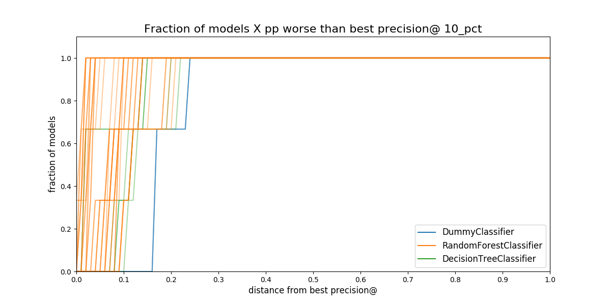
*Figure. Proportion of *models* in a *model group* that are separated
from the best model. The distance is measured in percentual points,
i.e. How much less precision at 10 percent of the population compared
to the best model in that date.*

In the figure, you can see that the ~60% of the `DummyClassifier`
models are ~18 percentual points below of the best.


### Selecting the best rule or strategy for choosing model groups

In this phase of the audition, you will see what will happen in the
next time if you choose your model group with an specific strategy or
rule. We call this the **regret** of the strategies.

We define **regret** as

!!! quote ""
    **Regret** Is the difference in performance between the model group you picked and the best one in the next time period.

The next plot show the *best* model group selected by the strategies specified in the configuration file:

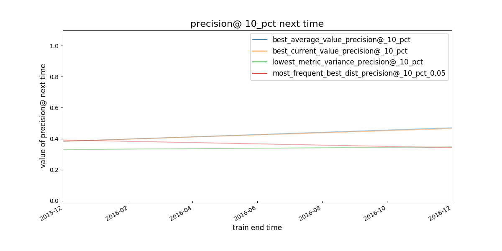
*Figure. Given a strategy for selecting model groups (in the figure, 4
are shown), What will be the performace of the model group chosen by
that strategy in the next evaluation date?*

It seems that the strategies *best average* and *best current value*
select the same **model group**.

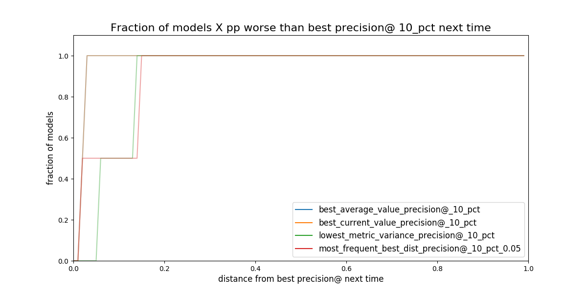
*Figure. Given a strategy for selecting model groups (in the plot 4
are shown). What will be the distance (*regret*) to the best
theoretical model in the following evaluation date?*

Obviously, you don’t know the future, but with the available data, if
you stick to an a particular strategy, How much you will *regret*
about that decision?

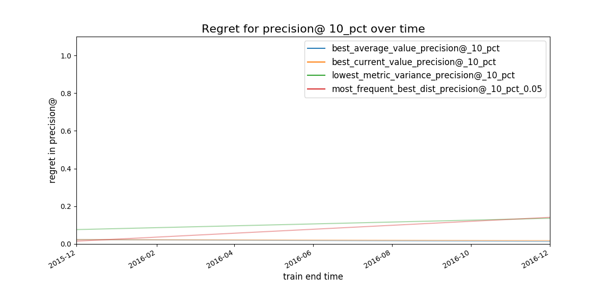
*Figure. Expected regret for the strategies. The less the better.*

The best **3** *model groups* per strategy will be stored in the file `[[file:audition/inspections/results_model_group_ids.json][results_model_group_ids.json]]`:

```json
{
    "best_current_value_precision@_10_pct": [39, 30, 9],
    "best_average_value_precision@_10_pct": [39, 9, 29],
    "lowest_metric_variance_precision@_10_pct": [1, 5, 19],
    "most_frequent_best_dist_precision@_10_pct_0.05": [8, 9, 10]
}
```

The analysis suggests that the best strategies are

-   select the model groups (`39,9,29`) which have the best average precision@10% value or,
-   select the best model group (`39,30,9`) using precision@10% today and use it for the next time period.

You will note that both strategies share two models groups and differ
in one. In the next two sections, we will investigate further those
four model groups selected by `audition`, using the *Postmodeling*
tool set.


## Postmodeling: Inspecting the best models closely

*Postmodeling* will help you to understand the behaviour orf your
selected models (from audition)

As in `Audition`, we will split the postmodeling process in two
parts. The first one is about exploring the *model groups* filtered by
audition, with the objective of select one. The second part is about
learning about *models* in the model group that was selected.

We will setup some parameters in the postmodeling configuration
file located at `/triage/postmodeling/inspection_postmodeling_config.yaml`,
mainly where is the audition’s output file located.

```yaml
# Postmodeling Configuration File

project_path: '/triage' # Project path defined in triage with matrices and models
model_group_id:
  - 39
  - 9
  - 29
  - 30

thresholds: # Thresholds for defining positive predictions
  rank_abs: [50, 100, 250]
  rank_pct: [5, 10, 25]

baseline_query: | # SQL query for defining a baseline for comparison in plots. It needs a metric and parameter
      select g.model_group_id,
             m.model_id,
             extract('year' from m.evaluation_end_time) as as_of_date_year,
             m.metric,
             m.parameter,
             m.value,
             m.num_labeled_examples,
             m.num_labeled_above_threshold,
             m.num_positive_labels
       from test_results.evaluations m
       left join triage_metadata.models g
       using(model_id)
       where g.model_group_id = 1
             and metric = 'precision@'
             and parameter = '10_pct'

max_depth_error_tree: 5 # For error trees, how depth the decision trees should go?
n_features_plots: 10 # Number of features for importances
figsize: [12, 12] # Default size for plots
fontsize: 20 # Default fontsize for plots
```

Compared to the previous sections, *postmodeling* is not an automated process (yet). Hence, to do the following part of the tutorial, you need to run `jupyter` inside `bastion` as follows:

```shell
jupyter-notebook –-ip=0.0.0.0  --port=56406 --allow-root
```

And then in your browser type[^11]: <http://0.0.0.0:56406>

Now that you are in a jupyter notebook, type the following:

```jupyter-python
%matplotlib inline
import matplotlib
#matplotlib.use('Agg')

import triage
import pandas as pd
import numpy as np

from collections import OrderedDict
from triage.component.postmodeling.contrast.utils.aux_funcs import create_pgconn, get_models_ids
from triage.component.catwalk.storage import ProjectStorage, ModelStorageEngine, MatrixStorageEngine
from triage.component.postmodeling.contrast.parameters import PostmodelParameters
from triage.component.postmodeling.contrast.model_evaluator import ModelEvaluator
from triage.component.postmodeling.contrast. model_group_evaluator import ModelGroupEvaluator
```

After importing, we need to create an `sqlalchemy engine` for connecting to the database, and read the configuration file.

```jupyter-python
params = PostmodelParameters('inspection_postmodeling_config.yaml')
engine = create_pgconn('database.yaml')
```

Postmodeling provides the object `ModelGroupEvaluator` to compare different *model groups*.

```jupyter-python
audited_models_class = ModelGroupEvaluator(tuple(params.model_group_id), engine)
```


### Comparing the audited model groups

First we will compare the performance of the audited model groups and the baseline over time. First, we will plot `precision@10_pct`

```jupyter-python
audited_models_class.plot_prec_across_time(param_type='rank_pct',
                                           param=10,
                                           baseline=True,
                                           baseline_query=params.baseline_query,
                                           metric='precision@',
                                               figsize=params.figsize)
```

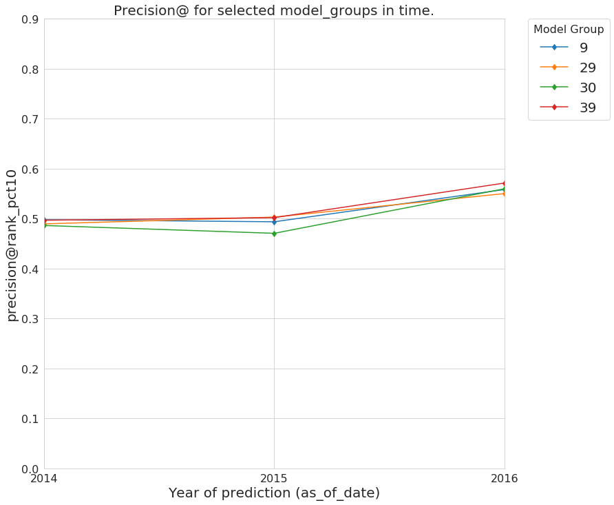
*Figure. Precision@10% over time from the best performing model groups selected by Audition*

and now the `recall@10_pct`

```jupyter-python
audited_models_class.plot_prec_across_time(param_type='rank_pct',
                                           param=10,
                                           metric='recall@',
                                           figsize=params.figsize)
```

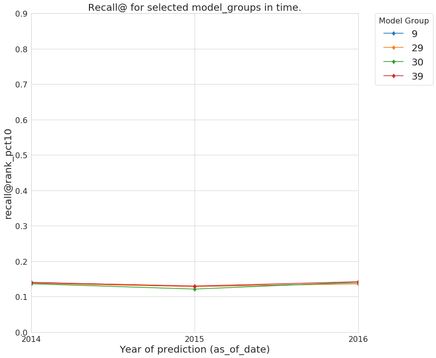
*Figure. Recall@10% over time from the best performing model groups selected by Audition*

All the selected model groups have a very similar performance. Let’s
see if they are predicting similar lists of facilities that are at
risk of fail an inspection.

```jupyter-python
audited_models_class.plot_jaccard_preds(param_type='rank_pct',
                                        param=10,
                                        temporal_comparison=True)
```

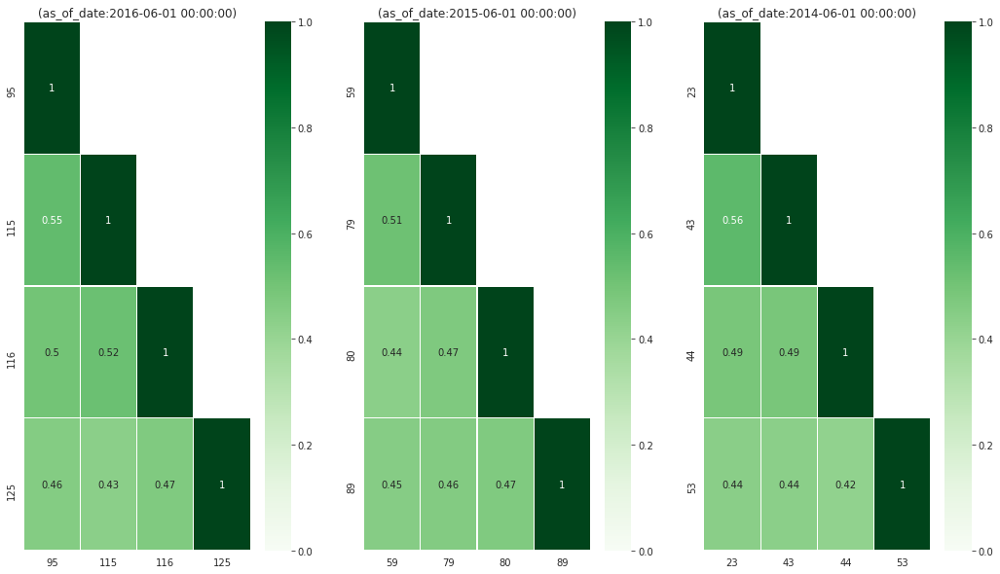
*Figure. How similar are the model groups’ generated list? We use
Jaccard similarity on the predicted lists (length of list 10%) to
asses the overlap between lists.*

The plot will shows the overlap of the predicted list containing the
10% of the facilities between model groups at each *as of date*. The
lists are at least 50% similar.

!!! tip
    *Why the models are not learning the same?*
    You should investigate why is that so. This could lead you
    to defining new features or some another conclusion about your data,
    but for this tutorial we will move on.


### Going deeper with a model

Imagine that after a deeper analysis, you decide to choose model group **39**

```sql
select
    mg.model_group_id,
    mg.model_type,
    mg.hyperparameters,
    array_agg(model_id order by train_end_time) as models
from
    triage_metadata.model_groups as mg
    inner join
    triage_metadata.models
    using (model_group_id)
where model_group_id = 39
group by 1,2,3
```

 model\_group\_id |               model\_type                |                                       hyperparameters                                       |   models
----------------|-----------------------------------------|---------------------------------------------------------------------------------------------|-------------
             39 | sklearn.ensemble.RandomForestClassifier | {"criterion": "gini", "max\_features": "sqrt", "n\_estimators": 250, "min\_samples\_split": 10} | {53,89,125}

We will investigate what the particular models are doing. *Postmodeling* created a `ModelEvaluator` (similar to the `ModelGroupEvaluator`) to do this exploration:

```jupyter-python
models_39 = { f'{model}': ModelEvaluator(39, model, engine) for model in [53,89,125] }
```

In this tutorial, we will just show some parts of the analysis in the
most recent model, but feel free of exploring the behavior of all the
models in this model group, and check if you can detect any pattern.

-   Feature importances

    ```jupyter-python
    models_39['125'].plot_feature_importances(path=params.project_path,
                                              n_features_plots=params.n_features_plots,
                                              figsize=params.figsize)
    ```

    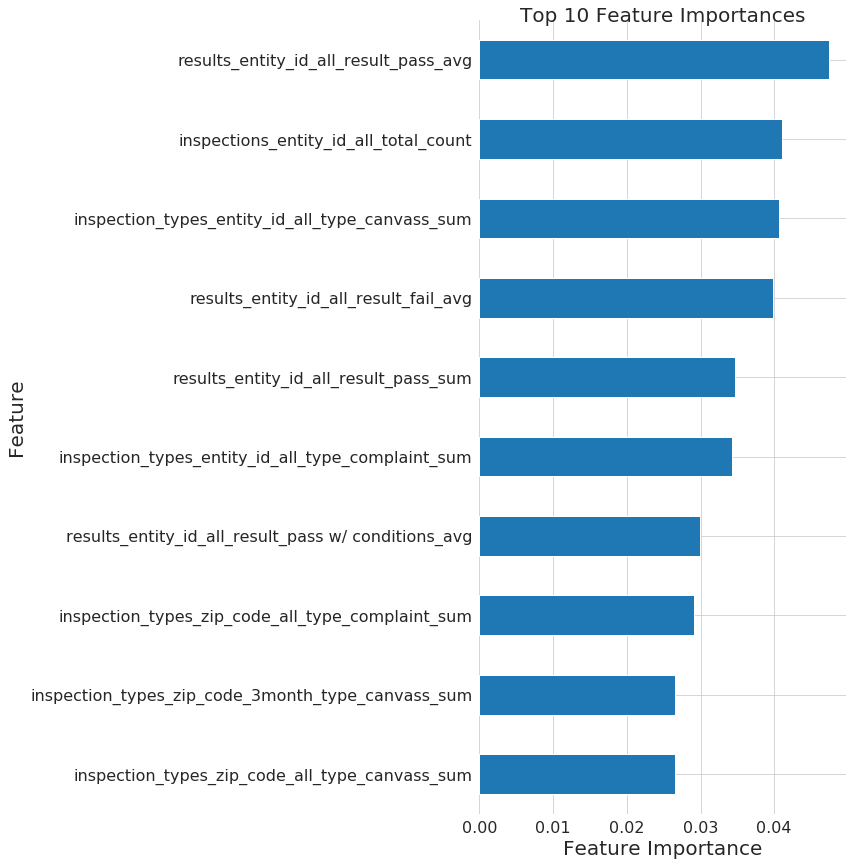
    *Figure. Top 10 feature importances for de model group 11 at 2016-06-01 (i.e. model 125).*

    ```jupyter-python
    models_39['125'].plot_feature_group_aggregate_importances()
    ```

    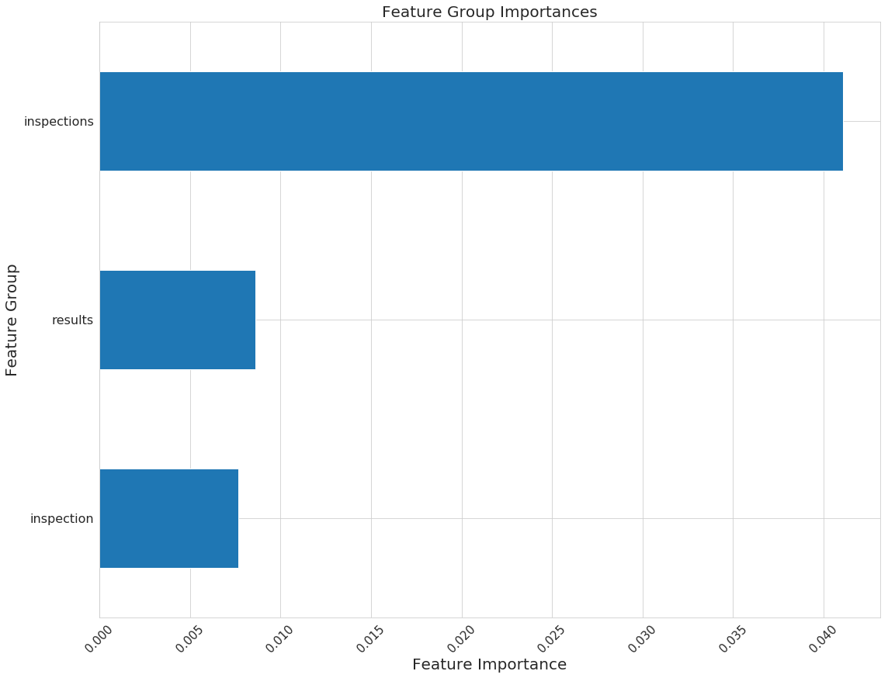
    *Figure. Feature group “importance” (we are basically taking the
    max of all the feature importances in a feature group) for the
    model group 39, model 125.*

-   Our *Policy menu*

    The following plot depicts the behavior of the metrics if you
    change the length of the facilities predicted at risk (i.e. the
    \(k\)). This plot is important from the decision making point of
    view, since it could be used as a *policy menu*.

    ```jupyter-python
    models_39['125'].plot_precision_recall_n()
    ```

    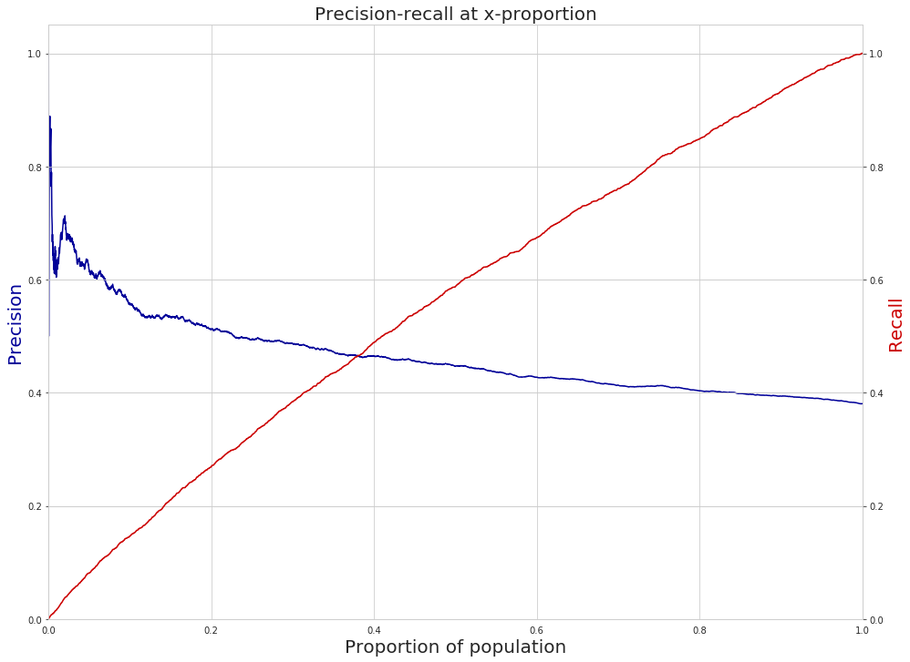
    *Figure. Plot of Precision and Recall over the proportion of the
    facilities. This plot is used as a "policy menu" since allows you
    to see how much you will gain if you invest more resources or how
    much you will sacrifice if you reduce your budget for
    resources. This is also known as “Rayid plot” at DSaPP.*

    We selected this model group because it was the best at precision
    at 10% (i.e. the model group consistently chose facilities will
    fail inspections at the top 10% of the risk). With the plot above
    you could decide to double your resources (maybe hiring more
    inspectors so you could inspect 20% of the facilities) and with
    this model you will double the detection of facilities that will
    fail inspections (from ~18% to ~30% in recall) with only a few
    percent points less of precision ~45% to ~40% (this means that 6
    in 10 facilities that the inspectors visit will pass the
    inspection). You could also go the other way around: if you reduce
    the length of the list from 10% to 5%, well you will gain a little
    of precision, but your recall will be ~5%.


### Where to go from here

Ready to get started with your own data? Check out [the suggested project workflow](https://dssg.github.io/triage/triage_project_workflow/) for some tips about how to iterate and tune the pipeline for your project.

Want to work through another example? Take a look at our [early warning system case study](https://dssg.github.io/triage/dirtyduck/eis/)


[^1]: If you assume a *uniform* distribution, it will make sense to select facilities at random.

[^2]: The underlying assumption here is that the City of Chicago is
    *currently* doing *random* selection for the inspections. This is
    not true (and probably unfair). In a real project, you will setup
    a **real** baseline and you will compare your models against
    it. This baseline could be a rule or a model.

[^3]: You need to check this! Fortunately, `triage` allows you to try
    several options here, so, if you think that this is too high or
    too low you can change that and fit your needs.

[^4]: Think about it: we **can’t** learn the relationship between the *features* and the *label* if we **don't know** the label.

[^5]: Confused? Check [A deeper look at triage](triage_intro.md) for
    more details.

[^6]: The formulas are, for `precision@k`, is the proportion of
    facilities correctly identified in the top-\(k\) facilities ranked
    by risk:

      $$
      precision@k = \frac{TP \in k}{k}
      $$

      This is a measure about *how efficiently* are your system using your resources.

       `recall@k`, in the other hand is the proportion of *all* the facilities that are risk found in the top-\(k\)

      $$
      recall@k = \frac{TP \in k}{TP}
      $$

      *recall* is a measure about the *coverage* of your system, i.e. *how good is identifying in the top-\(k\) the facilities at risk*.

      One possible variation of this is to **only** include in the
      denominator the *labeled* rows in \(k\). **This is the approach** used by `triage`.

[^7]: We will explore how to one way to tackle this in the advance part of this tutorial.

[^8]: The flags `-no-save-predictions` and `profile` are not necessary
    but useful. The first one configure triage to not store the
    predictions (at this stage you don't need them, and you can always
    could recreate them from the model and the matrix). This will save
    you execution time. The flag `profile` stores the *execution*
    profile times in a file, so you can check which models or matrices
    are taking a lot of time on been built.

[^9]: From a more mathematical point of view: Your data actually
    reflects the empirical probability: \(P(violation|inspected)\),
    i.e. the probability of find a violation given that the facility
    is inspected. But the probability that you want is
    \(P(violation)\) (yes, I know that there are no such things as
    unconditional probabilities, please bare with me),i.e. the
    probability that the facility is in violation.

[^10]: You should see that this assumption is very dangerous in other settings, for example, crime prediction.

[^11]: This assumes that you are in a GNU/Linux machine, if not (you
    should reconsider what are you doing with your life) you should
    change the ip address (`0.0.0.0`) and use the one from the docker
    virtual machine.

[^12]: For some reason, `sklearn` doesn’t scale the *inputs* to the
    Logistic Regression, so we (DSaPP) developed a version that does that.
