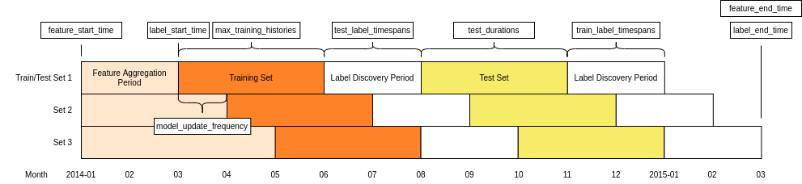

# Configuration

Explain the parameters for running Triage experiments

Triage is a great tool to make our life easier by semi-automating many different tasks when we are doing predictive anlaytics projects, so that the users can focus more on the problem formulation and modeling than implementation. The configuration helps users define the parameters in an experiment. To run a full Triage experiment, users are required to define `experiment.yaml` and `audition.yaml`. The `postmodeling_config.yaml` and `postmodeling_crosstabs.yaml` are
optional, only for users who want to use `triage.postmodeling` module after experiment. 

## Experiment Configuration
Also check out the example file [`experiment.yaml`](https://github.com/dssg/triage/blob/master/example/config/experiment.yaml).


### Config Version

- `config_version`: The experiment configuration changes from time to time, and we upgrade the `triage.experiments.CONFIG_VERSION` variable whenever drastic changes that break old configuration files are released. Be sure to assign the config version that matches the `triage.experiments.CONFIG_VERSION` in the triage release you are developing against!

### Experiment Metadata
- `model_comment` (optional): will end up in the model_comment column of the models table for each model created in this experiment.
- `random_seed` (optional): will be set in Python at the beginning of the experiment and affect the generation of all model seeds. If omitted, a random value will be chosen and recorded in the database to allow for future replication.

### Time Splitting
This section defines a set of parameters used in label generation and temporal cross-validation. 

Dates should be specified as date strings of the format `YYYY-MM-DD`. Intervals should be specified as strings of the [Postgres interval input format](https://www.postgresql.org/docs/11/datatype-datetime.html#DATATYPE-INTERVAL-INPUT).

Some parameters accept lists of arguments. If multiple arguments are specified, Triage will run experiments on each available permutation of time splitting arguments. Arguments to parameters that take lists **must** be specified as lists, even if specifying a single variable.

Note that these default values were selected to simplify the beginnings of your project, and are by no means *suggested* values.


| Parameter | Description | Type | Default | Example            | Takes List |
|-|-|-|-|-|-|
| feature_start_time | Earliest date included in features | date | Earliest date in feature_aggregations from_objs | '1995-01-01' | No |
| feature_end_time | Latest date included in features | date | Latest date in feature_aggregations from_objs | '2015-01-01' | No |
| label_start_time | Earliest date for which labels are available | date | Latest date in feature_aggregations from_objs | '2012-01-01' | No |
| label_end_time | Day AFTER last label date (all dates in any model are before this date) | date | latest date in feature_aggregations from_objs | '2015-01-01' | No |
| model_update_frequency | How frequently to retrain models | interval | '100y' | '4 months' | No |
| training_as_of_date_frequencies | Time between as of dates for the same entity in train matrix | interval | ['100y'] | ['1 week'] | Yes |
| test_as_of_date_frequencies | Time between as of dates for the same entity in test matrix | interval | ['100y'] | ['1 week'] | Yes |
| max_training_histories | Length of time included in a train matrix | interval | ['0d'] | ['1 month'] | Yes |
| test_durations | Length of time included in a test matrix | interval | ['0d'] | ['1 month'] | Yes |
| training_label_timespans | Amount of time required to determine an entity's label. Affects training sets. See the [Label Deep Dive](https://dssg.github.io/triage/experiments/cohort-labels/#what-are-cohorts-and-labels-in-triage) for more information.  | interval | No default | ['1 month'] | Yes |
| test_label_timespans | Same as above, affecting test sets. | interval | No default | ['1 month'] | Yes |


Note that if your label timespan is the same in both testing and training, you can simply set a single `label_timespans` parameter instead of specifying both `training_label_timespans` and `test_label_timespans`.



This diagram represents three train/test sets generated by the following temporal config. Date and interval parameters are labeled where they affect the plot.

```yaml
temporal_config:
    feature_start_time: '2014-01-01'
    feature_end_time: '2015-03-01'

    label_start_time: '2014-03-01'
    label_end_time: '2015-03-01'

    model_update_frequency: '1 month'
    training_as_of_date_frequencies: ['1 day']
    test_as_of_date_frequencies: ['1 day']

    max_training_histories: ['3 months']
    test_durations: ['3 months']

    label_timespans: ['2 months']
```

### Cohort Config
Cohorts are configured by passing a query with placeholders for the **as_of_date**.

- `cohort_conifg`: 
    - `qurey`: The `query` key should have a query, parameterized with an `'{as_of_date}'`, to select the entity_ids that should be included for a given date. The `{as_of_date}` will be replaced with each `as_of_date` that the experiment needs. The returned `entity_id` must be an integer.
    - `name`: You may enter a `name` for your configuration. This will be included in the metadata for each matrix and used to group models. If you don't pass one, the string `default` will be used.

The cohort config section of your experiment config can optionally be omitted. If you don't specify it, it will default to all the entities in your event's tables  (from_obj in feature_aggregations). The name by default in this case will be 'all_entities'. As with the time splitting defaults, this may be a good starting point, but you will likely want to refine your cohort definition as you iterate on your project.

### Label Generation
Labels are configured by passing a query with placeholders for the `as_of_date` and `label_timespan`.

- `label_config`:
    - `query`: The query must return two columns: `entity_id` and `outcome`, based on a given `as_of_date` and `label_timespan`. The `as_of_date` and `label_timespan` must be represented by placeholders marked by curly brackets. The example in `experiment.yaml` reproduces the inspection outcome boolean-or logic. In addition, you can configure what label is given to entities that are in the matrix (see **cohort_config** section) but that do not show up in this label query.
    - `include_missing_labels_in_train_as`: However, passing the key `include_missing_labels_in_train_as` allows you to pick True or False. By default, these will show up as missing/null.
    - `name`: In addition to these configuration options, you can pass a name to apply to the label configuration that will be present in matrix metadata for each matrix created by this experiment, under the `label_name` key. The default label_name is `outcome`.


### Feature Generation
The aggregate features to generate for each train/test split. Implemented by wrapping [collate](https://github.com/dssg/triage/tree/config_doc/src/triage/component/collate). Most terminology here is taken directly from [collate](https://github.com/dssg/triage/tree/config_doc/src/triage/component/collate).

Each entry describes a collate.SpacetimeAggregation object, and the arguments needed to create it. Generally, each of these entries controls the features from one source table, though in the case of multiple groups may result in multiple output tables.

Rules specifying how to handle imputation of null values must be explicitly defined in your config file. These can be specified in two places: either within each feature or overall for each type of feature (`aggregates_imputation`, `categoricals_imputation`, `array_categoricals_imputation`). In either case, a rule must be given for each aggregation function/metric (e.g., `sum`, `max`, `avg`, etc) used, or a catch-all can be specified with `all`. Aggregation function-specific rules will take precedence over the `all` rule and feature-specific rules will take precedence over the higher-level rules. Several examples are provided below. The supported aggregation functions/metrics are subject to the aggreagtion functions of the version of postgres being used.

Available Imputation Rules: 
- `mean`: The average value of the feature (for SpacetimeAggregation the mean is taken within-date).
- `constant`: Fill with a constant value from a required `value` parameter.
- `zero`: Fill with zero.
- `zero_noflag`: Fill with zero without generating an **imputed** flag. This option should be used only for cases where null values are explicitly known to be zero such as absence of an entity from an events table indicating that no such event has occurred.
- `null_category`: Only available for categorical features. Just flag null values with the null category column.
- `binary_mode`: Only available for aggregate column types. Takes the modal value for a binary feature.
- `error`: Raise an exception if any null values are encountered for this feature.


- `feature_aggregations`: 
    - `prefix`: prefix given to the resultant tables
    - `from_obj`: from_obj is usually a source table but can be an expression, such as a join (ie `cool_stuff join other_stuff using (stuff_id)`)
    - `knowledge_date_column`: The date column to use for specifying which records to include in temporal features. It is important that the column used specifies the date at which the event is known about, which may be different from the date the event happened.
    - `aggregates_imputation`: top-level imputation rules that will apply to all aggregates functions can also specify `categoricals_imputation` or `array_categoricals_imputation`. You must specify at least one of the top-level or feature-level imputation to cover every feature being defined.
        - `all`: The `all` rule will apply to all aggregation functions, unless overridden by more specific one. This is a default/fallback imputation method for any aggregation from this `from_obj`
            - `type`: every imputation rule must have a `type` parameter, while some (like 'constant') have other required parameters (`value` here)
            - `value`
        - `some aggregation function`: The reudction function used by the aggreagate such as `sum`, `count`, `avg`, `max` etc. Function-specific rules will take precedence over the catch-all rule.
    - `aggregates`: aggregates and categoricals define the actual features created. So at least one is required. Aggregates of numerical columns.
        - No keys are used on this line, which marks the first aggregate in a list
            - `quantity`: Each quantity is a number of some and the list of metrics are applied to each quantity, e.g. `homeless::INT`
            - `imputation`:  Imputation rules specified at the level of specific features will take precedence over the higer-level rules specified above. Note that the 'count' and 'sum' metrics will be imputed differently here.
                - `count`:
                    - `type`: `mean`
                - `sum`:
                    - `type`: `constant`
                    - `value`: `137`
            - `metrics`: the metrics/aggreagtion functions listed here will be used for the current aggregation only and must be defined separately for all aggregations.
                - `count`
                - `sum`
            - `coltype`: `smallint` (Optional, if you want to control the column type in the generated features tables)
        - No keys are used on this line, which marks the second aggregate in a list
            - `quantity`: `some_flag` (Since we're specifying `aggregates_imputation` above, a feature-specific imputation rule can be omitted)
            - `metrics`: 
                - `max`
                - `sum`

    - `categoricals`:  Categorical features. The column given can be of any type, but the choices must comparable to that type for equality within SQL The result will be one feature for each choice/metric combination.
    - (First column)
        - `column`: Note that we haven't specified a top level `categoricals_imputation` set of rules, so we have to include feature-specific imputation rules for both of our categoricals here.
        - `imputation`:
            - `sum`:
                - `type`: `null_category`
            - `max`:
                - `type`: `mean`
        - `choices`:
        - `metrics`: `sum`
    - (Second column)
        - `column`: `shape` (As with the top-level imputation rules, `all` can be used for the feature-level rules to specify the same type of imputation for all aggregation functions)
        - `imputation`:
            - `all`:
                `type`: `zero`
        - `choice_query`: `select distinct shape from cool stuff`
        - `metrics`: 
            - `sum`
    - `intervals`: The time intervals over which to aggregate features
    - `groups`: A list of different columns to separately group by

### Feature Grouping (optional)
define how to group features and generate combinations

- `feature_group_definition`: `feature_group_definition` allows you to create groups/subset of your features by different criteria. One can either specify `tables` or `prefix` (If omitted, all unique prefixes present in `feature_aggregations` will be used). 
    - `tables`: allows you to send a list of collate feature tables (collate builds these by appending `aggregation_imputed` to the prefix)
    - `prefix`: allows you to specify a list of feature name prefixes. Triage will consider prefixes sharing their initial string as the same (e.g., `bookings` will encompass `bookings_charges` as well as `bookings`). In other words, it's not actually maintaining a list of prefixes and searching for exact matches but trusting that prefixes do not overlap in this way.

- `feature_group_strategies`: strategies for generating combinations of groups. available: all, leave-one-out, leave-one-in, all-combinations

### User Metadata
These are arbitrary keys/values that you can have Triage apply to the metadata for every matrix in the experiment. Any keys you include here can be used in the `model_group_keys` below. User metadata makes Triage extensible to support ad hoc needs for your use case. In the early days of Triage, it was often used as a placeholder for yet-to-be developed features, such as setting a flag for a test run when there was not yet an option to preview experiment components before running. 

Nowadays, user metadata is often used to store details of the system or data state that fall outside of Triage's purview. For example, on cross-systems projects, Triage is often run after an entity-matching algorithm that links users across different databases. When that entity-matching model is updated, the linkage of Triage `entity_id`s to source data records may change, invalidating the predictions tables.  To avoid this, you can add the model id of your entity matching model to the `user_metadata` that signifies which set of `entity_id`s was used to create a given model/model group. That way, you can don't accidentally match old predictions to new ids during postmodel exploration. 

- `user_metadata`: 
    - `entity_model_id`: `em-0242ac120002` 


### Model Grouping (optional)
Model groups are a way of partitioning trained models in a way that makes for easier analysis.

`model_group_keys` defines a list of training matrix metadata and classifier keys that should be considered when creating a model group.

There is an extensive default configuration, which is aimed at producing groups whose constituent models are equivalent to each other in all ways except for when they were trained. This makes the analysis of model stability easier.

To accomplish this, the following default keys are used: `class_path`, `parameters`, `feature_names`, `feature_groups`, `cohort_name`, `state`, `label_name`, `label_timespan`, `as_of_date_frequency`, `max_training_history`

If you want to override this list, you can supply a `model_group_keys` value. All of the defaults are available, along with some other temporal information that could be useful for more specialized analyses:

`first_as_of_time`, `last_as_of_time`, `matrix_info_end_time`, `as_of_times`, `feature_start_time`

You can also use any pieces of user_metadata that you included in this experiment definition, as they will be present in the matrix metadata. 
- `model_group_keys`: [`feature_groups`, `label_definition`]

### Bias Audit Config (optional)
Every evaluation will include a bias audit (using the Aequitas toolkit).
To run the bias audit it is necessary to define the protected groups by defining attributes (e.g. race) for every entity

from_obj parameter: it can be a table name or a query (such as with features generators)
The from_obj is expected to have the protected attributes in a single table with a entity_id and knowledge date column

Triage will use the most recent entry of the source table with date < than current as_of_date as the value for those attributes in a given as of date

Running the bias audit might be slow, so the user should specify which thresholds should be used for the bias audit

Please have a look to Aequitas documentation for further information about the ref_groups_method
https://dssg.github.io/aequitas/config.html
By default uses the min_metric, meaning for each bias metric it uses as reference the group with minimum metric value (e.g. the group defined by race that has the lower FPR)
Alternatively it can be 'majority' (picks the largest group to serve as reference) or 'predefined' (needs a list of key values, see below)


### Model Grid Presets
Triage now comes with a set of predefined *recommended* grids named: quickstart, small, medium, large
See the documentation for recommended uses cases for those.

If you set this configuration section you SHOULD NOT include the grid_config section

- `model_grid_presets`: One of 'quickstart', 'small', 'medium', 'large'

### Grid Configuration
The classifier/hyperparameter combinations that should be trained

Each top-level key should be a class name, importable from triage. sklearn is available, and if you have another classifier package you would like available, contribute it to requirement/main.txt

- `grid_config`: Each lower-level key is a hyperparameter name for the given classifier, and each value is a list of potential values. All possible combinations of classifiers and hyperparameters are trained. Please check out the [grid_config section](https://github.com/dssg/triage/blob/6cb43f9cca032a980cbc25a9501e9559135fd04d/example/config/experiment.yaml#L276) in `experiment.yaml` as for a detailed example.

NOTE: Triage now include a new parameter named 'model_grid_presets' (see above)
you can't have both at the same time. The experiment will fail if you forget this.

### Prediction
How predictions are computed for train and test matrices? This is used only for *stored* predcitions and only affect postmodeling analysis (not model scoring), so if you are not stroing predictions, this will not affect anything.

- `prediction`: Rank tiebreaking - In the predictions.rank_abs and rank_pct columns, ties in the score are broken either at random or based on the `worst` or `best` options. `worst` is the default.


`worst` will break ties with the ascending label value, so if you take the top **k** predictions, and there are ties across the **k** threshold, the predictions above the threshold will be negative labels if possible.

`best` will break ties with the descending label value, so if you take the top **k** predictions, and there are ties across the **k** threshold, the predictions above the threshold will be positive labels if possible.

`random` will choose one random ordering to break ties. The result will be affected by current state of Postgres' random number generator. Before ranking, the generator is seeded based on the **model**'s random seed.


### Model Scoring
How each trained model is scored?

Each entry in `testing_metric_groups` needs a list of one of the metrics defined in catwalk.evaluation.ModelEvaluator.available_metrics (contributions welcome!) Depending on the metric, either thresholds or parameters.

`Parameters`: specify any hyperparameters needed. For most metrics, which are simply wrappers of sklearn functions, these are passed directly to sklearn. 

- `thresholds` are more specific: The list is dichotomized and only the top percentile or top n entities are scored as positive labels

subsets, if passed, will add evaluations for subset(s) of the predictions to the subset_evaluations tables, using the same testing and training metric groups as used for overall evaluations but with any thresholds reapplied only to entities in the subset on the relevant as_of_dates. For example, when calculating **precision@5_pct** for the subset of women, the ModelEvaluator will count as positively labeled the top 5% of women, rather than any women in the top 5% overall. This is useful if, for example, different interventions will be applied to different subsets of entities (e.g., one program will provide subsidies to the top 500 women with children and another program will provide shelter to the top 150 women without children) and you would like to see whether a single model can be used for both applications. Subsets can also be used to see how a model's performance would be affected if the requirements for intervention eligibility became more restricted.

### Individual Importances
How feature importances for individuals should be computed. This entire section can be left blank, in which case the defaults will be used.

- `individual_importance`:
    - `methods`: Refer to *how to compute* individual importances. Each entry in this list should represent a different method. Available methods are in the catwalk library's: `catwalk.individual_importance.CALCULATE_STRATEGIES` list. Will default to `uniform`, or just the global importances. Empty list means don't calculate individual importances. Individual importances take up the largest amount of database space, so an empty list is a good idea unless you need them.
    - `n_ranks`: The number of top features per individual to compute importances for. Will default to 5.
