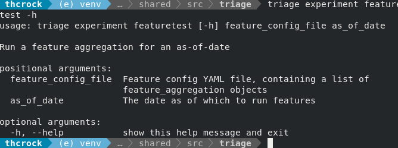
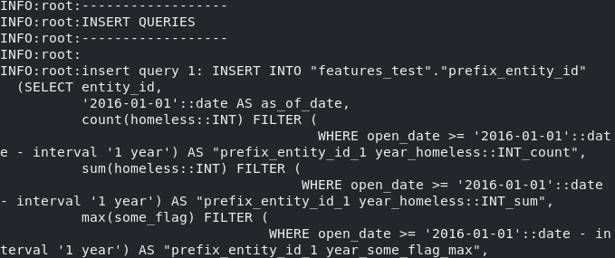

# Testing a Feature Aggregation

Developing features for Triage experiments can be a daunting task. There are a lot of things to configure, a small amount of configuration can result in a ton of SQL, and it can take a long time to validate your feature configuration in the context of an Experiment being run on real data.

To speed up the process of iterating on features, you can run a list of feature aggregations, without imputation, on just one as-of-date. This functionality can be accessed through the `triage` command line tool or called directly from code (say, in a Jupyter notebook) using the `FeatureGenerator` component.

## Using Triage CLI


The command-line interface for testing features takes in two arguments:
	- An experiment config file. Refer to the [example_experiment_config.yaml](https://github.com/dssg/triage/blob/master/example/config/experiment.yaml)'s `feature_aggregations` section. It consists of a YAML list, with one or more feature_aggregation rows present.
	- An as-of-date. This should be in the format `2016-01-01`.

Example: `triage experiment featuretest example/config/experiment.yaml 2016-01-01`

All given feature aggregations will be processed for the given date. You will see a bunch of queries pass by in your terminal, populating tables in the `features_test` schema which you can inspect afterwards.



## Using Python Code
If you'd like to call this from a notebook or from any other Python code, the arguments look similar but are a bit different. You have to supply your own sqlalchemy database engine to create a 'FeatureGenerator' object, and then call the `create_features_before_imputation` method with your feature config as a list of dictionaries, along with an as-of-date as a string. Make sure your logging level is set to INFO if you want to see all of the queries.

```
from triage.component.architect.feature_generators import FeatureGenerator
from triage.util.db import create_engine
import logging
import yaml

logging.basicConfig(level=logging.INFO)

# create a db_engine 
db_url = 'your db url here'
db_engine = create_engine(db_url)

feature_config = [{
	'prefix': 'aprefix',
	'aggregates': [
		{
		'quantity': 'quantity_one',
		'metrics': ['sum', 'count'],
	],
	'categoricals': [
		{
			'column': 'cat_one',
			'choices': ['good', 'bad'],
			'metrics': ['sum']
		},
	],
	'groups': ['entity_id', 'zip_code'],
	'intervals': ['all'],
	'knowledge_date_column': 'knowledge_date',
	'from_obj': 'data'
}]

FeatureGenerator(db_engine, 'features_test').create_features_before_imputation(
	feature_aggregation_config=feature_config,
	feature_dates=['2016-01-01']
)
```
