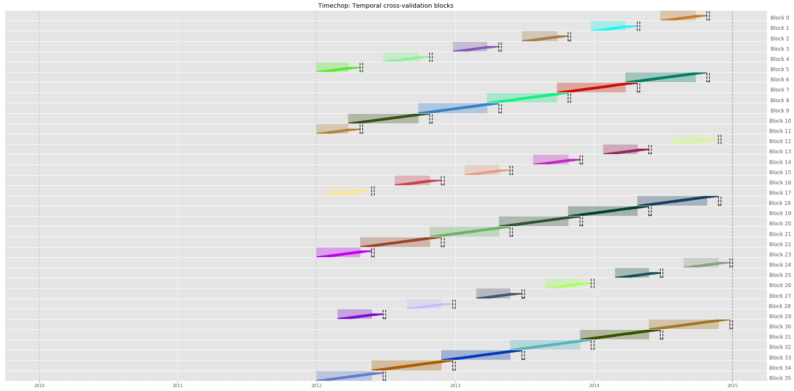

# Temporal Validation Deep Dive

A temporal validation deep dive is currently available in the Dirty Duck tutorial. [Dirty Duck - Temporal Cross-validation](../../dirtyduck/triage_intro/#temporal-crossvalidation)

You can produce the time graphs detailed in the Dirty Duck deep dive using the Triage CLI or through calling Python code directly. The graphs use matplotlib, so you'll need a matplotlib backend to use. Refer to the [matplotlib docs](https://matplotlib.org/faq/usage_faq.html) for more details.

## Python Code

Plotting is supported through the `visualize_chops` function, which takes a fully configured Timechop object. You may store the configuration for this object in a YAML file if you wish and load from a file, but in this example we directly set the parameters as arguments to the Timechop object. This would enable faster iteration of time config in a notebook setting.

```
from triage.component.timechop.plotting import visualize_chops
from triage.component.timechop import Timechop

chopper = Timechop(
    feature_start_time='2010-01-01'
    feature_end_time='2015-01-01'   # latest date included in features
    label_start_time='2012-01-01' # earliest date for which labels are avialable
    label_end_time='2015-01-01' # day AFTER last label date (all dates in any model are < this date)
    model_update_frequency='6month' # how frequently to retrain models
    training_as_of_date_frequencies='1day' # time between as of dates for same entity in train matrix
    test_as_of_date_frequencies='3month' # time between as of dates for same entity in test matrix
    max_training_histories=['6month', '3month'] # length of time included in a train matrix
    test_durations=['0day', '1month', '2month'] # length of time included in a test matrix (0 days will give a single prediction immediately after training end)
    training_label_timespans=['1month'] # time period across which outcomes are labeled in train matrices
    test_label_timespans=['7day'] # time period across which outcomes are labeled in test matrices
)

visualize_chops(chopper)
```

## Triage CLI

The Triage CLI exposes the `showtimechops` command which just takes a YAML file as input. This YAML file is expected to have a `temporal_config` section with Timechop parameters. You can use a full experiment config, or just create a YAML file with only temporal config parameters; the temporal config just has to be present. Here, we use the [example_experiment_config.yaml](https://github.com/dssg/triage/blob/master/example/config/experiment.yaml) from the Triage repository root as an example.

`triage experiment example_experiment_config.yaml --show-timechops`

## Result

Using either method, you should see output similar to this:


